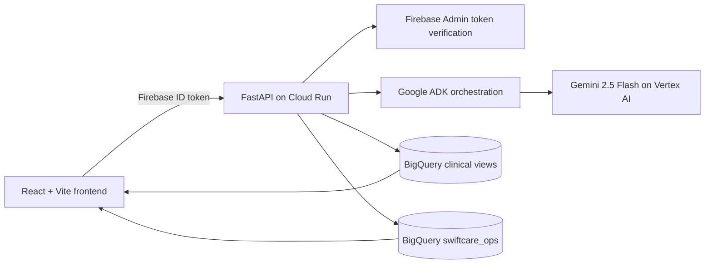

# SwiftCare AI

**SwiftCare AI** is a deployed clinical-operations workspace for organising synthetic patient-continuity work. It turns source-backed care signals into a prioritised attention queue, provides the relevant FHIR chart context, supports staff-recorded outcomes, and preserves the operational trail in Work History.

Built for **Patchamomma 2026**, SwiftCare is a synthetic-data demonstration for care-coordination and front-desk workflows. It is **not** a diagnostic, prescribing, or clinical decision-making system.

## Live demo

- Application: [swiftcare-api-841404088974.asia-south1.run.app](https://swiftcare-api-841404088974.asia-south1.run.app/)
- Health check: [API health](https://swiftcare-api-841404088974.asia-south1.run.app/api/v1/health)
- Source: [HaripriyaB/swiftcare-ai](https://github.com/HaripriyaB/swiftcare-ai)

### Demo access

```text
Email:    demo@swiftcare.ai
Password: swify@ai
```

This account is for the synthetic demo only. Do not enter real patient information.

### Suggested review path

1. Sign in and review the **Attention queue**.
2. Select one or more priority filters, then open a work card.
3. Open the linked **Patient record** to inspect FHIR chart context and recorded symptoms.
4. Ask **Swify** a patient or operational-workflow question.
5. Start, complete, or dismiss the operational work item, then verify the resulting event in **Work history**.

## What is implemented

### Attention queue

- Deterministic, source-backed continuity cards ranked **High**, **Medium**, or **Low** priority.
- Multi-select priority filters, page navigation, and a live count summary in the page header.
- Each card links directly to the relevant patient record and shows the operational reason and source evidence.
- Staff can start, complete, or dismiss a card. Completion and dismissal record an operational outcome and can include a staff note.

### Patient workspace

- Patient search and a direct link back to an open attention-queue card when one exists.
- FHIR chart context: demographics, conditions, medications, allergies, visits, timeline, and latest vital signs.
- Vitals include blood group when available in the source record, plus blood pressure, heart rate, respiratory rate, height, weight, and BMI when recorded.
- A dedicated Symptoms view distinguishes **FHIR symptom-relevant observations and conditions** from **active recorded symptoms** entered by staff or a patient.
- Staff can add and resolve operational symptoms; these are stored separately from the immutable clinical source layer.
- Downloadable patient-detail export in JSON or CSV.

### Care dashboard and history

- Care Dashboard for follow-up windows missed, repeated recent visits, medication-coordination review, and multiple ongoing conditions.
- Trend visuals scale with the displayed metric; affected-patient groups are paginated at ten records per page.
- Operational alerts can be acknowledged for review.
- Work History retains in-progress, completed, and dismissed continuity actions with timestamp, patient, outcome, and staff note.

### Swify, the operations assistant

- A persistent assistant rail is available across the application and retains the active patient context automatically.
- **Ask** routes supported patient, queue, and cohort questions to the appropriate grounded workflow; **Help** explains the product; **Learn** links to trusted public-health resources.
- When a question would amount to diagnosis, prescribing, or a treatment plan, Swify refuses and redirects to chart context or operational workflow support.
- Browser speech input is available when supported by the user’s browser.

## Data model and runtime source of truth

SwiftCare uses **synthetic FHIR data only**. Its cohort-provisioning SQL selects a reproducible set of 5,000 patients and associated FHIR resources from the Google BigQuery public dataset [`bigquery-public-data.fhir_synthea`](https://console.cloud.google.com/marketplace/product/bigquery-public-data/fhir_synthea), then copies that cohort into the SwiftCare BigQuery datasets.

```text
Google BigQuery public FHIR Synthea dataset
                    |
                    v
swiftcare_fhir_raw -> analytics transforms -> guarded clinical views
                    |
                    +--> patient charts, Care Dashboard, and Swify reads
                    |
                    v
swiftcare_ops operational tables
  - continuity cards and action events
  - recorded symptoms
  - insight alerts and advisory cards
  - sessions and optional access/audit records
```

**BigQuery is the runtime source of truth.** Clinical reads are served from allowlisted SwiftCare clinical views and analytics datasets. Workflow writes are persisted in `swiftcare_ops`.

| Operation | Persisted destination | Clinical source data changed? |
| --- | --- | --- |
| Read a chart, care pattern, or queue evidence | Guarded BigQuery clinical views | No |
| Add or resolve a recorded symptom | `swiftcare_ops.patient_symptoms` | No |
| Start, complete, or dismiss work | `continuity_cards` and `continuity_action_events` | No |
| Acknowledge an operational alert | `swiftcare_ops.insight_alerts` | No |

The repository also contains a fixture-based local adapter for development. It is active only with `LOCAL_DEMO_MODE=true`; it is not the intended deployed data path.

## Architecture



The container serves the compiled React app and the FastAPI API from Cloud Run. The service is publicly reachable so the browser can load the application, while protected API routes require a verified Firebase ID token.

## Google Cloud and AI implementation

| Area | Current implementation |
| --- | --- |
| AI model | Gemini 2.5 Flash, configured through Vertex AI |
| Agent orchestration | Google Agent Development Kit (ADK) runners for retrieval, suggestion, and insights workflows |
| Clinical and operational data | Google BigQuery |
| API | Python 3.11, FastAPI, Uvicorn |
| Web app | React 19, Vite, TypeScript |
| Authentication | Firebase Authentication and Firebase Admin SDK |
| Deployment | Docker, Cloud Build, Artifact Registry, Cloud Run |
| Build-time web configuration | Secret Manager |
| Build logs | Cloud Storage |

The deployed service sets `GOOGLE_GENAI_USE_VERTEXAI=TRUE` and runs the configured Gemini model through ADK. This is an application that uses ADK and Vertex AI; it should not be described as a separate Gemini Agent Platform deployment.

## Authentication and authorization

- Firebase Authentication provides the signed-in staff identity; FastAPI verifies the ID token with Firebase Admin.
- `API_AUTH_BYPASS` is only for local development. Cloud Run deploys with it set to `false`.
- The synthetic demo uses authenticated open access by default (`SWIFTCARE_DEMO_OPEN_ACCESS=true`) so a signed-in demo reviewer can inspect the cohort without pre-provisioned BigQuery grants.
- For restricted deployments, set `SWIFTCARE_DEMO_OPEN_ACCESS=false`. `swiftcare_ops.patient_access_grants` then controls population and patient-chart access; `can_write = TRUE` is required for mutations.
- Read-access auditing is optional (`AUDIT_READS=true`). Operational action events are always recorded when the associated workflow action succeeds.

## Deployed environment

| Item | Value |
| --- | --- |
| Google Cloud project | `swiftcare-patchamomma` |
| Region | `asia-south1` |
| Cloud Run service | `swiftcare-api` |
| Runtime service account | `swiftcare-cloudrun@swiftcare-patchamomma.iam.gserviceaccount.com` |
| Operational BigQuery dataset | `swiftcare_ops` |

## Run locally

### Prerequisites

- Python 3.11+
- Node.js 22+
- A Google Cloud project with BigQuery and Vertex AI enabled
- Authenticated `gcloud` and Application Default Credentials when using BigQuery and Vertex AI
- Firebase web configuration for authenticated frontend testing

### Install

```bash
git clone https://github.com/HaripriyaB/swiftcare-ai.git
cd swiftcare-ai

python3 -m venv .venv
source .venv/bin/activate
pip install -e ".[dev]"

cp .env.example .env
cp frontend/.env.example frontend/.env
```

Set the GCP project, Firebase web settings, and Vertex AI configuration in the copied environment files. Do not commit `.env` files.

### Provision a fresh synthetic BigQuery environment

`run_chunk1.sh` creates the raw cohort, transformations, operational tables, clinical views, materialized views, and validation queries. It uses `CREATE OR REPLACE` for the raw cohort tables, so run it only in an intended demo environment.

```bash
./scripts/run_chunk1.sh
bq query --use_legacy_sql=false < sql/09_patient_symptoms.sql
bq query --use_legacy_sql=false < sql/11_continuity_queue.sql
```

The last command seeds deterministic continuity cards from the risk view without modifying source clinical data.

### Start the app

```bash
./scripts/run_api.sh
./scripts/run_frontend.sh
```

For a fixture-only local experience, enable the documented `LOCAL_DEMO_MODE` and `VITE_USE_MSW` settings. Never use local-fixture mode as a substitute for the deployed BigQuery path.

## Deploy to Cloud Run

The deployment script invokes Cloud Build, which builds the frontend and backend container, retrieves Firebase web-build configuration from Secret Manager, pushes the image to Artifact Registry, and deploys it to Cloud Run with Firebase auth bypass disabled.

```bash
./scripts/deploy_cloud_run.sh
```

The deployment requires the target project, runtime service account, Artifact Registry repository, Firebase web configuration, and build-log bucket described in `cloudbuild.yaml` and `.env.example`.

## Verify

```bash
pytest -q
cd frontend && npm run test
cd frontend && npm run build
```

## Repository layout

```text
agents/       Google ADK retrieval, suggestion, and insights agents
api/          FastAPI routes, authentication, authorization, and BigQuery access
frontend/     React user interface and MSW local fixtures
sql/          Cohort ingestion, transformations, views, and workflow tables
scripts/      Local-run, data-provisioning, agent, and Cloud Run deployment scripts
tests/        API and agent tests
```

## Safety and scope

- All data in this demo is synthetic; SwiftCare is not for real patient data.
- Swify provides grounded operational support, not medical advice.
- The app does not diagnose, prescribe, create clinical orders, or replace clinician judgment.
- BigQuery access uses fixed, parameterized query patterns rather than unrestricted text-to-SQL.
- Clinical source tables are never modified by application workflows.
- Firebase stores identity, not clinical chart data; clinical and workflow data remain in BigQuery.
