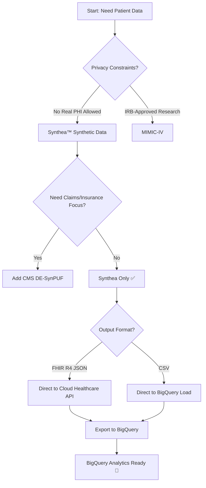
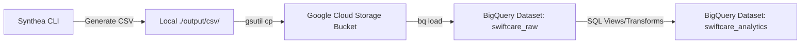
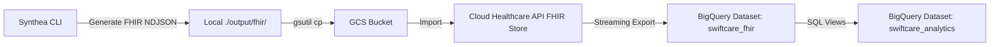
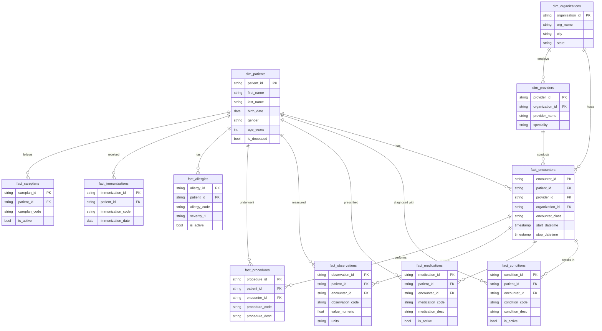
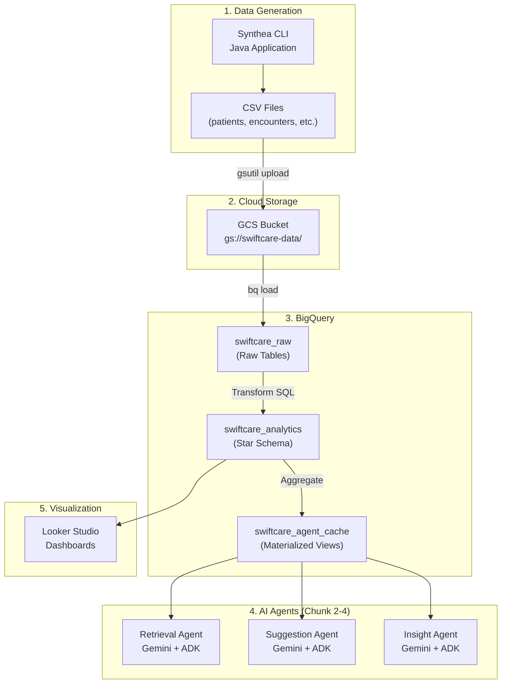

# Chunk 1: Data Exploration, Gathering & Schema Design

## SwiftCare AI — Patient Data Strategy for BigQuery

---

## 1. Project Context (from spec.md)

**SwiftCare AI** is an agentic RAG healthcare operations platform with three AI agents:

| Agent | Purpose |
|---|---|
| **Retrieval Agent** | Resolves natural-language queries against FHIR patient records in BigQuery |
| **Suggestion Agent** | Surfaces guardrailed next-step advisories for clinical accountability |
| **Insight Agent** | Mines visit/follow-up patterns to flag at-risk patients and scheduling gaps |

**Chunk 1 Goal**: Generate/gather patient data, define schema, load into BigQuery, and validate data quality before agent development begins.

---

## 2. Data Requirements Analysis

### 2.1 What Data Do the Agents Need?

Based on the three agents and front-desk/care-coordination workflows, the platform requires:

| Data Category | Why It's Needed | FHIR Resource |
|---|---|---|
| **Patient Demographics** | Identify and look up patients at front desk | `Patient` |
| **Visit / Encounter History** | Track visit patterns, scheduling, care coordination | `Encounter` |
| **Medical Conditions** | Clinical context for retrieval agent queries | `Condition` |
| **Medications** | Current/past prescriptions for care coordination | `MedicationRequest` |
| **Lab Results & Vitals** | Clinical observations for insight mining | `Observation` |
| **Procedures** | Surgical/diagnostic procedures performed | `Procedure` |
| **Allergies** | Critical safety data for suggestion agent | `AllergyIntolerance` |
| **Immunizations** | Vaccination history for preventive care flags | `Immunization` |
| **Care Plans** | Ongoing treatment plans for follow-up tracking | `CarePlan` |
| **Appointments** | Scheduling data for insight agent analytics | `Appointment` |
| **Practitioners** | Provider information for care team context | `Practitioner` |
| **Organizations** | Facility/clinic information | `Organization` |

---

## 3. Data Sources — Reliable, Free & Useful

### 3.1 🏆 Primary Recommendation: Synthea™ (Synthetic Patient Generator)

> [!IMPORTANT]
> **Synthea is the recommended primary data source** for SwiftCare AI. It generates realistic, FHIR-compliant synthetic patient data with zero privacy/legal risk.

| Attribute | Detail |
|---|---|
| **Source** | [github.com/synthetichealth/synthea](https://github.com/synthetichealth/synthea) |
| **License** | Apache 2.0 — fully free and open-source |
| **Output Formats** | FHIR R4 JSON, FHIR R4 NDJSON, CSV, C-CDA XML |
| **Data Quality** | Clinically realistic — models disease progression, medications, vitals over patient lifetimes |
| **Privacy** | 100% synthetic — no HIPAA/PHI concerns |
| **Customizable** | Population size, geographic region, disease modules, date ranges |

#### What Synthea Generates

Synthea produces **18+ interrelated CSV files** (or equivalent FHIR bundles):

| CSV File | Key Columns | Records Per 1K Patients (approx.) |
|---|---|---|
| `patients.csv` | Id, BIRTHDATE, DEATHDATE, SSN, FIRST, LAST, GENDER, RACE, ETHNICITY, ADDRESS, CITY, STATE, ZIP, LAT, LON, INCOME | 1,000 |
| `encounters.csv` | Id, START, STOP, PATIENT, ORGANIZATION, PROVIDER, PAYER, ENCOUNTERCLASS, CODE, DESCRIPTION, REASONCODE, REASONDESCRIPTION | ~35,000 |
| `conditions.csv` | START, STOP, PATIENT, ENCOUNTER, CODE, DESCRIPTION | ~10,000 |
| `medications.csv` | START, STOP, PATIENT, PAYER, ENCOUNTER, CODE, DESCRIPTION, BASE_COST, PAYER_COVERAGE, DISPENSES, TOTALCOST, REASONCODE, REASONDESCRIPTION | ~15,000 |
| `observations.csv` | DATE, PATIENT, ENCOUNTER, CATEGORY, CODE, DESCRIPTION, VALUE, UNITS, TYPE | ~200,000 |
| `procedures.csv` | START, STOP, PATIENT, ENCOUNTER, CODE, DESCRIPTION, BASE_COST, REASONCODE, REASONDESCRIPTION | ~20,000 |
| `allergies.csv` | START, STOP, PATIENT, ENCOUNTER, CODE, SYSTEM, DESCRIPTION, TYPE, CATEGORY, REACTION1, DESCRIPTION1, SEVERITY1 | ~2,000 |
| `immunizations.csv` | DATE, PATIENT, ENCOUNTER, CODE, DESCRIPTION, BASE_COST | ~15,000 |
| `careplans.csv` | Id, START, STOP, PATIENT, ENCOUNTER, CODE, DESCRIPTION, REASONCODE, REASONDESCRIPTION | ~5,000 |
| `organizations.csv` | Id, NAME, ADDRESS, CITY, STATE, ZIP, LAT, LON, PHONE, REVENUE, UTILIZATION | ~50 |
| `providers.csv` | Id, ORGANIZATION, NAME, GENDER, SPECIALITY, ADDRESS, CITY, STATE, ZIP, LAT, LON, ENCOUNTERS, PROCEDURES | ~200 |
| `payers.csv` | Id, NAME, OWNERSHIP, ADDRESS, CITY, STATE_HEADQUARTERED, ZIP, PHONE, AMOUNT_COVERED, AMOUNT_UNCOVERED, REVENUE, COVERED_ENCOUNTERS, UNCOVERED_ENCOUNTERS, COVERED_MEDICATIONS, UNCOVERED_MEDICATIONS, COVERED_PROCEDURES, UNCOVERED_PROCEDURES, COVERED_IMMUNIZATIONS, UNCOVERED_IMMUNIZATIONS, UNIQUE_CUSTOMERS, QOLS_AVG, MEMBER_MONTHS | ~10 |
| `payer_transitions.csv` | PATIENT, MEMBERID, START_DATE, END_DATE, PAYER, SECONDARY_PAYER, PLAN_OWNERSHIP, OWNER_NAME | ~5,000 |
| `claims.csv` | Id, PATIENTID, PROVIDERID, PRIMARYPATIENTINSURANCEID, ... | ~50,000 |
| `claims_transactions.csv` | ... | ~100,000 |
| `supplies.csv` | DATE, PATIENT, ENCOUNTER, CODE, DESCRIPTION, QUANTITY | ~5,000 |
| `devices.csv` | START, STOP, PATIENT, ENCOUNTER, CODE, DESCRIPTION, UDI | ~500 |

#### How to Install & Run Synthea

```bash
# Prerequisites: Java 11+ (JDK)
java -version

# Clone the repository
git clone https://github.com/synthetichealth/synthea.git
cd synthea

# Generate 1,000 patients (CSV + FHIR output)
./run_synthea -p 1000 --exporter.csv.export=true

# Generate for a specific US state
./run_synthea -p 500 Massachusetts --exporter.csv.export=true

# Output locations:
# CSV  → ./output/csv/
# FHIR → ./output/fhir/
```

#### Recommended Generation Parameters for SwiftCare AI

```properties
# synthea.properties overrides
exporter.csv.export = true
exporter.fhir.export = true
exporter.fhir.bulk_data = true
generate.default_population = 5000
exporter.years_of_history = 10
```

> [!TIP]
> **Start with 5,000 patients** — this gives ~175K encounters, ~1M observations, and enough data for meaningful agent queries without exceeding BigQuery free-tier limits during development.

---

### 3.2 Alternative/Supplementary Free Data Sources

| Source | Description | URL | Pros | Cons |
|---|---|---|---|---|
| **CMS Synthetic Data (DE-SynPUF)** | CMS Medicare claims synthetic data — 5% sample | [cms.gov/data-research](https://www.cms.gov/data-research/statistics-trends-and-reports/medicare-claims-synthetic-public-use-files) | Claims-focused, realistic distributions | Not FHIR-formatted; requires transformation |
| **MIMIC-IV (PhysioNet)** | ICU patient data from Beth Israel Deaconess Medical Center | [physionet.org/content/mimiciv](https://physionet.org/content/mimiciv/) | Real clinical data, extremely detailed | Requires credentialed access, data use agreement, CITI training |
| **Google GCS Sample Data** | Pre-built Synthea FHIR bundles hosted by Google | `gs://hcls_testing_data_fhir_10_patients/` | Instant — no generation needed | Only 10 patients (good for schema testing, not analytics) |
| **openFDA** | Drug adverse events, recalls, labeling | [open.fda.gov](https://open.fda.gov/) | Free API, no auth needed | Supplementary only — no patient records |
| **HL7 FHIR Test Servers** | Public FHIR R4 endpoints with test data | [hapi.fhir.org](http://hapi.fhir.org/baseR4) | Live FHIR API for testing | Data quality varies, not suitable for analytics |

> [!NOTE]
> **For SwiftCare AI**, Synthea alone covers all data needs. CMS Synthetic Data can supplement if you want realistic insurance claims distributions. MIMIC-IV is overkill for front-desk workflows and has access restrictions.

---

### 3.3 Data Gathering Decision Matrix



---

## 4. Data Ingestion Pipeline — GCP Architecture

### 4.1 Two Recommended Approaches

#### Approach A: CSV Direct Load (Simpler — Recommended for MVP)



**Steps:**
1. Run Synthea locally → generates CSV files
2. Upload CSVs to a GCS bucket
3. Use `bq load` or BigQuery Console to load CSVs into raw tables
4. Create analytical views and derived tables

```bash
# Upload to GCS
gsutil -m cp -r ./output/csv/* gs://swiftcare-data-bucket/synthea-csv/

# Load into BigQuery (example for patients)
bq load --source_format=CSV --autodetect \
  swiftcare_raw.patients \
  gs://swiftcare-data-bucket/synthea-csv/patients.csv
```

#### Approach B: FHIR via Cloud Healthcare API (Production-Grade)



**Steps:**
1. Run Synthea → generates FHIR R4 NDJSON bundles
2. Upload to GCS
3. Create Healthcare API dataset + FHIR store
4. Import FHIR bundles from GCS
5. Configure BigQuery streaming export (Analytics V2 schema)

> [!TIP]
> **For the hackathon/MVP, use Approach A (CSV Direct Load)**. It's faster to set up and gives you full control over the schema. Switch to Approach B when productionizing the system.

---

## 5. BigQuery Schema Design

### 5.1 Dataset Organization

```
GCP Project: swiftcare-ai
│
├── Dataset: swiftcare_raw          ← Raw Synthea CSV data (source of truth)
│   ├── patients
│   ├── encounters
│   ├── conditions
│   ├── medications
│   ├── observations
│   ├── procedures
│   ├── allergies
│   ├── immunizations
│   ├── careplans
│   ├── organizations
│   ├── providers
│   ├── payers
│   └── payer_transitions
│
├── Dataset: swiftcare_analytics    ← Cleaned, enriched, partitioned tables
│   ├── dim_patients                ← Dimension: patient demographics
│   ├── dim_providers               ← Dimension: providers/practitioners
│   ├── dim_organizations           ← Dimension: facilities
│   ├── fact_encounters             ← Fact: all encounters (partitioned by date)
│   ├── fact_conditions             ← Fact: diagnoses
│   ├── fact_medications            ← Fact: prescriptions
│   ├── fact_observations           ← Fact: labs, vitals
│   ├── fact_procedures             ← Fact: procedures
│   ├── fact_allergies              ← Fact: allergies
│   ├── fact_immunizations          ← Fact: vaccinations
│   ├── fact_careplans              ← Fact: care plans
│   └── vw_patient_360             ← View: unified patient summary
│
└── Dataset: swiftcare_agent_cache  ← Agent-specific materialized views
    ├── mv_patient_latest_vitals    ← Latest vitals per patient
    ├── mv_active_medications       ← Currently active medications
    ├── mv_upcoming_followups       ← Patients needing follow-up
    └── mv_at_risk_patients         ← Insight agent: at-risk flags
```

### 5.2 Detailed Table Schemas

#### 5.2.1 `swiftcare_analytics.dim_patients`

```sql
CREATE TABLE swiftcare_analytics.dim_patients (
  patient_id        STRING       NOT NULL,   -- Synthea UUID
  first_name        STRING,
  last_name         STRING,
  birth_date        DATE,
  death_date        DATE,                    -- NULL if alive
  gender            STRING,                  -- M / F
  race              STRING,
  ethnicity         STRING,
  marital_status    STRING,
  address_line      STRING,
  city              STRING,
  state             STRING,
  zip               STRING,
  county            STRING,
  latitude          FLOAT64,
  longitude         FLOAT64,
  income            INT64,
  is_deceased       BOOL,
  age_years         INT64,                   -- Computed: current age or age at death
  created_at        TIMESTAMP    DEFAULT CURRENT_TIMESTAMP(),
  updated_at        TIMESTAMP    DEFAULT CURRENT_TIMESTAMP()
)
OPTIONS (
  description = 'Patient demographics dimension table'
);
```

#### 5.2.2 `swiftcare_analytics.fact_encounters`

```sql
CREATE TABLE swiftcare_analytics.fact_encounters (
  encounter_id        STRING       NOT NULL,
  patient_id          STRING       NOT NULL,  -- FK → dim_patients
  provider_id         STRING,                 -- FK → dim_providers
  organization_id     STRING,                 -- FK → dim_organizations
  payer_id            STRING,
  encounter_class     STRING,                 -- ambulatory, emergency, inpatient, wellness, urgentcare
  encounter_code      STRING,                 -- SNOMED code
  encounter_desc      STRING,
  reason_code         STRING,                 -- SNOMED reason code
  reason_desc         STRING,
  start_datetime      TIMESTAMP   NOT NULL,
  stop_datetime       TIMESTAMP,
  duration_minutes    INT64,                  -- Computed
  base_cost           FLOAT64,
  total_claim_cost    FLOAT64,
  payer_coverage      FLOAT64,
  created_at          TIMESTAMP   DEFAULT CURRENT_TIMESTAMP()
)
PARTITION BY DATE(start_datetime)
CLUSTER BY patient_id, encounter_class
OPTIONS (
  description = 'Encounter/visit fact table — partitioned by visit date'
);
```

#### 5.2.3 `swiftcare_analytics.fact_conditions`

```sql
CREATE TABLE swiftcare_analytics.fact_conditions (
  condition_id        STRING       NOT NULL,
  patient_id          STRING       NOT NULL,
  encounter_id        STRING       NOT NULL,
  condition_code      STRING,                 -- SNOMED-CT code
  condition_desc      STRING,
  onset_date          DATE,
  abatement_date      DATE,                   -- NULL if still active
  is_active           BOOL,                   -- Computed
  created_at          TIMESTAMP   DEFAULT CURRENT_TIMESTAMP()
)
PARTITION BY onset_date
CLUSTER BY patient_id, condition_code
OPTIONS (
  description = 'Patient conditions/diagnoses fact table'
);
```

#### 5.2.4 `swiftcare_analytics.fact_medications`

```sql
CREATE TABLE swiftcare_analytics.fact_medications (
  medication_id       STRING       NOT NULL,
  patient_id          STRING       NOT NULL,
  encounter_id        STRING       NOT NULL,
  payer_id            STRING,
  medication_code     STRING,                 -- RxNorm code
  medication_desc     STRING,
  start_date          DATE,
  stop_date           DATE,                   -- NULL if currently active
  is_active           BOOL,
  base_cost           FLOAT64,
  payer_coverage      FLOAT64,
  total_cost          FLOAT64,
  dispenses           INT64,
  reason_code         STRING,
  reason_desc         STRING,
  created_at          TIMESTAMP   DEFAULT CURRENT_TIMESTAMP()
)
PARTITION BY start_date
CLUSTER BY patient_id, medication_code
OPTIONS (
  description = 'Medication prescriptions fact table'
);
```

#### 5.2.5 `swiftcare_analytics.fact_observations`

```sql
CREATE TABLE swiftcare_analytics.fact_observations (
  observation_id      STRING       NOT NULL,
  patient_id          STRING       NOT NULL,
  encounter_id        STRING       NOT NULL,
  observation_date    DATE         NOT NULL,
  category            STRING,                 -- vital-signs, laboratory, survey
  observation_code    STRING,                 -- LOINC code
  observation_desc    STRING,
  value_numeric       FLOAT64,               -- For numeric observations
  value_string        STRING,                -- For text observations
  units               STRING,
  created_at          TIMESTAMP   DEFAULT CURRENT_TIMESTAMP()
)
PARTITION BY observation_date
CLUSTER BY patient_id, category, observation_code
OPTIONS (
  description = 'Clinical observations (vitals, labs) fact table'
);
```

#### 5.2.6 `swiftcare_analytics.fact_procedures`

```sql
CREATE TABLE swiftcare_analytics.fact_procedures (
  procedure_id        STRING       NOT NULL,
  patient_id          STRING       NOT NULL,
  encounter_id        STRING       NOT NULL,
  procedure_code      STRING,                 -- SNOMED code
  procedure_desc      STRING,
  start_datetime      TIMESTAMP,
  stop_datetime       TIMESTAMP,
  base_cost           FLOAT64,
  reason_code         STRING,
  reason_desc         STRING,
  created_at          TIMESTAMP   DEFAULT CURRENT_TIMESTAMP()
)
PARTITION BY DATE(start_datetime)
CLUSTER BY patient_id, procedure_code
OPTIONS (
  description = 'Medical procedures fact table'
);
```

#### 5.2.7 `swiftcare_analytics.fact_allergies`

```sql
CREATE TABLE swiftcare_analytics.fact_allergies (
  allergy_id          STRING       NOT NULL,
  patient_id          STRING       NOT NULL,
  encounter_id        STRING       NOT NULL,
  allergy_code        STRING,                 -- SNOMED code
  allergy_system      STRING,                 -- coding system
  allergy_desc        STRING,
  allergy_type        STRING,                 -- allergy | intolerance
  category            STRING,                 -- food, medication, environment
  onset_date          DATE,
  resolved_date       DATE,                   -- NULL if still active
  is_active           BOOL,
  reaction_code_1     STRING,
  reaction_desc_1     STRING,
  severity_1          STRING,                 -- mild, moderate, severe
  created_at          TIMESTAMP   DEFAULT CURRENT_TIMESTAMP()
)
CLUSTER BY patient_id
OPTIONS (
  description = 'Patient allergies and intolerances fact table'
);
```

#### 5.2.8 `swiftcare_analytics.fact_immunizations`

```sql
CREATE TABLE swiftcare_analytics.fact_immunizations (
  immunization_id     STRING       NOT NULL,
  patient_id          STRING       NOT NULL,
  encounter_id        STRING       NOT NULL,
  immunization_date   DATE,
  immunization_code   STRING,                 -- CVX code
  immunization_desc   STRING,
  base_cost           FLOAT64,
  created_at          TIMESTAMP   DEFAULT CURRENT_TIMESTAMP()
)
PARTITION BY immunization_date
CLUSTER BY patient_id
OPTIONS (
  description = 'Vaccination/immunization records fact table'
);
```

#### 5.2.9 `swiftcare_analytics.fact_careplans`

```sql
CREATE TABLE swiftcare_analytics.fact_careplans (
  careplan_id         STRING       NOT NULL,
  patient_id          STRING       NOT NULL,
  encounter_id        STRING       NOT NULL,
  careplan_code       STRING,                 -- SNOMED code
  careplan_desc       STRING,
  start_date          DATE,
  stop_date           DATE,                   -- NULL if ongoing
  is_active           BOOL,
  reason_code         STRING,
  reason_desc         STRING,
  created_at          TIMESTAMP   DEFAULT CURRENT_TIMESTAMP()
)
PARTITION BY start_date
CLUSTER BY patient_id
OPTIONS (
  description = 'Patient care plans fact table'
);
```

#### 5.2.10 `swiftcare_analytics.dim_providers`

```sql
CREATE TABLE swiftcare_analytics.dim_providers (
  provider_id         STRING       NOT NULL,
  organization_id     STRING,
  provider_name       STRING,
  gender              STRING,
  speciality          STRING,
  address_line        STRING,
  city                STRING,
  state               STRING,
  zip                 STRING,
  total_encounters    INT64,
  total_procedures    INT64,
  created_at          TIMESTAMP   DEFAULT CURRENT_TIMESTAMP()
)
OPTIONS (
  description = 'Healthcare provider/practitioner dimension table'
);
```

#### 5.2.11 `swiftcare_analytics.dim_organizations`

```sql
CREATE TABLE swiftcare_analytics.dim_organizations (
  organization_id     STRING       NOT NULL,
  org_name            STRING,
  address_line        STRING,
  city                STRING,
  state               STRING,
  zip                 STRING,
  latitude            FLOAT64,
  longitude           FLOAT64,
  phone               STRING,
  revenue             FLOAT64,
  utilization         INT64,
  created_at          TIMESTAMP   DEFAULT CURRENT_TIMESTAMP()
)
OPTIONS (
  description = 'Healthcare organization/facility dimension table'
);
```

### 5.3 Critical Analytical Views

#### Patient 360° View (Used by Retrieval Agent)

```sql
CREATE OR REPLACE VIEW swiftcare_analytics.vw_patient_360 AS
SELECT
  p.patient_id,
  p.first_name,
  p.last_name,
  p.birth_date,
  p.age_years,
  p.gender,
  p.race,
  p.is_deceased,

  -- Latest encounter summary
  le.encounter_class   AS last_encounter_class,
  le.encounter_desc    AS last_encounter_desc,
  le.start_datetime    AS last_visit_date,

  -- Active conditions count
  (SELECT COUNT(*) FROM swiftcare_analytics.fact_conditions c
   WHERE c.patient_id = p.patient_id AND c.is_active = TRUE) AS active_conditions_count,

  -- Active medications count
  (SELECT COUNT(*) FROM swiftcare_analytics.fact_medications m
   WHERE m.patient_id = p.patient_id AND m.is_active = TRUE) AS active_medications_count,

  -- Active allergies count
  (SELECT COUNT(*) FROM swiftcare_analytics.fact_allergies a
   WHERE a.patient_id = p.patient_id AND a.is_active = TRUE) AS active_allergies_count,

  -- Total encounters
  (SELECT COUNT(*) FROM swiftcare_analytics.fact_encounters e
   WHERE e.patient_id = p.patient_id) AS total_encounters

FROM swiftcare_analytics.dim_patients p
LEFT JOIN (
  SELECT *, ROW_NUMBER() OVER(PARTITION BY patient_id ORDER BY start_datetime DESC) AS rn
  FROM swiftcare_analytics.fact_encounters
) le ON le.patient_id = p.patient_id AND le.rn = 1;
```

#### Latest Vitals (Used by Retrieval Agent)

```sql
CREATE MATERIALIZED VIEW swiftcare_agent_cache.mv_patient_latest_vitals AS
SELECT
  patient_id,
  MAX(IF(observation_code = '8302-2', value_numeric, NULL))  AS height_cm,
  MAX(IF(observation_code = '29463-7', value_numeric, NULL)) AS weight_kg,
  MAX(IF(observation_code = '39156-5', value_numeric, NULL)) AS bmi,
  MAX(IF(observation_code = '8480-6', value_numeric, NULL))  AS systolic_bp,
  MAX(IF(observation_code = '8462-4', value_numeric, NULL))  AS diastolic_bp,
  MAX(IF(observation_code = '8867-4', value_numeric, NULL))  AS heart_rate,
  MAX(IF(observation_code = '9279-1', value_numeric, NULL))  AS respiratory_rate,
  MAX(observation_date) AS latest_observation_date
FROM swiftcare_analytics.fact_observations
WHERE category = 'vital-signs'
GROUP BY patient_id;
```

#### Active Medications (Used by Retrieval + Suggestion Agents)

```sql
CREATE MATERIALIZED VIEW swiftcare_agent_cache.mv_active_medications AS
SELECT
  m.patient_id,
  p.first_name,
  p.last_name,
  m.medication_code,
  m.medication_desc,
  m.start_date,
  m.reason_desc
FROM swiftcare_analytics.fact_medications m
JOIN swiftcare_analytics.dim_patients p ON m.patient_id = p.patient_id
WHERE m.is_active = TRUE;
```

#### At-Risk Patients (Used by Insight Agent)

```sql
CREATE MATERIALIZED VIEW swiftcare_agent_cache.mv_at_risk_patients AS
SELECT
  p.patient_id,
  p.first_name,
  p.last_name,
  p.age_years,
  COUNT(DISTINCT e.encounter_id) AS encounters_last_90_days,
  COUNT(DISTINCT c.condition_code) AS active_condition_count,
  COUNT(DISTINCT m.medication_code) AS active_medication_count,
  MAX(e.start_datetime) AS last_visit,
  DATE_DIFF(CURRENT_DATE(), DATE(MAX(e.start_datetime)), DAY) AS days_since_last_visit,
  CASE
    WHEN COUNT(DISTINCT e.encounter_id) >= 5 THEN 'HIGH'
    WHEN COUNT(DISTINCT c.condition_code) >= 3 THEN 'MEDIUM'
    WHEN DATE_DIFF(CURRENT_DATE(), DATE(MAX(e.start_datetime)), DAY) > 180 THEN 'MEDIUM'
    ELSE 'LOW'
  END AS risk_level
FROM swiftcare_analytics.dim_patients p
LEFT JOIN swiftcare_analytics.fact_encounters e
  ON p.patient_id = e.patient_id
  AND e.start_datetime >= TIMESTAMP_SUB(CURRENT_TIMESTAMP(), INTERVAL 90 DAY)
LEFT JOIN swiftcare_analytics.fact_conditions c
  ON p.patient_id = c.patient_id AND c.is_active = TRUE
LEFT JOIN swiftcare_analytics.fact_medications m
  ON p.patient_id = m.patient_id AND m.is_active = TRUE
WHERE p.is_deceased = FALSE
GROUP BY p.patient_id, p.first_name, p.last_name, p.age_years;
```

---

## 6. Entity Relationship Diagram



---

## 7. GCP Architecture Overview



---

## 8. FHIR Resource Mapping Reference

This table maps Synthea CSV → FHIR R4 Resource → BigQuery Table for traceability:

| Synthea CSV | FHIR R4 Resource | BigQuery Table | Clinical Code System |
|---|---|---|---|
| `patients.csv` | `Patient` | `dim_patients` | — |
| `encounters.csv` | `Encounter` | `fact_encounters` | SNOMED-CT |
| `conditions.csv` | `Condition` | `fact_conditions` | SNOMED-CT |
| `medications.csv` | `MedicationRequest` | `fact_medications` | RxNorm |
| `observations.csv` | `Observation` | `fact_observations` | LOINC |
| `procedures.csv` | `Procedure` | `fact_procedures` | SNOMED-CT |
| `allergies.csv` | `AllergyIntolerance` | `fact_allergies` | SNOMED-CT |
| `immunizations.csv` | `Immunization` | `fact_immunizations` | CVX |
| `careplans.csv` | `CarePlan` | `fact_careplans` | SNOMED-CT |
| `organizations.csv` | `Organization` | `dim_organizations` | — |
| `providers.csv` | `Practitioner` | `dim_providers` | — |

---

## 9. Data Quality Validation Queries

After loading data, run these validation checks:

```sql
-- 1. Row counts per table
SELECT 'patients' AS tbl, COUNT(*) AS cnt FROM swiftcare_raw.patients
UNION ALL
SELECT 'encounters', COUNT(*) FROM swiftcare_raw.encounters
UNION ALL
SELECT 'conditions', COUNT(*) FROM swiftcare_raw.conditions
UNION ALL
SELECT 'medications', COUNT(*) FROM swiftcare_raw.medications
UNION ALL
SELECT 'observations', COUNT(*) FROM swiftcare_raw.observations;

-- 2. Referential integrity: encounters → patients
SELECT COUNT(*) AS orphaned_encounters
FROM swiftcare_raw.encounters e
LEFT JOIN swiftcare_raw.patients p ON e.PATIENT = p.Id
WHERE p.Id IS NULL;

-- 3. Date range sanity check
SELECT
  MIN(START) AS earliest_encounter,
  MAX(START) AS latest_encounter,
  COUNT(DISTINCT PATIENT) AS unique_patients
FROM swiftcare_raw.encounters;

-- 4. Gender distribution
SELECT GENDER, COUNT(*) AS cnt,
  ROUND(COUNT(*) * 100.0 / SUM(COUNT(*)) OVER(), 1) AS pct
FROM swiftcare_raw.patients
GROUP BY GENDER;

-- 5. Top 10 conditions
SELECT DESCRIPTION, COUNT(*) AS cnt
FROM swiftcare_raw.conditions
GROUP BY DESCRIPTION
ORDER BY cnt DESC
LIMIT 10;
```

---

## 10. Estimated Costs (BigQuery Free Tier)

| Resource | Free Tier Limit | SwiftCare Estimate (5K patients) | Within Free Tier? |
|---|---|---|---|
| **BigQuery Storage** | 10 GB/month | ~500 MB | ✅ Yes |
| **BigQuery Queries** | 1 TB/month processed | ~10 GB/month during dev | ✅ Yes |
| **Cloud Storage** | 5 GB (Standard) | ~200 MB CSV files | ✅ Yes |
| **Healthcare API** | Pay-as-you-go | \$0 if using CSV approach | ✅ N/A |

> [!CAUTION]
> The free tier estimates assume the **CSV Direct Load approach** (Approach A). Using the Cloud Healthcare API (Approach B) incurs additional per-operation charges. For the hackathon, stick with Approach A.

---

## 11. Step-by-Step Execution Checklist

- [ ] **Step 1**: Install Java 11+ and clone Synthea repository
- [ ] **Step 2**: Configure `synthea.properties` for 5,000 patients with CSV + FHIR export
- [ ] **Step 3**: Run Synthea to generate synthetic data
- [ ] **Step 4**: Create GCP project and enable BigQuery API
- [ ] **Step 5**: Create GCS bucket `gs://swiftcare-data/`
- [ ] **Step 6**: Upload CSV files to GCS
- [ ] **Step 7**: Create BigQuery dataset `swiftcare_raw`
- [ ] **Step 8**: Load all CSV files into raw tables using `bq load`
- [ ] **Step 9**: Run data validation queries (Section 9)
- [ ] **Step 10**: Create BigQuery dataset `swiftcare_analytics`
- [ ] **Step 11**: Create dimension and fact tables with schema (Section 5.2)
- [ ] **Step 12**: Write and run ETL transform queries (raw → analytics)
- [ ] **Step 13**: Create BigQuery dataset `swiftcare_agent_cache`
- [ ] **Step 14**: Create materialized views (Section 5.3)
- [ ] **Step 15**: Validate Patient 360° view returns correct data
- [ ] **Step 16**: Document data dictionary and share with team

---

## 12. Key Design Decisions & Rationale

| Decision | Choice | Rationale |
|---|---|---|
| **Data source** | Synthea synthetic data | Free, FHIR-compliant, zero privacy risk, fully customizable |
| **Schema pattern** | Star schema (dim + fact) | Optimized for analytical queries the agents will run |
| **Partitioning** | Date-based on all fact tables | Reduces query costs, improves performance for time-based filters |
| **Clustering** | patient_id + domain-specific codes | Agents primarily query by patient; secondary filters on codes |
| **Three datasets** | raw → analytics → agent_cache | Separation of concerns: raw data preserved, clean analytics layer, pre-computed agent views |
| **Materialized views** | For agent-facing queries | Sub-second response times for the retrieval agent |
| **CSV over FHIR API** | For MVP/hackathon | Simpler setup, full schema control, stays within free tier |

---

> [!NOTE]
> This document covers Chunk 1 of SwiftCare AI. After completing data loading and validation, proceed to **Chunk 2: Build Retrieval Agent** which will connect Gemini + ADK to the BigQuery tables and materialized views defined here.
