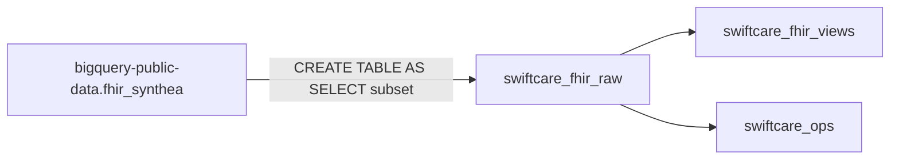
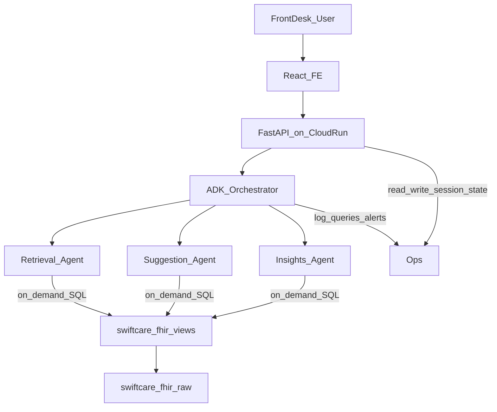

# Chunk 1: Patient Data Analysis & BigQuery Schema

**SwiftCare AI** | Chunk 1 deliverable for Cursor / agentic development

---

# PART A — Human Review

> **Audience:** Haripriya and team. Review this section before implementation. Sign off on decisions in Section A.9.

## A.1 Executive Summary

Chunk 1 establishes the **patient data foundation** for SwiftCare AI. All clinical data — demographics, visit history, conditions, medications, labs, allergies — lives in **BigQuery only**. There is no Firestore, Firebase, or secondary database for patient records.

Three AI agents (retrieval, suggestion, insights) will query BigQuery **on demand** at runtime via SQL. Chunk 1 delivers:

1. A curated patient cohort from the free public FHIR Synthea dataset
2. A three-layer BigQuery schema (raw → views → ops)
3. A structured validation framework with pass/fail thresholds
4. Agent query contracts for Chunks 2–4

**Total data infrastructure cost: $0** (within GCP free tier limits).

---

## A.2 Key Decisions

| # | Decision | Choice | Rationale |
|---|----------|--------|-----------|
| D1 | **Data store** | BigQuery only | Matches spec ("FHIR structured patient records in BigQuery"); single source of truth |
| D2 | **No Firestore / Firebase for data** | Excluded | Avoids split-brain; all patient, session, advisory, and audit data in BigQuery |
| D3 | **Data source** | `bigquery-public-data.fhir_synthea` | Free, FHIR R4, longitudinal patient history, no HIPAA risk |
| D4 | **Ingestion mode** | One-time batch copy (CTAS) | $0; no Cloud Healthcare API (paid) |
| D5 | **Cohort size** | 500–1,000 patients | Stays under 10 GB free storage; enough for agent dev |
| D6 | **Runtime access** | On-demand SQL per agent query | No pre-downloading charts; agents generate SQL → query views |
| D7 | **Schema pattern** | 3 datasets: raw → views → ops | Separation: source data, agent-friendly layer, application state |
| D8 | **Validation** | 5-category runbook with blockers | Structured, repeatable, logged to `data_validation_runs` |

---

## A.3 Features Delivered in Chunk 1

| Feature | Dataset | Description |
|---------|---------|-------------|
| FHIR raw tables | `swiftcare_fhir_raw` | Patient, Encounter, Condition, Observation, etc. copied from public dataset |
| Semantic views | `swiftcare_fhir_views` | Flattened demographics, timeline, active meds, visit summaries, risk flags |
| Ops tables | `swiftcare_ops` | Sessions, advisory cards, query logs, insight alerts, validation runs |
| Validation runbook | `swiftcare_ops` | V1–V5 checks with CHECK_ID, thresholds, severity |
| Exploration queries | Part B | Profiling SQL for data discovery |
| Looker Studio hook | `swiftcare_fhir_views` | Optional $0 dashboard on views |

---

## A.4 Architecture — How Data Flows

### Ingestion (one-time, Chunk 1)



### Runtime (Chunks 2–6)



### What is NOT happening

- Patient FHIR data is **not** stored in Firestore or Firebase
- Charts are **not** streamed or pre-downloaded to the application
- Agents do **not** read raw NDJSON bundles at query time
- Cloud Healthcare API FHIR store is **not** used (paid service)

### Example runtime flow (Retrieval Agent)

1. User asks: *"What medications is John Smith on?"*
2. FastAPI receives request with `patient_id` (from `swiftcare_ops.sessions` or request body).
3. Retrieval Agent (ADK + Gemini) generates SQL against `v_active_medications`.
4. BigQuery returns rows; agent formats a natural-language response.
5. Response logged to `swiftcare_ops.agent_query_log`.

---

## A.5 Cost Guarantee — $0 Data Stack

| Resource | Free tier limit | SwiftCare estimate (1K patients) | Cost |
|----------|----------------|----------------------------------|------|
| BigQuery storage | 10 GB/month | ~1–2 GB | $0 |
| BigQuery queries | 1 TB processed/month | ~20–50 GB during dev | $0 |
| Public dataset queries | Included in query quota | Exploration only | $0 |
| BigQuery views | No storage charge | 5–8 views | $0 |
| Looker Studio | Free | 1 dashboard | $0 |
| Synthea (optional local) | Open source | N/A | $0 |
| **Cloud Healthcare API** | Pay-per-op | **Not used** | — |
| **Firestore / Firebase** | — | **Not used** | — |

**Guardrails:** Use `LIMIT` during exploration; keep cohort ≤ 1,000 patients; prefer views over duplicate tables.

---

## A.6 Trade-offs Accepted

| Trade-off | Accepted because |
|-----------|------------------|
| Batch ingest, not real-time | Chunk 1 is setup; agents read snapshot data |
| Public dataset subset, not custom Synthea | Faster $0 start; Synthea local gen documented as optional |
| FHIR nested fields in raw tables | Views flatten for agents; raw preserved for fidelity |
| Session state in BigQuery, not Firestore | Single data platform; slightly higher latency for session reads (acceptable for MVP) |

---

## A.7 Risks & Mitigations

| Risk | Mitigation |
|------|------------|
| Exceed BigQuery free tier | 1K patient cap; quota alerts; `LIMIT` on exploration |
| Nested FHIR fields hard to query | Semantic views abstract complexity |
| Public dataset table/column changes | V1 schema validation checks on every run |
| Agent generates bad SQL | V5 smoke tests; query logs in `swiftcare_ops` |

---

## A.8 Open Questions (Future Chunks)

- Gemini API usage costs (separate from data; not $0)
- Production FHIR store via Healthcare API (paid upgrade path)
- Pub/Sub for agent coordination (Chunk 6; messages carry IDs only)

---

## A.9 Exit Criteria — Human Sign-off

<!-- AGENT:CHECKLIST:chunk1-exit -->

- [ ] Decisions in A.2 reviewed and accepted
- [ ] Patient subset (500–1,000) loaded into `swiftcare_fhir_raw`
- [ ] All views in `swiftcare_fhir_views` created
- [ ] All ops tables in `swiftcare_ops` created
- [ ] V1–V5 validation run completed; **zero blocker failures**
- [ ] Results logged in `swiftcare_ops.data_validation_runs`
- [ ] Runtime model confirmed: **BigQuery only**, on-demand SQL
- [ ] Ready for Chunk 2 (Retrieval Agent)

---

# PART B — Agentic Implementation

> **Audience:** AI agents building Chunks 2–6. Execute sections in order. Use `<!-- AGENT:... -->` markers to locate contracts.

---

## B.1 Environment Variables Contract

```bash
GCP_PROJECT_ID=your-gcp-project-id
BQ_LOCATION=US
BQ_DATASET_RAW=swiftcare_fhir_raw
BQ_DATASET_VIEWS=swiftcare_fhir_views
BQ_DATASET_OPS=swiftcare_ops
FHIR_PUBLIC_PROJECT=bigquery-public-data
FHIR_PUBLIC_DATASET=fhir_synthea
COHORT_PATIENT_LIMIT=1000
```

---

## B.2 Dataset Setup

```sql
-- Run in BigQuery console or bq query
CREATE SCHEMA IF NOT EXISTS `{{GCP_PROJECT_ID}}.swiftcare_fhir_raw`
  OPTIONS(location = 'US', description = 'FHIR R4 raw tables copied from public Synthea dataset');

CREATE SCHEMA IF NOT EXISTS `{{GCP_PROJECT_ID}}.swiftcare_fhir_views`
  OPTIONS(location = 'US', description = 'Agent-facing flattened views');

CREATE SCHEMA IF NOT EXISTS `{{GCP_PROJECT_ID}}.swiftcare_ops`
  OPTIONS(location = 'US', description = 'Sessions, audit logs, advisories, validation results');
```

Replace `{{GCP_PROJECT_ID}}` with your project ID in all SQL below.

---

## B.3 Ingestion — Copy Public Dataset Subset ($0)

### B.3.1 Discover public tables

```sql
SELECT table_name, table_type
FROM `bigquery-public-data.fhir_synthea.INFORMATION_SCHEMA.TABLES`
ORDER BY table_name;
```

Expected tables include: `patient`, `encounter`, `observation`, `condition`, `medicationrequest`, `procedure`, `allergyintolerance`, `immunization`, `diagnosticreport`, `organization`, `practitioner`, `appointment`, `careplan`.

### B.3.2 Select cohort patient IDs (reproducible)

```sql
-- Save 1000 patient IDs for consistent subset across all tables
CREATE OR REPLACE TABLE `{{GCP_PROJECT_ID}}.swiftcare_fhir_raw._cohort_patient_ids` AS
SELECT id AS patient_id
FROM `bigquery-public-data.fhir_synthea.patient`
ORDER BY id
LIMIT 1000;
```

### B.3.3 Copy raw tables (filtered to cohort)

```sql
-- Patient
CREATE OR REPLACE TABLE `{{GCP_PROJECT_ID}}.swiftcare_fhir_raw.patient` AS
SELECT p.*
FROM `bigquery-public-data.fhir_synthea.patient` p
JOIN `{{GCP_PROJECT_ID}}.swiftcare_fhir_raw._cohort_patient_ids` c ON p.id = c.patient_id;

-- Encounter
CREATE OR REPLACE TABLE `{{GCP_PROJECT_ID}}.swiftcare_fhir_raw.encounter` AS
SELECT e.*
FROM `bigquery-public-data.fhir_synthea.encounter` e
JOIN `{{GCP_PROJECT_ID}}.swiftcare_fhir_raw._cohort_patient_ids` c
  ON e.subject.patientId = c.patient_id;

-- Condition
CREATE OR REPLACE TABLE `{{GCP_PROJECT_ID}}.swiftcare_fhir_raw.condition` AS
SELECT x.*
FROM `bigquery-public-data.fhir_synthea.condition` x
JOIN `{{GCP_PROJECT_ID}}.swiftcare_fhir_raw._cohort_patient_ids` c
  ON x.subject.patientId = c.patient_id;

-- Observation
CREATE OR REPLACE TABLE `{{GCP_PROJECT_ID}}.swiftcare_fhir_raw.observation` AS
SELECT x.*
FROM `bigquery-public-data.fhir_synthea.observation` x
JOIN `{{GCP_PROJECT_ID}}.swiftcare_fhir_raw._cohort_patient_ids` c
  ON x.subject.patientId = c.patient_id;

-- MedicationRequest
CREATE OR REPLACE TABLE `{{GCP_PROJECT_ID}}.swiftcare_fhir_raw.medicationrequest` AS
SELECT x.*
FROM `bigquery-public-data.fhir_synthea.medicationrequest` x
JOIN `{{GCP_PROJECT_ID}}.swiftcare_fhir_raw._cohort_patient_ids` c
  ON x.subject.patientId = c.patient_id;

-- Procedure
CREATE OR REPLACE TABLE `{{GCP_PROJECT_ID}}.swiftcare_fhir_raw.procedure` AS
SELECT x.*
FROM `bigquery-public-data.fhir_synthea.procedure` x
JOIN `{{GCP_PROJECT_ID}}.swiftcare_fhir_raw._cohort_patient_ids` c
  ON x.subject.patientId = c.patient_id;

-- AllergyIntolerance
CREATE OR REPLACE TABLE `{{GCP_PROJECT_ID}}.swiftcare_fhir_raw.allergyintolerance` AS
SELECT x.*
FROM `bigquery-public-data.fhir_synthea.allergyintolerance` x
JOIN `{{GCP_PROJECT_ID}}.swiftcare_fhir_raw._cohort_patient_ids` c
  ON x.patient.patientId = c.patient_id;

-- Immunization
CREATE OR REPLACE TABLE `{{GCP_PROJECT_ID}}.swiftcare_fhir_raw.immunization` AS
SELECT x.*
FROM `bigquery-public-data.fhir_synthea.immunization` x
JOIN `{{GCP_PROJECT_ID}}.swiftcare_fhir_raw._cohort_patient_ids` c
  ON x.patient.patientId = c.patient_id;

-- DiagnosticReport
CREATE OR REPLACE TABLE `{{GCP_PROJECT_ID}}.swiftcare_fhir_raw.diagnosticreport` AS
SELECT x.*
FROM `bigquery-public-data.fhir_synthea.diagnosticreport` x
JOIN `{{GCP_PROJECT_ID}}.swiftcare_fhir_raw._cohort_patient_ids` c
  ON x.subject.patientId = c.patient_id;

-- Organization (reference data — copy all)
CREATE OR REPLACE TABLE `{{GCP_PROJECT_ID}}.swiftcare_fhir_raw.organization` AS
SELECT * FROM `bigquery-public-data.fhir_synthea.organization`;

-- Practitioner (reference data — copy all)
CREATE OR REPLACE TABLE `{{GCP_PROJECT_ID}}.swiftcare_fhir_raw.practitioner` AS
SELECT * FROM `bigquery-public-data.fhir_synthea.practitioner`;

-- Appointment (if exists in public dataset)
CREATE OR REPLACE TABLE `{{GCP_PROJECT_ID}}.swiftcare_fhir_raw.appointment` AS
SELECT x.*
FROM `bigquery-public-data.fhir_synthea.appointment` x
JOIN `{{GCP_PROJECT_ID}}.swiftcare_fhir_raw._cohort_patient_ids` c
  ON x.participant[SAFE_OFFSET(0)].actor.patientId = c.patient_id;

-- CarePlan
CREATE OR REPLACE TABLE `{{GCP_PROJECT_ID}}.swiftcare_fhir_raw.careplan` AS
SELECT x.*
FROM `bigquery-public-data.fhir_synthea.careplan` x
JOIN `{{GCP_PROJECT_ID}}.swiftcare_fhir_raw._cohort_patient_ids` c
  ON x.subject.patientId = c.patient_id;
```

> **Note:** If a public table name differs, run B.3.1 and adjust. Some deployments use PascalCase (`Patient`); use whatever `INFORMATION_SCHEMA` returns.

### B.3.4 Optional — local Synthea generation ($0)

```bash
git clone https://github.com/synthetichealth/synthea.git
cd synthea
./run_synthea -s 42 -p 1000 Massachusetts --exporter.fhir.export=true
# Then load FHIR NDJSON via bq load or flatten to CSV — only if public subset is insufficient
```

---

## B.4 Ops Tables DDL (BigQuery-only application state)

<!-- AGENT:DDL:swiftcare_ops -->

```sql
-- Sessions (replaces Firestore — active patient context)
CREATE TABLE IF NOT EXISTS `{{GCP_PROJECT_ID}}.swiftcare_ops.sessions` (
  session_id       STRING NOT NULL,
  user_id          STRING,
  active_patient_id STRING,
  created_at       TIMESTAMP DEFAULT CURRENT_TIMESTAMP(),
  updated_at       TIMESTAMP DEFAULT CURRENT_TIMESTAMP()
);

-- Advisory cards (suggestion agent — dismissible)
CREATE TABLE IF NOT EXISTS `{{GCP_PROJECT_ID}}.swiftcare_ops.advisory_cards` (
  card_id          STRING NOT NULL,
  session_id       STRING,
  patient_id       STRING NOT NULL,
  agent_type       STRING,          -- retrieval | suggestion | insights
  content          STRING,          -- rendered advisory text (not raw FHIR)
  source_refs      STRING,          -- JSON array of BigQuery row references
  dismissed        BOOL DEFAULT FALSE,
  created_at       TIMESTAMP DEFAULT CURRENT_TIMESTAMP()
);

-- Agent query log
CREATE TABLE IF NOT EXISTS `{{GCP_PROJECT_ID}}.swiftcare_ops.agent_query_log` (
  log_id           STRING NOT NULL,
  session_id       STRING,
  agent_type       STRING NOT NULL,
  patient_id       STRING,
  natural_language_query STRING,
  generated_sql    STRING,
  row_count        INT64,
  latency_ms       INT64,
  created_at       TIMESTAMP DEFAULT CURRENT_TIMESTAMP()
);

-- Insight alerts
CREATE TABLE IF NOT EXISTS `{{GCP_PROJECT_ID}}.swiftcare_ops.insight_alerts` (
  alert_id         STRING NOT NULL,
  patient_id       STRING NOT NULL,
  alert_type       STRING,          -- gap_in_care | scheduling | polypharmacy | high_utilizer
  severity         STRING,          -- low | medium | high
  message          STRING,
  dismissed        BOOL DEFAULT FALSE,
  created_at       TIMESTAMP DEFAULT CURRENT_TIMESTAMP()
);

-- Patient access audit
CREATE TABLE IF NOT EXISTS `{{GCP_PROJECT_ID}}.swiftcare_ops.patient_access_audit` (
  audit_id         STRING NOT NULL,
  user_id          STRING,
  patient_id       STRING NOT NULL,
  action           STRING,          -- view | query | export
  created_at       TIMESTAMP DEFAULT CURRENT_TIMESTAMP()
);

-- Validation runs
CREATE TABLE IF NOT EXISTS `{{GCP_PROJECT_ID}}.swiftcare_ops.data_validation_runs` (
  run_id           STRING NOT NULL,
  run_timestamp    TIMESTAMP NOT NULL,
  check_id         STRING NOT NULL,
  check_name       STRING,
  severity         STRING,          -- blocker | warning
  expected         STRING,
  actual           STRING,
  passed           BOOL,
  details          STRING
);
```

---

## B.5 Semantic Views (Agent Layer)

<!-- AGENT:DDL:swiftcare_fhir_views -->

### B.5.1 `v_patient_demographics`

```sql
CREATE OR REPLACE VIEW `{{GCP_PROJECT_ID}}.swiftcare_fhir_views.v_patient_demographics` AS
SELECT
  p.id AS patient_id,
  p.name[SAFE_OFFSET(0)].given[SAFE_OFFSET(0)] AS first_name,
  p.name[SAFE_OFFSET(0)].family AS last_name,
  DATE(p.birthDate) AS birth_date,
  p.gender,
  p.address[SAFE_OFFSET(0)].city AS city,
  p.address[SAFE_OFFSET(0)].state AS state,
  p.address[SAFE_OFFSET(0)].postalCode AS zip,
  p.telecom[SAFE_OFFSET(0)].value AS phone,
  DATE_DIFF(CURRENT_DATE(), DATE(p.birthDate), YEAR) AS age_years
FROM `{{GCP_PROJECT_ID}}.swiftcare_fhir_raw.patient` p;
```

### B.5.2 `v_patient_timeline`

<!-- AGENT:DDL:swiftcare_fhir_views.v_patient_timeline -->

```sql
CREATE OR REPLACE VIEW `{{GCP_PROJECT_ID}}.swiftcare_fhir_views.v_patient_timeline` AS
SELECT patient_id, event_date, event_type, event_label, source_id, encounter_id FROM (
  SELECT
    subject.patientId AS patient_id,
    DATE(period.start) AS event_date,
    'encounter' AS event_type,
    type[SAFE_OFFSET(0)].text AS event_label,
    id AS source_id,
    id AS encounter_id
  FROM `{{GCP_PROJECT_ID}}.swiftcare_fhir_raw.encounter`
  UNION ALL
  SELECT
    subject.patientId,
    DATE(onsetDateTime),
    'condition',
    code.text,
    id,
    encounter.encounterId
  FROM `{{GCP_PROJECT_ID}}.swiftcare_fhir_raw.condition`
  UNION ALL
  SELECT
    subject.patientId,
    DATE(COALESCE(effectiveDateTime, effectivePeriod.start)),
    'observation',
    code.text,
    id,
    encounter.encounterId
  FROM `{{GCP_PROJECT_ID}}.swiftcare_fhir_raw.observation`
  UNION ALL
  SELECT
    subject.patientId,
    DATE(COALESCE(performedPeriod.start, performedDateTime)),
    'procedure',
    code.text,
    id,
    encounter.encounterId
  FROM `{{GCP_PROJECT_ID}}.swiftcare_fhir_raw.procedure`
  UNION ALL
  SELECT
    subject.patientId,
    DATE(authoredOn),
    'medication',
    medicationCodeableConcept.text,
    id,
    encounter.encounterId
  FROM `{{GCP_PROJECT_ID}}.swiftcare_fhir_raw.medicationrequest`
);
```

### B.5.3 `v_active_medications`

```sql
CREATE OR REPLACE VIEW `{{GCP_PROJECT_ID}}.swiftcare_fhir_views.v_active_medications` AS
SELECT
  m.subject.patientId AS patient_id,
  m.id AS medication_request_id,
  m.medicationCodeableConcept.text AS medication_name,
  m.medicationCodeableConcept.coding[SAFE_OFFSET(0)].code AS rxnorm_code,
  m.status,
  DATE(m.authoredOn) AS prescribed_date,
  m.dosageInstruction[SAFE_OFFSET(0)].text AS dosage
FROM `{{GCP_PROJECT_ID}}.swiftcare_fhir_raw.medicationrequest` m
WHERE m.status IN ('active', 'on-hold');
```

### B.5.4 `v_active_allergies`

```sql
CREATE OR REPLACE VIEW `{{GCP_PROJECT_ID}}.swiftcare_fhir_views.v_active_allergies` AS
SELECT
  a.patient.patientId AS patient_id,
  a.id AS allergy_id,
  a.code.text AS allergen,
  a.criticality,
  a.clinicalStatus.coding[SAFE_OFFSET(0)].code AS clinical_status
FROM `{{GCP_PROJECT_ID}}.swiftcare_fhir_raw.allergyintolerance` a
WHERE a.clinicalStatus.coding[SAFE_OFFSET(0)].code = 'active';
```

### B.5.5 `v_visit_summary`

```sql
CREATE OR REPLACE VIEW `{{GCP_PROJECT_ID}}.swiftcare_fhir_views.v_visit_summary` AS
SELECT
  e.id AS encounter_id,
  e.subject.patientId AS patient_id,
  DATE(e.period.start) AS visit_date,
  e.class.code AS encounter_class,
  e.type[SAFE_OFFSET(0)].text AS visit_type,
  e.reasonCode[SAFE_OFFSET(0)].text AS chief_complaint,
  e.status
FROM `{{GCP_PROJECT_ID}}.swiftcare_fhir_raw.encounter` e;
```

### B.5.6 `v_risk_flags` (Insights Agent)

```sql
CREATE OR REPLACE VIEW `{{GCP_PROJECT_ID}}.swiftcare_fhir_views.v_risk_flags` AS
WITH encounter_stats AS (
  SELECT
    subject.patientId AS patient_id,
    COUNT(*) AS total_encounters,
    MAX(DATE(period.start)) AS last_visit_date,
    COUNTIF(DATE(period.start) >= DATE_SUB(CURRENT_DATE(), INTERVAL 90 DAY)) AS encounters_last_90d
  FROM `{{GCP_PROJECT_ID}}.swiftcare_fhir_raw.encounter`
  GROUP BY 1
),
med_counts AS (
  SELECT patient_id, COUNT(*) AS active_med_count
  FROM `{{GCP_PROJECT_ID}}.swiftcare_fhir_views.v_active_medications`
  GROUP BY 1
),
condition_counts AS (
  SELECT subject.patientId AS patient_id, COUNT(*) AS active_condition_count
  FROM `{{GCP_PROJECT_ID}}.swiftcare_fhir_raw.condition`
  WHERE clinicalStatus.coding[SAFE_OFFSET(0)].code = 'active'
  GROUP BY 1
)
SELECT
  p.patient_id,
  p.first_name,
  p.last_name,
  p.age_years,
  COALESCE(e.total_encounters, 0) AS total_encounters,
  e.last_visit_date,
  DATE_DIFF(CURRENT_DATE(), e.last_visit_date, DAY) AS days_since_last_visit,
  COALESCE(e.encounters_last_90d, 0) AS encounters_last_90d,
  COALESCE(m.active_med_count, 0) AS active_med_count,
  COALESCE(c.active_condition_count, 0) AS active_condition_count,
  CASE
    WHEN DATE_DIFF(CURRENT_DATE(), e.last_visit_date, DAY) > 365 THEN 'gap_in_care'
    WHEN COALESCE(m.active_med_count, 0) >= 5 THEN 'polypharmacy'
    WHEN COALESCE(e.encounters_last_90d, 0) >= 5 THEN 'high_utilizer'
    WHEN COALESCE(c.active_condition_count, 0) >= 3 THEN 'chronic_burden'
    ELSE 'none'
  END AS risk_flag
FROM `{{GCP_PROJECT_ID}}.swiftcare_fhir_views.v_patient_demographics` p
LEFT JOIN encounter_stats e ON p.patient_id = e.patient_id
LEFT JOIN med_counts m ON p.patient_id = m.patient_id
LEFT JOIN condition_counts c ON p.patient_id = c.patient_id;
```

---

## B.6 Data Dictionary (Key Fields)

| View / Table | Column | Type | Description |
|--------------|--------|------|-------------|
| `v_patient_demographics` | `patient_id` | STRING | FHIR Patient.id (UUID) |
| `v_patient_demographics` | `first_name`, `last_name` | STRING | From `Patient.name` |
| `v_patient_demographics` | `birth_date` | DATE | Patient birthDate |
| `v_patient_demographics` | `age_years` | INT64 | Computed from birth_date |
| `v_patient_timeline` | `event_type` | STRING | encounter, condition, observation, procedure, medication |
| `v_patient_timeline` | `event_date` | DATE | When the clinical event occurred |
| `v_active_medications` | `medication_name` | STRING | Human-readable drug name |
| `v_active_medications` | `status` | STRING | FHIR MedicationRequest status |
| `v_risk_flags` | `risk_flag` | STRING | gap_in_care, polypharmacy, high_utilizer, chronic_burden, none |
| `sessions` | `active_patient_id` | STRING | Currently selected patient in UI session |
| `advisory_cards` | `dismissed` | BOOL | Whether front-desk dismissed the advisory |

---

## B.7 Validation Runbook

Run checks in order. Stop on blocker failure. Log all results to `swiftcare_ops.data_validation_runs`.

### V1 — Schema (blockers)

<!-- AGENT:VALIDATION:V1-001 -->
```
CHECK_ID: V1-001
NAME: raw_tables_exist
SEVERITY: blocker
SQL:
  SELECT COUNT(*) AS cnt FROM `{{GCP_PROJECT_ID}}.swiftcare_fhir_raw.INFORMATION_SCHEMA.TABLES`
  WHERE table_name IN ('patient','encounter','condition','observation','medicationrequest')
EXPECTED: cnt = 5
ON_FAIL: Re-run ingestion B.3.3
```

<!-- AGENT:VALIDATION:V1-002 -->
```
CHECK_ID: V1-002
NAME: views_exist
SEVERITY: blocker
SQL:
  SELECT COUNT(*) AS cnt FROM `{{GCP_PROJECT_ID}}.swiftcare_fhir_views.INFORMATION_SCHEMA.TABLES`
  WHERE table_name IN ('v_patient_demographics','v_patient_timeline','v_active_medications','v_risk_flags')
EXPECTED: cnt = 4
ON_FAIL: Re-run view DDL B.5
```

<!-- AGENT:VALIDATION:V1-003 -->
```
CHECK_ID: V1-003
NAME: cohort_size
SEVERITY: blocker
SQL:
  SELECT COUNT(*) AS cnt FROM `{{GCP_PROJECT_ID}}.swiftcare_fhir_raw._cohort_patient_ids`
EXPECTED: cnt BETWEEN 500 AND 1000
ON_FAIL: Adjust LIMIT in B.3.2
```

### V2 — Referential Integrity (blockers if orphan_rate > 1%)

<!-- AGENT:VALIDATION:V2-001 -->
```
CHECK_ID: V2-001
NAME: orphaned_encounters
SEVERITY: blocker
SQL:
  WITH orphans AS (
    SELECT COUNT(*) AS orphan_count
    FROM `{{GCP_PROJECT_ID}}.swiftcare_fhir_raw.encounter` e
    LEFT JOIN `{{GCP_PROJECT_ID}}.swiftcare_fhir_raw.patient` p ON e.subject.patientId = p.id
    WHERE p.id IS NULL
  ),
  total AS (SELECT COUNT(*) AS total_count FROM `{{GCP_PROJECT_ID}}.swiftcare_fhir_raw.encounter`)
  SELECT SAFE_DIVIDE(o.orphan_count, t.total_count) AS orphan_rate
  FROM orphans o, total t
THRESHOLD: orphan_rate = 0 (or < 0.01)
ON_FAIL: Re-run cohort copy; verify join key subject.patientId
```

<!-- AGENT:VALIDATION:V2-002 -->
```
CHECK_ID: V2-002
NAME: orphaned_conditions
SEVERITY: blocker
SQL:
  WITH orphans AS (
    SELECT COUNT(*) AS orphan_count
    FROM `{{GCP_PROJECT_ID}}.swiftcare_fhir_raw.condition` c
    LEFT JOIN `{{GCP_PROJECT_ID}}.swiftcare_fhir_raw.patient` p ON c.subject.patientId = p.id
    WHERE p.id IS NULL
  ),
  total AS (SELECT COUNT(*) AS total_count FROM `{{GCP_PROJECT_ID}}.swiftcare_fhir_raw.condition`)
  SELECT SAFE_DIVIDE(o.orphan_count, t.total_count) AS orphan_rate FROM orphans o, total t
THRESHOLD: orphan_rate < 0.01
ON_FAIL: Re-run condition copy
```

### V3 — Completeness (warnings if < 80%)

<!-- AGENT:VALIDATION:V3-001 -->
```
CHECK_ID: V3-001
NAME: patients_with_encounters
SEVERITY: warning
SQL:
  WITH cohort AS (SELECT patient_id FROM `{{GCP_PROJECT_ID}}.swiftcare_fhir_raw._cohort_patient_ids`),
  with_enc AS (
    SELECT DISTINCT subject.patientId AS patient_id
    FROM `{{GCP_PROJECT_ID}}.swiftcare_fhir_raw.encounter`
  )
  SELECT SAFE_DIVIDE(COUNT(w.patient_id), COUNT(c.patient_id)) AS coverage_rate
  FROM cohort c LEFT JOIN with_enc w ON c.patient_id = w.patient_id
THRESHOLD: coverage_rate >= 0.80
ON_FAIL: Warning only — check Synthea module coverage
```

<!-- AGENT:VALIDATION:V3-002 -->
```
CHECK_ID: V3-002
NAME: patients_with_observations
SEVERITY: warning
SQL:
  WITH cohort AS (SELECT patient_id FROM `{{GCP_PROJECT_ID}}.swiftcare_fhir_raw._cohort_patient_ids`),
  with_obs AS (
    SELECT DISTINCT subject.patientId AS patient_id
    FROM `{{GCP_PROJECT_ID}}.swiftcare_fhir_raw.observation`
  )
  SELECT SAFE_DIVIDE(COUNT(w.patient_id), COUNT(c.patient_id)) AS coverage_rate
  FROM cohort c LEFT JOIN with_obs w ON c.patient_id = w.patient_id
THRESHOLD: coverage_rate >= 0.80
```

### V4 — Temporal Sanity (blockers)

<!-- AGENT:VALIDATION:V4-001 -->
```
CHECK_ID: V4-001
NAME: no_future_encounters
SEVERITY: blocker
SQL:
  SELECT COUNT(*) AS future_count
  FROM `{{GCP_PROJECT_ID}}.swiftcare_fhir_raw.encounter`
  WHERE DATE(period.start) > CURRENT_DATE()
EXPECTED: future_count = 0
```

<!-- AGENT:VALIDATION:V4-002 -->
```
CHECK_ID: V4-002
NAME: birth_before_encounters
SEVERITY: blocker
SQL:
  SELECT COUNT(*) AS invalid_count
  FROM `{{GCP_PROJECT_ID}}.swiftcare_fhir_raw.encounter` e
  JOIN `{{GCP_PROJECT_ID}}.swiftcare_fhir_raw.patient` p ON e.subject.patientId = p.id
  WHERE DATE(e.period.start) < DATE(p.birthDate)
EXPECTED: invalid_count = 0
```

### V5 — Agent Readiness (blockers)

<!-- AGENT:VALIDATION:V5-001 -->
```
CHECK_ID: V5-001
NAME: retrieval_demographics_smoke
SEVERITY: blocker
SQL:
  SELECT patient_id, first_name, last_name, birth_date, gender
  FROM `{{GCP_PROJECT_ID}}.swiftcare_fhir_views.v_patient_demographics`
  LIMIT 1
EXPECTED: 1 row; all columns non-null
```

<!-- AGENT:VALIDATION:V5-002 -->
```
CHECK_ID: V5-002
NAME: retrieval_timeline_smoke
SEVERITY: blocker
SQL:
  SELECT patient_id, event_date, event_type, event_label
  FROM `{{GCP_PROJECT_ID}}.swiftcare_fhir_views.v_patient_timeline`
  WHERE patient_id = (SELECT patient_id FROM `{{GCP_PROJECT_ID}}.swiftcare_fhir_views.v_patient_demographics` LIMIT 1)
  ORDER BY event_date DESC LIMIT 5
EXPECTED: >= 1 row
```

<!-- AGENT:VALIDATION:V5-003 -->
```
CHECK_ID: V5-003
NAME: suggestion_allergies_meds_smoke
SEVERITY: blocker
SQL:
  SELECT
    (SELECT COUNT(*) FROM `{{GCP_PROJECT_ID}}.swiftcare_fhir_views.v_active_medications`) AS med_count,
    (SELECT COUNT(*) FROM `{{GCP_PROJECT_ID}}.swiftcare_fhir_views.v_active_allergies`) AS allergy_count
EXPECTED: med_count > 0 (allergy_count may be 0 for some cohorts — log warning if 0)
```

<!-- AGENT:VALIDATION:V5-004 -->
```
CHECK_ID: V5-004
NAME: insights_risk_flags_smoke
SEVERITY: blocker
SQL:
  SELECT patient_id, risk_flag, days_since_last_visit
  FROM `{{GCP_PROJECT_ID}}.swiftcare_fhir_views.v_risk_flags`
  WHERE risk_flag != 'none'
  LIMIT 10
EXPECTED: >= 1 row
```

### B.7.1 Log validation results

```sql
INSERT INTO `{{GCP_PROJECT_ID}}.swiftcare_ops.data_validation_runs`
  (run_id, run_timestamp, check_id, check_name, severity, expected, actual, passed, details)
VALUES
  ('RUN-001', CURRENT_TIMESTAMP(), 'V2-001', 'orphaned_encounters', 'blocker', 'orphan_rate < 0.01', '<actual>', TRUE, 'Manual: replace with query result');
```

---

## B.8 Agent Query Contracts

| Agent | Required filter | Primary views | Example use |
|-------|----------------|---------------|-------------|
| **Retrieval** | `patient_id` or name lookup | `v_patient_demographics`, `v_patient_timeline` | "Show visit history for patient X" |
| **Suggestion** | `patient_id` | `v_active_medications`, `v_active_allergies`, `v_visit_summary` | "What should front desk flag before scheduling?" |
| **Insights** | population-level (no filter) or `patient_id` | `v_risk_flags` | "Which patients have care gaps?" |

### Retrieval Agent — example SQL

```sql
-- Lookup patient by name (front desk)
SELECT patient_id, first_name, last_name, age_years, city, state
FROM `{{GCP_PROJECT_ID}}.swiftcare_fhir_views.v_patient_demographics`
WHERE LOWER(last_name) = LOWER(@last_name)
LIMIT 20;

-- Patient timeline
SELECT event_date, event_type, event_label
FROM `{{GCP_PROJECT_ID}}.swiftcare_fhir_views.v_patient_timeline`
WHERE patient_id = @patient_id
ORDER BY event_date DESC
LIMIT 50;
```

### Suggestion Agent — example SQL

```sql
SELECT medication_name, status, prescribed_date
FROM `{{GCP_PROJECT_ID}}.swiftcare_fhir_views.v_active_medications`
WHERE patient_id = @patient_id;

SELECT allergen, criticality
FROM `{{GCP_PROJECT_ID}}.swiftcare_fhir_views.v_active_allergies`
WHERE patient_id = @patient_id;
```

### Insights Agent — example SQL

```sql
SELECT patient_id, first_name, last_name, risk_flag, days_since_last_visit
FROM `{{GCP_PROJECT_ID}}.swiftcare_fhir_views.v_risk_flags`
WHERE risk_flag IN ('gap_in_care', 'high_utilizer', 'polypharmacy')
ORDER BY days_since_last_visit DESC
LIMIT 50;
```

### Session management (BigQuery — not Firestore)

```sql
-- Create session
INSERT INTO `{{GCP_PROJECT_ID}}.swiftcare_ops.sessions` (session_id, user_id, active_patient_id)
VALUES (@session_id, @user_id, @patient_id);

-- Update active patient
UPDATE `{{GCP_PROJECT_ID}}.swiftcare_ops.sessions`
SET active_patient_id = @patient_id, updated_at = CURRENT_TIMESTAMP()
WHERE session_id = @session_id;
```

---

## B.9 Exploration Queries

```sql
-- Row counts per raw table
SELECT 'patient' AS tbl, COUNT(*) AS cnt FROM `{{GCP_PROJECT_ID}}.swiftcare_fhir_raw.patient`
UNION ALL SELECT 'encounter', COUNT(*) FROM `{{GCP_PROJECT_ID}}.swiftcare_fhir_raw.encounter`
UNION ALL SELECT 'condition', COUNT(*) FROM `{{GCP_PROJECT_ID}}.swiftcare_fhir_raw.condition`
UNION ALL SELECT 'observation', COUNT(*) FROM `{{GCP_PROJECT_ID}}.swiftcare_fhir_raw.observation`
UNION ALL SELECT 'medicationrequest', COUNT(*) FROM `{{GCP_PROJECT_ID}}.swiftcare_fhir_raw.medicationrequest`;

-- Gender distribution
SELECT gender, COUNT(*) AS cnt
FROM `{{GCP_PROJECT_ID}}.swiftcare_fhir_views.v_patient_demographics`
GROUP BY gender;

-- Top 10 conditions
SELECT event_label, COUNT(*) AS cnt
FROM `{{GCP_PROJECT_ID}}.swiftcare_fhir_views.v_patient_timeline`
WHERE event_type = 'condition'
GROUP BY event_label ORDER BY cnt DESC LIMIT 10;

-- Patients with no visit in 12 months
SELECT patient_id, first_name, last_name, days_since_last_visit
FROM `{{GCP_PROJECT_ID}}.swiftcare_fhir_views.v_risk_flags`
WHERE days_since_last_visit > 365
ORDER BY days_since_last_visit DESC LIMIT 20;

-- Avg observations per patient
SELECT AVG(obs_count) AS avg_observations
FROM (
  SELECT subject.patientId AS patient_id, COUNT(*) AS obs_count
  FROM `{{GCP_PROJECT_ID}}.swiftcare_fhir_raw.observation`
  GROUP BY 1
);

-- Encounter class distribution
SELECT encounter_class, COUNT(*) AS cnt
FROM `{{GCP_PROJECT_ID}}.swiftcare_fhir_views.v_visit_summary`
GROUP BY encounter_class ORDER BY cnt DESC;

-- Schema introspection (any table)
SELECT field_path, data_type
FROM `{{GCP_PROJECT_ID}}.swiftcare_fhir_raw.INFORMATION_SCHEMA.COLUMN_FIELD_PATHS`
WHERE table_name = 'patient'
ORDER BY field_path LIMIT 50;
```

---

## B.10 Troubleshooting

| Issue | Cause | Fix |
|-------|-------|-----|
| `Table not found: patient` | Public dataset uses PascalCase | Run B.3.1; use `Patient` if lowercase fails |
| `Cannot access bigquery-public-data` | Missing BigQuery API or permissions | Enable BigQuery API; use project with billing (free tier still applies) |
| `subject.patientId` is null | FHIR reference structure differs | Inspect with `SELECT subject FROM encounter LIMIT 5` |
| Orphan rate > 1% | Cohort join mismatch | Rebuild `_cohort_patient_ids` and re-copy all tables |
| Query exceeds free tier | Full table scan on observation | Always filter by `patient_id`; use views |
| Session UPDATE slow | BigQuery DML latency | Acceptable for MVP; batch session updates if needed |

---

## B.11 Python Client Snippet (Agents)

```python
from google.cloud import bigquery

client = bigquery.Client(project="YOUR_PROJECT_ID")

def query_patient_timeline(patient_id: str) -> list[dict]:
    sql = """
        SELECT event_date, event_type, event_label
        FROM `YOUR_PROJECT_ID.swiftcare_fhir_views.v_patient_timeline`
        WHERE patient_id = @patient_id
        ORDER BY event_date DESC
        LIMIT 50
    """
    job_config = bigquery.QueryJobConfig(
        query_parameters=[
            bigquery.ScalarQueryParameter("patient_id", "STRING", patient_id)
        ]
    )
    return [dict(row) for row in client.query(sql, job_config=job_config)]
```

---

> **Next:** Chunk 2 — Build Retrieval Agent (Gemini + ADK → BigQuery views defined here).
