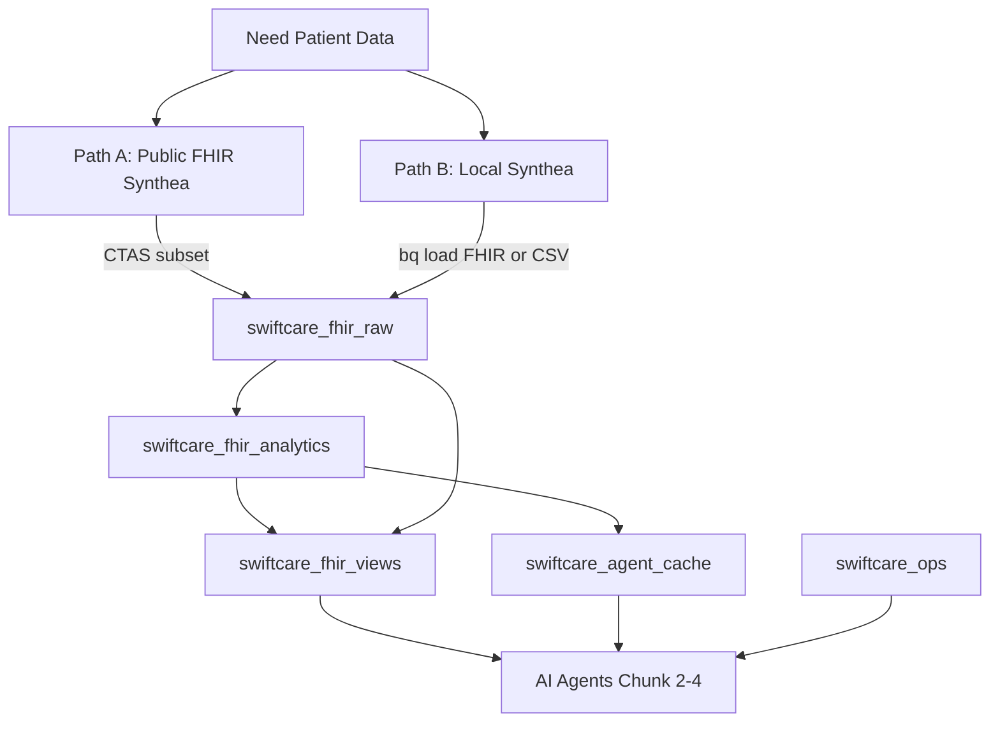
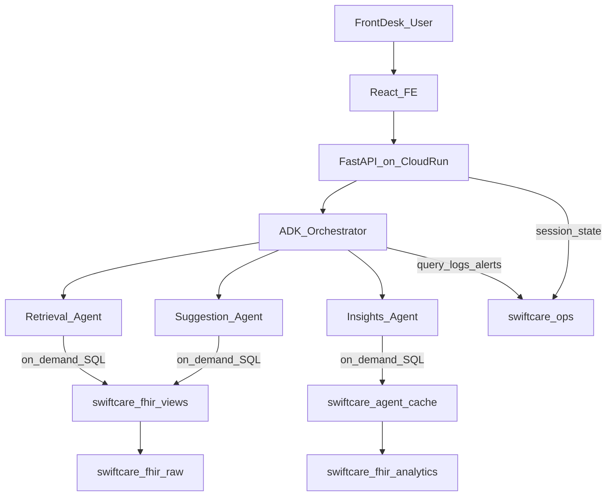
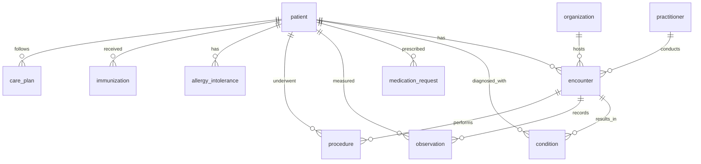

# Chunk 1: Patient Data Foundation for SwiftCare AI

**Scope:** Generate and gather FHIR patient data in BigQuery, define schema, validate quality, and prepare agent query contracts before Chunks 2–4.

---

# PART A — Human Review

> Review this section before implementation. Sign off on decisions in Section A.10.

## A.1 Executive Summary

Chunk 1 establishes the patient data foundation for **SwiftCare AI** — an agentic RAG healthcare operations platform with three agents:


| Agent                | Purpose                                                                         |
| -------------------- | ------------------------------------------------------------------------------- |
| **Retrieval Agent**  | Resolves natural-language queries against FHIR patient records in BigQuery      |
| **Suggestion Agent** | Surfaces guardrailed next-step advisories for clinical accountability           |
| **Insight Agent**    | Mines visit and follow-up patterns to flag at-risk patients and scheduling gaps |


All clinical and application data lives in **BigQuery only**. There is no Firestore, Firebase, or secondary database. Agents query BigQuery **on demand** at runtime via SQL.

Chunk 1 delivers:

1. A curated FHIR R4 patient cohort (5,000 patients) at **$0** infrastructure cost
2. A four-layer BigQuery architecture: raw FHIR → analytics → views → agent cache, plus ops tables
3. A structured validation framework (V1–V5) with pass/fail thresholds
4. Agent query contracts, refreshable cache snapshot tables, and a Patient 360° summary for Chunks 2–4

---

## A.2 Data Requirements

Front-desk and care-coordination workflows require the following data categories:


| Data Category             | Why It's Needed                                     | FHIR Resource        |
| ------------------------- | --------------------------------------------------- | -------------------- |
| Patient Demographics      | Identify and look up patients at front desk         | `Patient`            |
| Visit / Encounter History | Track visit patterns, scheduling, care coordination | `Encounter`          |
| Medical Conditions        | Clinical context for retrieval queries              | `Condition`          |
| Medications               | Current/past prescriptions for care coordination    | `MedicationRequest`  |
| Lab Results & Vitals      | Clinical observations for insight mining            | `Observation`        |
| Procedures                | Surgical/diagnostic procedures performed            | `Procedure`          |
| Allergies                 | Critical safety data for suggestion agent           | `AllergyIntolerance` |
| Immunizations             | Vaccination history for preventive care flags       | `Immunization`       |
| Care Plans                | Ongoing treatment plans for follow-up tracking      | `CarePlan`           |
| Appointments              | Scheduling data for insight agent analytics         | `Appointment`        |
| Practitioners             | Provider information for care team context          | `Practitioner`       |
| Organizations             | Facility/clinic information                         | `Organization`       |


---

## A.3 Key Decisions


| #   | Decision             | Choice                                            | Rationale                                                             |
| --- | -------------------- | ------------------------------------------------- | --------------------------------------------------------------------- |
| D1  | Data store           | BigQuery only                                     | Matches spec; single source of truth for clinical + application state |
| D2  | Primary data source  | `bigquery-public-data.fhir_synthea`               | Free, FHIR R4, longitudinal history, zero HIPAA risk, instant start   |
| D3  | Fallback data source | Local Synthea generation                          | Custom cohort (seed, state, size) when public dataset is insufficient |
| D4  | Ingestion mode       | One-time batch (CTAS or `bq load`)                | $0; no Cloud Healthcare API                                           |
| D5  | Cohort size          | 5,000 patients (minimum)                          | ~175K encounters, ~1M observations; stays within 10 GB free storage   |
| D6  | Schema pattern       | raw → analytics → views → agent cache + ops       | FHIR fidelity + query performance + agent-ready layer                 |
| D7  | Runtime access       | On-demand SQL per agent query                     | No chart replication; agents generate SQL against views/MVs           |
| D8  | Performance          | Clustered analytics tables + refreshable cache snapshot tables | Patient-scoped reads and predictable cache refreshes without MV query-shape limits |
| D9  | Validation           | 5-category runbook with blockers                  | Structured, repeatable, logged to `data_validation_runs`              |


---

## A.4 Features Delivered


| Feature               | Location                   | Description                                                                      |
| --------------------- | -------------------------- | -------------------------------------------------------------------------------- |
| FHIR raw tables       | `swiftcare_fhir_raw`       | Patient, Encounter, Condition, Observation, etc.                                 |
| Partitioned analytics | `swiftcare_fhir_analytics` | Flattened dim/fact tables with partitioning and clustering                       |
| Semantic views        | `swiftcare_fhir_views`     | Demographics, timeline, meds, allergies, visit summary, risk flags, Patient 360° |
| Cache snapshot tables | `swiftcare_agent_cache`    | Latest vitals, active medications, at-risk patients; rebuilt after ETL          |
| Ops tables            | `swiftcare_ops`            | Sessions, advisory cards, query logs, insight alerts, validation runs            |
| Validation runbook    | Part B §B.8                | V1–V5 checks with CHECK_ID, thresholds, severity                                 |
| Looker Studio         | `swiftcare_fhir_views`     | Optional $0 exploration dashboard                                                |


---

## A.5 Architecture

### Data sources and ingestion




**Path A (recommended):** Copy a 5,000-patient cohort from `bigquery-public-data.fhir_synthea` using `CREATE TABLE AS SELECT`. No Java, no GCS, no upload step.

**Path B (fallback):** Generate locally with [Synthea](https://github.com/synthetichealth/synthea) (Java 11+, Apache 2.0). Output FHIR R4 NDJSON or CSV, then load via `bq load`. Use when you need a fixed seed, specific US state module, or custom population parameters.

### Runtime (Chunks 2–6)




### What is NOT happening

- Patient FHIR data is not stored outside BigQuery
- Charts are not streamed or pre-downloaded to the application
- Agents do not read raw NDJSON bundles at query time
- Cloud Healthcare API FHIR store is not used (paid service)

### Example runtime flow

1. User asks: *"What medications is John Smith on?"*
2. FastAPI receives request with `patient_id` from `swiftcare_ops.sessions` or request body.
3. Retrieval Agent (ADK + Gemini) generates SQL against `v_active_medications` or `mv_active_medications`.
4. BigQuery returns rows; agent formats a natural-language response.
5. Response logged to `swiftcare_ops.agent_query_log`.

---

## A.6 Supplementary Data Sources


| Source                                                 | Format        | Use Case                                        | Cost     |
| ------------------------------------------------------ | ------------- | ----------------------------------------------- | -------- |
| `bigquery-public-data.fhir_synthea`                    | FHIR R4       | **Primary** — exploration and cohort copy       | $0       |
| `bigquery-public-data.cms_synthetic_patient_data_omop` | OMOP CDM      | Population-level insights supplement            | $0 query |
| Local Synthea                                          | FHIR R4 / CSV | Custom cohort with reproducible seed            | $0       |
| CMS DE-SynPUF                                          | Claims CSV    | Insurance/claims analytics (requires transform) | $0       |
| openFDA                                                | REST API      | Drug labeling supplement (no patient records)   | $0       |
| `gs://hcls_testing_data_fhir_10_patients/`             | FHIR bundles  | Schema smoke test only (10 patients)            | $0       |


Sources requiring credentialed access (MIMIC-IV, etc.) are excluded — unnecessary for front-desk workflows and incompatible with a zero-friction MVP.

---

## A.7 Cost Guarantee — $0 Data Stack


| Resource                   | Free Tier Limit                | Estimate (5K patients) | Cost |
| -------------------------- | ------------------------------ | ---------------------- | ---- |
| BigQuery storage           | 10 GB/month                    | ~3–5 GB                | $0   |
| BigQuery queries           | 1 TB processed/month           | ~50–100 GB during dev  | $0   |
| Public dataset queries     | Included in query quota        | Exploration only       | $0   |
| Views + cache snapshot tables | Snapshot storage counts toward 10 GB | ~500 MB                | $0   |
| Synthea (fallback)         | Open source                    | N/A                    | $0   |
| Looker Studio              | Free tier                      | 1 dashboard            | $0   |
| Cloud Healthcare API       | Pay-per-op                     | Not used               | —    |
| Firestore / Firebase       | —                              | Not used               | —    |


**Guardrails:** Use `LIMIT` during exploration; load exactly 5,000 patients for the cohort; always filter by `patient_id` in agent queries; set optional BigQuery quota alert at 2 GB/day processed.

---

## A.8 Trade-offs, Risks & Mitigations


| Trade-off / Risk                   | Mitigation                                                         |
| ---------------------------------- | ------------------------------------------------------------------ |
| Batch ingest, not real-time        | Acceptable for Chunk 1 setup; agents read snapshot data            |
| FHIR nested fields in raw tables   | Analytics layer + views flatten for agents                         |
| Public dataset table name variance | V1 schema check via `INFORMATION_SCHEMA` before ingest             |
| Exceed free tier                   | 5K patient cohort; partition large tables; use MVs for hot queries |
| Agent generates bad SQL            | V5 smoke tests; parameterized queries in contracts; query logs     |
| Session DML latency in BigQuery    | Acceptable for MVP; batch updates if needed                        |


---

## A.9 Entity Relationship Overview




---

## A.10 Exit Criteria — Human Sign-off

- [ ] Decisions in A.3 reviewed and accepted
- [ ] Patient cohort (5,000) loaded into `swiftcare_fhir_raw`
- [ ] Analytics tables created in `swiftcare_fhir_analytics` with partitioning
- [ ] All views in `swiftcare_fhir_views` including `v_patient_360`
- [ ] Refreshed cache snapshot tables in `swiftcare_agent_cache`
- [ ] Ops tables in `swiftcare_ops`
- [ ] V1–V5 validation completed with zero blocker failures
- [ ] Results logged in `swiftcare_ops.data_validation_runs`
- [ ] Runtime model confirmed: BigQuery only, on-demand SQL
- [ ] Ready for Chunk 2 (Retrieval Agent)

---

# PART B — Agentic Implementation

> Execute sections in order. Use `<!-- AGENT:... -->` markers to locate contracts. Replace `{{GCP_PROJECT_ID}}` with your project ID throughout.

---

## B.1 Environment Variables

```bash
GCP_PROJECT_ID=your-gcp-project-id
BQ_LOCATION=US
BQ_DATASET_RAW=swiftcare_fhir_raw
BQ_DATASET_ANALYTICS=swiftcare_fhir_analytics
BQ_DATASET_VIEWS=swiftcare_fhir_views
BQ_DATASET_CACHE=swiftcare_agent_cache
BQ_DATASET_OPS=swiftcare_ops
FHIR_PUBLIC_PROJECT=bigquery-public-data
FHIR_PUBLIC_DATASET=fhir_synthea
COHORT_PATIENT_LIMIT=5000
SYNTHEA_SEED=42
```

---

## B.2 Dataset Setup

```sql
CREATE SCHEMA IF NOT EXISTS `{{GCP_PROJECT_ID}}.swiftcare_fhir_raw`
  OPTIONS(location = 'US', description = 'FHIR R4 raw tables');

CREATE SCHEMA IF NOT EXISTS `{{GCP_PROJECT_ID}}.swiftcare_fhir_analytics`
  OPTIONS(location = 'US', description = 'Partitioned dim/fact tables flattened from FHIR');

CREATE SCHEMA IF NOT EXISTS `{{GCP_PROJECT_ID}}.swiftcare_fhir_views`
  OPTIONS(location = 'US', description = 'Agent-facing semantic views');

CREATE SCHEMA IF NOT EXISTS `{{GCP_PROJECT_ID}}.swiftcare_agent_cache`
  OPTIONS(location = 'US', description = 'Refreshable cache snapshot tables for hot agent queries');

CREATE SCHEMA IF NOT EXISTS `{{GCP_PROJECT_ID}}.swiftcare_ops`
  OPTIONS(location = 'US', description = 'Sessions, audit, advisories, validation');
```

---

## B.3 Ingestion — Path A: Public FHIR Synthea ($0)

### B.3.1 Discover public tables

```sql
SELECT table_name, table_type
FROM `bigquery-public-data.fhir_synthea.INFORMATION_SCHEMA.TABLES`
ORDER BY table_name;
```

### B.3.2 Select reproducible cohort

```sql
CREATE OR REPLACE TABLE `{{GCP_PROJECT_ID}}.swiftcare_fhir_raw._cohort_patient_ids` AS
SELECT id AS patient_id
FROM `bigquery-public-data.fhir_synthea.patient`
ORDER BY id
LIMIT 5000;
```

### B.3.3 Copy FHIR raw tables (filtered to cohort)

```sql
CREATE OR REPLACE TABLE `{{GCP_PROJECT_ID}}.swiftcare_fhir_raw.patient` AS
SELECT p.* FROM `bigquery-public-data.fhir_synthea.patient` p
JOIN `{{GCP_PROJECT_ID}}.swiftcare_fhir_raw._cohort_patient_ids` c ON p.id = c.patient_id;

CREATE OR REPLACE TABLE `{{GCP_PROJECT_ID}}.swiftcare_fhir_raw.encounter` AS
SELECT e.* FROM `bigquery-public-data.fhir_synthea.encounter` e
JOIN `{{GCP_PROJECT_ID}}.swiftcare_fhir_raw._cohort_patient_ids` c ON e.subject.patientId = c.patient_id;

CREATE OR REPLACE TABLE `{{GCP_PROJECT_ID}}.swiftcare_fhir_raw.condition` AS
SELECT x.* FROM `bigquery-public-data.fhir_synthea.condition` x
JOIN `{{GCP_PROJECT_ID}}.swiftcare_fhir_raw._cohort_patient_ids` c ON x.subject.patientId = c.patient_id;

CREATE OR REPLACE TABLE `{{GCP_PROJECT_ID}}.swiftcare_fhir_raw.observation` AS
SELECT x.* FROM `bigquery-public-data.fhir_synthea.observation` x
JOIN `{{GCP_PROJECT_ID}}.swiftcare_fhir_raw._cohort_patient_ids` c ON x.subject.patientId = c.patient_id;

CREATE OR REPLACE TABLE `{{GCP_PROJECT_ID}}.swiftcare_fhir_raw.medication_request` AS
SELECT x.* FROM `bigquery-public-data.fhir_synthea.medication_request` x
JOIN `{{GCP_PROJECT_ID}}.swiftcare_fhir_raw._cohort_patient_ids` c ON x.subject.patientId = c.patient_id;

CREATE OR REPLACE TABLE `{{GCP_PROJECT_ID}}.swiftcare_fhir_raw.procedure` AS
SELECT x.* FROM `bigquery-public-data.fhir_synthea.procedure` x
JOIN `{{GCP_PROJECT_ID}}.swiftcare_fhir_raw._cohort_patient_ids` c ON x.subject.patientId = c.patient_id;

CREATE OR REPLACE TABLE `{{GCP_PROJECT_ID}}.swiftcare_fhir_raw.allergy_intolerance` AS
SELECT x.* FROM `bigquery-public-data.fhir_synthea.allergy_intolerance` x
JOIN `{{GCP_PROJECT_ID}}.swiftcare_fhir_raw._cohort_patient_ids` c ON x.patient.patientId = c.patient_id;

CREATE OR REPLACE TABLE `{{GCP_PROJECT_ID}}.swiftcare_fhir_raw.immunization` AS
SELECT x.* FROM `bigquery-public-data.fhir_synthea.immunization` x
JOIN `{{GCP_PROJECT_ID}}.swiftcare_fhir_raw._cohort_patient_ids` c ON x.patient.patientId = c.patient_id;

CREATE OR REPLACE TABLE `{{GCP_PROJECT_ID}}.swiftcare_fhir_raw.diagnostic_report` AS
SELECT x.* FROM `bigquery-public-data.fhir_synthea.diagnostic_report` x
JOIN `{{GCP_PROJECT_ID}}.swiftcare_fhir_raw._cohort_patient_ids` c ON x.subject.patientId = c.patient_id;

CREATE OR REPLACE TABLE `{{GCP_PROJECT_ID}}.swiftcare_fhir_raw.care_plan` AS
SELECT x.* FROM `bigquery-public-data.fhir_synthea.care_plan` x
JOIN `{{GCP_PROJECT_ID}}.swiftcare_fhir_raw._cohort_patient_ids` c ON x.subject.patientId = c.patient_id;

CREATE OR REPLACE TABLE `{{GCP_PROJECT_ID}}.swiftcare_fhir_raw.organization` AS
SELECT * FROM `bigquery-public-data.fhir_synthea.organization`;

CREATE OR REPLACE TABLE `{{GCP_PROJECT_ID}}.swiftcare_fhir_raw.practitioner` AS
SELECT * FROM `bigquery-public-data.fhir_synthea.practitioner`;

```

> **Schema compatibility gate:** table *and field* names in `fhir_synthea` are
> implementation-specific. The checked-in pipeline uses snake-case resource
> tables such as `medication_request`, `allergy_intolerance`,
> `diagnostic_report`, and `care_plan` (not the camel-case names above), and
> its resource fields use paths such as `condition.context.encounterId`,
> `condition.onset.dateTime`, and `medication_request.medication.codeableConcept`.
> Run `INFORMATION_SCHEMA.COLUMN_FIELD_PATHS` for every resource before copying
> this snippet. Treat [`sql/02_ingest_cohort.sql`](../sql/02_ingest_cohort.sql)
> and [`sql/03_analytics_etl.sql`](../sql/03_analytics_etl.sql) as the executable
> source of truth for this repository; do not mix field paths from another FHIR
> BigQuery export into the ETL.

---

## B.4 Ingestion — Path B: Local Synthea (Fallback)

```bash
# Prerequisites: Java 11+
java -version
git clone https://github.com/synthetichealth/synthea.git
cd synthea

# Generate 5000 patients with fixed seed (reproducible)
./run_synthea -s 42 -p 5000 Massachusetts \
  --exporter.fhir.export=true \
  --exporter.csv.export=true

# Output: ./output/fhir/ (NDJSON) and ./output/csv/
```

Recommended `synthea.properties` overrides for larger cohorts:

```properties
exporter.csv.export = true
exporter.fhir.export = true
exporter.fhir.bulk_data = true
generate.default_population = 5000
exporter.years_of_history = 10
```

Load CSV into BigQuery (if using CSV path):

```bash
bq load --source_format=CSV --autodetect \
  {{GCP_PROJECT_ID}}:swiftcare_fhir_raw.patients_csv \
  ./output/csv/patients.csv
```

Then run analytics ETL (B.5) to flatten CSV or FHIR raw into the analytics layer.

---

## B.5 Analytics Layer — Partitioned Dim/Fact Tables

ETL from FHIR raw into flattened tables for performant agent queries. Partitioning
is useful only when the source dates are reliably populated and queries filter on
them; the checked-in ETL clusters by `patient_id` and clinical code instead. Do
not claim a table is partitioned unless the deployed DDL contains `PARTITION BY`.

### B.5.1 `dim_patients`

```sql
CREATE OR REPLACE TABLE `{{GCP_PROJECT_ID}}.swiftcare_fhir_analytics.dim_patients` AS
SELECT
  p.id AS patient_id,
  p.name[SAFE_OFFSET(0)].given[SAFE_OFFSET(0)] AS first_name,
  p.name[SAFE_OFFSET(0)].family AS last_name,
  DATE(p.birthDate) AS birth_date,
  DATE(p.deathDate) AS death_date,
  p.gender,
  p.address[SAFE_OFFSET(0)].city AS city,
  p.address[SAFE_OFFSET(0)].state AS state,
  p.address[SAFE_OFFSET(0)].postalCode AS zip,
  COALESCE(p.deceased.boolean, FALSE) AS is_deceased,
  DATE_DIFF(CURRENT_DATE(), DATE(p.birthDate), YEAR) AS age_years,
  CURRENT_TIMESTAMP() AS created_at
FROM `{{GCP_PROJECT_ID}}.swiftcare_fhir_raw.patient` p;
```

### B.5.2 `fact_encounters`

```sql
CREATE OR REPLACE TABLE `{{GCP_PROJECT_ID}}.swiftcare_fhir_analytics.fact_encounters`
CLUSTER BY patient_id, encounter_class AS
SELECT
  e.id AS encounter_id,
  e.subject.patientId AS patient_id,
  e.participant[SAFE_OFFSET(0)].individual.practitionerId AS provider_id,
  e.serviceProvider.organizationId AS organization_id,
  e.class.code AS encounter_class,
  COALESCE(e.type[SAFE_OFFSET(0)].text, e.type[SAFE_OFFSET(0)].coding[SAFE_OFFSET(0)].display) AS encounter_desc,
  COALESCE(e.reason[SAFE_OFFSET(0)].text, e.reason[SAFE_OFFSET(0)].coding[SAFE_OFFSET(0)].display) AS reason_desc,
  DATE(e.period.start) AS visit_date,
  TIMESTAMP(e.period.start) AS start_datetime,
  TIMESTAMP(e.period.end) AS stop_datetime,
  e.status,
  CURRENT_TIMESTAMP() AS created_at
FROM `{{GCP_PROJECT_ID}}.swiftcare_fhir_raw.encounter` e;
```

### B.5.3 `fact_conditions`

```sql
CREATE OR REPLACE TABLE `{{GCP_PROJECT_ID}}.swiftcare_fhir_analytics.fact_conditions`
CLUSTER BY patient_id, condition_code AS
SELECT
  c.id AS condition_id,
  c.subject.patientId AS patient_id,
  c.context.encounterId AS encounter_id,
  c.code.coding[SAFE_OFFSET(0)].code AS condition_code,
  c.code.text AS condition_desc,
  DATE(c.onset.dateTime) AS onset_date,
  DATE(COALESCE(c.abatement.dateTime, c.abatement.period.start)) AS abatement_date,
  c.clinicalStatus = 'active' AS is_active,
  CURRENT_TIMESTAMP() AS created_at
FROM `{{GCP_PROJECT_ID}}.swiftcare_fhir_raw.condition` c;
```

### B.5.4 `fact_medications`

```sql
CREATE OR REPLACE TABLE `{{GCP_PROJECT_ID}}.swiftcare_fhir_analytics.fact_medications`
CLUSTER BY patient_id, medication_code AS
SELECT
  m.id AS medication_id,
  m.subject.patientId AS patient_id,
  m.context.encounterId AS encounter_id,
  m.medication.codeableConcept.coding[SAFE_OFFSET(0)].code AS medication_code,
  m.medication.codeableConcept.text AS medication_desc,
  DATE(m.authoredOn) AS start_date,
  m.status IN ('active', 'on-hold') AS is_active,
  m.status,
  CURRENT_TIMESTAMP() AS created_at
FROM `{{GCP_PROJECT_ID}}.swiftcare_fhir_raw.medication_request` m;
```

### B.5.5 `fact_observations`

```sql
CREATE OR REPLACE TABLE `{{GCP_PROJECT_ID}}.swiftcare_fhir_analytics.fact_observations`
PARTITION BY observation_date
CLUSTER BY patient_id, category, observation_code AS
SELECT
  o.id AS observation_id,
  o.subject.patientId AS patient_id,
  o.context.encounterId AS encounter_id,
  DATE(COALESCE(o.effective.dateTime, o.effective.period.start)) AS observation_date,
  COALESCE(o.category[SAFE_OFFSET(0)].coding[SAFE_OFFSET(0)].code, o.category[SAFE_OFFSET(0)].text) AS category,
  o.code.coding[SAFE_OFFSET(0)].code AS observation_code,
  o.code.text AS observation_desc,
  o.value.quantity.value AS value_numeric,
  o.value.quantity.unit AS units,
  CAST(NULL AS STRING) AS value_string,
  CURRENT_TIMESTAMP() AS created_at
FROM `{{GCP_PROJECT_ID}}.swiftcare_fhir_raw.observation` o;
```

### B.5.6 `fact_allergies`

```sql
CREATE OR REPLACE TABLE `{{GCP_PROJECT_ID}}.swiftcare_fhir_analytics.fact_allergies`
CLUSTER BY patient_id AS
SELECT
  a.id AS allergy_id,
  a.patient.patientId AS patient_id,
  a.code.text AS allergy_desc,
  a.criticality,
  a.clinicalStatus = 'active' AS is_active,
  CURRENT_TIMESTAMP() AS created_at
FROM `{{GCP_PROJECT_ID}}.swiftcare_fhir_raw.allergy_intolerance` a;
```

### B.5.7 `dim_providers` and `dim_organizations`

```sql
CREATE OR REPLACE TABLE `{{GCP_PROJECT_ID}}.swiftcare_fhir_analytics.dim_providers` AS
SELECT
  id AS provider_id,
  name[SAFE_OFFSET(0)].text AS provider_name,
  qualification[SAFE_OFFSET(0)].code.text AS speciality
FROM `{{GCP_PROJECT_ID}}.swiftcare_fhir_raw.practitioner`;

CREATE OR REPLACE TABLE `{{GCP_PROJECT_ID}}.swiftcare_fhir_analytics.dim_organizations` AS
SELECT
  id AS organization_id,
  name AS org_name,
  address[SAFE_OFFSET(0)].city AS city,
  address[SAFE_OFFSET(0)].state AS state
FROM `{{GCP_PROJECT_ID}}.swiftcare_fhir_raw.organization`;
```

---

## B.6 FHIR Resource Mapping Reference


| FHIR R4 Resource     | Raw Table            | Analytics Table     | Code System |
| -------------------- | -------------------- | ------------------- | ----------- |
| `Patient`            | `patient`            | `dim_patients`      | —           |
| `Encounter`          | `encounter`          | `fact_encounters`   | SNOMED-CT   |
| `Condition`          | `condition`          | `fact_conditions`   | SNOMED-CT   |
| `MedicationRequest`  | `medication_request` | `fact_medications`  | RxNorm      |
| `Observation`        | `observation`        | `fact_observations` | LOINC       |
| `Procedure`          | `procedure`          | — (use raw + views) | SNOMED-CT   |
| `AllergyIntolerance` | `allergy_intolerance`| `fact_allergies`    | SNOMED-CT   |
| `Immunization`       | `immunization`       | — (use raw + views) | CVX         |
| `CarePlan`           | `care_plan`          | — (use raw + views) | SNOMED-CT   |
| `Organization`       | `organization`       | `dim_organizations` | —           |
| `Practitioner`       | `practitioner`       | `dim_providers`     | —           |


---

## B.7 Ops Tables

```sql
CREATE TABLE IF NOT EXISTS `{{GCP_PROJECT_ID}}.swiftcare_ops.sessions` (
  session_id        STRING NOT NULL,
  user_id           STRING,
  active_patient_id STRING,
  created_at        TIMESTAMP DEFAULT CURRENT_TIMESTAMP(),
  updated_at        TIMESTAMP DEFAULT CURRENT_TIMESTAMP()
);

CREATE TABLE IF NOT EXISTS `{{GCP_PROJECT_ID}}.swiftcare_ops.advisory_cards` (
  card_id      STRING NOT NULL,
  session_id   STRING,
  patient_id   STRING NOT NULL,
  agent_type   STRING,
  content      STRING,
  source_refs  STRING,
  dismissed    BOOL DEFAULT FALSE,
  created_at   TIMESTAMP DEFAULT CURRENT_TIMESTAMP()
);

CREATE TABLE IF NOT EXISTS `{{GCP_PROJECT_ID}}.swiftcare_ops.agent_query_log` (
  log_id                 STRING NOT NULL,
  session_id             STRING,
  agent_type             STRING NOT NULL,
  patient_id             STRING,
  natural_language_query STRING,
  generated_sql          STRING,
  row_count              INT64,
  latency_ms             INT64,
  created_at             TIMESTAMP DEFAULT CURRENT_TIMESTAMP()
);

CREATE TABLE IF NOT EXISTS `{{GCP_PROJECT_ID}}.swiftcare_ops.insight_alerts` (
  alert_id   STRING NOT NULL,
  patient_id STRING NOT NULL,
  alert_type STRING,
  severity   STRING,
  message    STRING,
  dismissed  BOOL DEFAULT FALSE,
  created_at TIMESTAMP DEFAULT CURRENT_TIMESTAMP()
);

CREATE TABLE IF NOT EXISTS `{{GCP_PROJECT_ID}}.swiftcare_ops.patient_access_audit` (
  audit_id   STRING NOT NULL,
  user_id    STRING,
  patient_id STRING NOT NULL,
  action     STRING,
  created_at TIMESTAMP DEFAULT CURRENT_TIMESTAMP()
);

CREATE TABLE IF NOT EXISTS `{{GCP_PROJECT_ID}}.swiftcare_ops.data_validation_runs` (
  run_id        STRING NOT NULL,
  run_timestamp TIMESTAMP NOT NULL,
  check_id      STRING NOT NULL,
  check_name    STRING,
  severity      STRING,
  expected      STRING,
  actual        STRING,
  passed        BOOL,
  details       STRING
);
```

---

## B.8 Semantic Views

### B.8.1 `v_patient_demographics`

```sql
CREATE OR REPLACE VIEW `{{GCP_PROJECT_ID}}.swiftcare_fhir_views.v_patient_demographics` AS
SELECT * FROM `{{GCP_PROJECT_ID}}.swiftcare_fhir_analytics.dim_patients`;
```

### B.8.2 `v_patient_timeline`

```sql
CREATE OR REPLACE VIEW `{{GCP_PROJECT_ID}}.swiftcare_fhir_views.v_patient_timeline` AS
SELECT patient_id, event_date, event_type, event_label, source_id, encounter_id FROM (
  SELECT patient_id, visit_date AS event_date, 'encounter' AS event_type,
         encounter_desc AS event_label, encounter_id AS source_id, encounter_id
  FROM `{{GCP_PROJECT_ID}}.swiftcare_fhir_analytics.fact_encounters`
  UNION ALL
  SELECT patient_id, onset_date, 'condition', condition_desc, condition_id, encounter_id
  FROM `{{GCP_PROJECT_ID}}.swiftcare_fhir_analytics.fact_conditions`
  UNION ALL
  SELECT patient_id, observation_date, 'observation', observation_desc, observation_id, encounter_id
  FROM `{{GCP_PROJECT_ID}}.swiftcare_fhir_analytics.fact_observations`
  UNION ALL
  SELECT patient_id, start_date, 'medication', medication_desc, medication_id, encounter_id
  FROM `{{GCP_PROJECT_ID}}.swiftcare_fhir_analytics.fact_medications`
);
```

### B.8.3 `v_active_medications`

```sql
CREATE OR REPLACE VIEW `{{GCP_PROJECT_ID}}.swiftcare_fhir_views.v_active_medications` AS
SELECT patient_id, medication_id, medication_code, medication_desc AS medication_name,
       start_date AS prescribed_date, status
FROM `{{GCP_PROJECT_ID}}.swiftcare_fhir_analytics.fact_medications`
WHERE is_active = TRUE;
```

### B.8.4 `v_active_allergies`

```sql
CREATE OR REPLACE VIEW `{{GCP_PROJECT_ID}}.swiftcare_fhir_views.v_active_allergies` AS
SELECT patient_id, allergy_id, allergy_desc AS allergen, criticality
FROM `{{GCP_PROJECT_ID}}.swiftcare_fhir_analytics.fact_allergies`
WHERE is_active = TRUE;
```

### B.8.5 `v_visit_summary`

```sql
CREATE OR REPLACE VIEW `{{GCP_PROJECT_ID}}.swiftcare_fhir_views.v_visit_summary` AS
SELECT encounter_id, patient_id, visit_date, encounter_class, encounter_desc AS visit_type,
       reason_desc AS chief_complaint, status
FROM `{{GCP_PROJECT_ID}}.swiftcare_fhir_analytics.fact_encounters`;
```

### B.8.6 `v_risk_flags`

```sql
CREATE OR REPLACE VIEW `{{GCP_PROJECT_ID}}.swiftcare_fhir_views.v_risk_flags` AS
WITH
-- Anchor synthetic-data rules to the cohort's newest encounter. CURRENT_DATE()
-- would label nearly every historical Synthea patient as overdue as time passes.
as_of AS (
  SELECT MAX(visit_date) AS as_of_date
  FROM `{{GCP_PROJECT_ID}}.swiftcare_fhir_analytics.fact_encounters`
),
enc AS (
  SELECT patient_id, COUNT(*) AS total_encounters,
         MAX(visit_date) AS last_visit_date,
         COUNTIF(visit_date >= DATE_SUB(as_of.as_of_date, INTERVAL 90 DAY)) AS encounters_last_90d
  FROM `{{GCP_PROJECT_ID}}.swiftcare_fhir_analytics.fact_encounters`
  CROSS JOIN as_of
  GROUP BY patient_id
),
meds AS (
  SELECT patient_id, COUNT(*) AS active_med_count
  FROM `{{GCP_PROJECT_ID}}.swiftcare_fhir_analytics.fact_medications` WHERE is_active GROUP BY 1
),
conds AS (
  SELECT patient_id, COUNT(*) AS active_condition_count
  FROM `{{GCP_PROJECT_ID}}.swiftcare_fhir_analytics.fact_conditions` WHERE is_active GROUP BY 1
)
SELECT p.patient_id, p.first_name, p.last_name, p.age_years,
       COALESCE(e.total_encounters, 0) AS total_encounters,
       e.last_visit_date,
       DATE_DIFF(as_of.as_of_date, e.last_visit_date, DAY) AS days_since_last_visit,
       COALESCE(e.encounters_last_90d, 0) AS encounters_last_90d,
       COALESCE(m.active_med_count, 0) AS active_med_count,
       COALESCE(c.active_condition_count, 0) AS active_condition_count,
       CASE
         WHEN DATE_DIFF(as_of.as_of_date, e.last_visit_date, DAY) > 365 THEN 'gap_in_care'
         WHEN COALESCE(m.active_med_count, 0) >= 5 THEN 'polypharmacy'
         WHEN COALESCE(e.encounters_last_90d, 0) >= 5 THEN 'high_utilizer'
         WHEN COALESCE(c.active_condition_count, 0) >= 3 THEN 'chronic_burden'
         ELSE 'none'
       END AS risk_flag,
       CASE
         WHEN COALESCE(e.encounters_last_90d, 0) >= 5 THEN 'HIGH'
         WHEN COALESCE(c.active_condition_count, 0) >= 3 THEN 'MEDIUM'
         WHEN DATE_DIFF(as_of.as_of_date, e.last_visit_date, DAY) > 180 THEN 'MEDIUM'
         ELSE 'LOW'
       END AS risk_level
FROM `{{GCP_PROJECT_ID}}.swiftcare_fhir_analytics.dim_patients` p
LEFT JOIN enc e ON p.patient_id = e.patient_id
LEFT JOIN meds m ON p.patient_id = m.patient_id
LEFT JOIN conds c ON p.patient_id = c.patient_id
CROSS JOIN as_of
WHERE NOT COALESCE(p.is_deceased, FALSE);
```

For a production feed, replace `as_of.as_of_date` with a governed reporting
date (usually `CURRENT_DATE()` in the clinic's reporting timezone). Record that
date with each risk run; otherwise a dashboard cannot distinguish a genuine care
gap from an aging static dataset.

### B.8.7 `v_patient_360`

```sql
CREATE OR REPLACE VIEW `{{GCP_PROJECT_ID}}.swiftcare_fhir_views.v_patient_360` AS
SELECT
  p.patient_id, p.first_name, p.last_name, p.birth_date, p.age_years, p.gender,
  p.city, p.state, p.is_deceased,
  le.encounter_class AS last_encounter_class,
  le.encounter_desc AS last_encounter_desc,
  le.visit_date AS last_visit_date,
  (SELECT COUNT(*) FROM `{{GCP_PROJECT_ID}}.swiftcare_fhir_analytics.fact_conditions` c
   WHERE c.patient_id = p.patient_id AND c.is_active) AS active_conditions_count,
  (SELECT COUNT(*) FROM `{{GCP_PROJECT_ID}}.swiftcare_fhir_analytics.fact_medications` m
   WHERE m.patient_id = p.patient_id AND m.is_active) AS active_medications_count,
  (SELECT COUNT(*) FROM `{{GCP_PROJECT_ID}}.swiftcare_fhir_analytics.fact_allergies` a
   WHERE a.patient_id = p.patient_id AND a.is_active) AS active_allergies_count,
  (SELECT COUNT(*) FROM `{{GCP_PROJECT_ID}}.swiftcare_fhir_analytics.fact_encounters` e
   WHERE e.patient_id = p.patient_id) AS total_encounters
FROM `{{GCP_PROJECT_ID}}.swiftcare_fhir_analytics.dim_patients` p
LEFT JOIN (
  SELECT *, ROW_NUMBER() OVER (PARTITION BY patient_id ORDER BY visit_date DESC) AS rn
  FROM `{{GCP_PROJECT_ID}}.swiftcare_fhir_analytics.fact_encounters`
) le ON le.patient_id = p.patient_id AND le.rn = 1;
```

---

## B.9 Agent Cache Snapshot Tables

The following objects are deliberately **snapshot tables**, despite the legacy
`mv_` names. BigQuery materialized views have source/query-shape restrictions
(including restrictions around logical views) that make the `v_risk_flags`
dependency unsuitable. Rebuild these tables after the analytics tables and
semantic views, and expose their refresh timestamp to operators. Do not use
`CREATE MATERIALIZED VIEW` for these definitions.

### B.9.1 Latest vitals

```sql
CREATE OR REPLACE TABLE `{{GCP_PROJECT_ID}}.swiftcare_agent_cache.mv_patient_latest_vitals` AS
WITH ranked AS (
  SELECT
    patient_id, observation_code, value_numeric, observation_date,
    ROW_NUMBER() OVER (
      PARTITION BY patient_id, observation_code
      ORDER BY observation_date DESC, observation_id DESC
    ) AS rn
  FROM `{{GCP_PROJECT_ID}}.swiftcare_fhir_analytics.fact_observations`
  WHERE category = 'vital-signs'
), latest AS (
  SELECT * FROM ranked WHERE rn = 1
)
SELECT
  patient_id,
  MAX(IF(observation_code = '8302-2', value_numeric, NULL))  AS height_cm,
  MAX(IF(observation_code = '29463-7', value_numeric, NULL)) AS weight_kg,
  MAX(IF(observation_code = '39156-5', value_numeric, NULL)) AS bmi,
  MAX(IF(observation_code = '8480-6', value_numeric, NULL))  AS systolic_bp,
  MAX(IF(observation_code = '8462-4', value_numeric, NULL))  AS diastolic_bp,
  MAX(IF(observation_code = '8867-4', value_numeric, NULL))  AS heart_rate,
  MAX(IF(observation_code = '9279-1', value_numeric, NULL))  AS respiratory_rate,
  MAX(observation_date) AS latest_observation_date,
  CURRENT_TIMESTAMP() AS cache_refreshed_at
FROM latest
GROUP BY patient_id;
```

### B.9.2 Active medications

```sql
CREATE OR REPLACE TABLE `{{GCP_PROJECT_ID}}.swiftcare_agent_cache.mv_active_medications` AS
SELECT m.patient_id, p.first_name, p.last_name, m.medication_code, m.medication_desc,
       m.start_date, m.status
FROM `{{GCP_PROJECT_ID}}.swiftcare_fhir_analytics.fact_medications` m
JOIN `{{GCP_PROJECT_ID}}.swiftcare_fhir_analytics.dim_patients` p ON m.patient_id = p.patient_id
WHERE m.is_active = TRUE;
```

### B.9.3 At-risk patients

```sql
CREATE OR REPLACE TABLE `{{GCP_PROJECT_ID}}.swiftcare_agent_cache.mv_at_risk_patients` AS
SELECT patient_id, first_name, last_name, age_years, encounters_last_90d,
       active_condition_count, active_med_count, days_since_last_visit, risk_flag, risk_level
FROM `{{GCP_PROJECT_ID}}.swiftcare_fhir_views.v_risk_flags`
WHERE risk_flag != 'none';
```

---

## B.10 Data Dictionary


| Object               | Column                     | Type   | Description                                                    |
| -------------------- | -------------------------- | ------ | -------------------------------------------------------------- |
| `dim_patients`       | `patient_id`               | STRING | FHIR Patient.id (UUID)                                         |
| `fact_encounters`    | `encounter_class`          | STRING | ambulatory, emergency, inpatient, wellness, urgentcare         |
| `fact_observations`  | `observation_code`         | STRING | LOINC code (e.g. 8480-6 = systolic BP)                         |
| `v_patient_timeline` | `event_type`               | STRING | encounter, condition, observation, medication                  |
| `v_risk_flags`       | `risk_flag`                | STRING | gap_in_care, polypharmacy, high_utilizer, chronic_burden, none |
| `v_risk_flags`       | `risk_level`               | STRING | HIGH, MEDIUM, LOW                                              |
| `v_patient_360`      | `active_medications_count` | INT64  | Count of active prescriptions                                  |
| `sessions`           | `active_patient_id`        | STRING | Currently selected patient in UI                               |
| `advisory_cards`     | `dismissed`                | BOOL   | Front-desk dismissed the advisory                              |


---

## B.11 Validation Runbook

Run in order. Stop on blocker failure. Log results to `swiftcare_ops.data_validation_runs`.

### V1 — Schema (blockers)

```
CHECK_ID: V1-001 | NAME: raw_tables_exist | SEVERITY: blocker
SQL: SELECT COUNT(*) AS cnt FROM `{{GCP_PROJECT_ID}}.swiftcare_fhir_raw.INFORMATION_SCHEMA.TABLES`
     WHERE table_name IN ('patient','encounter','condition','observation','medication_request')
EXPECTED: cnt = 5
```

```
CHECK_ID: V1-002 | NAME: analytics_tables_exist | SEVERITY: blocker
SQL: SELECT COUNT(*) AS cnt FROM `{{GCP_PROJECT_ID}}.swiftcare_fhir_analytics.INFORMATION_SCHEMA.TABLES`
     WHERE table_name IN ('dim_patients','fact_encounters','fact_conditions','fact_medications','fact_observations')
EXPECTED: cnt = 5
```

```
CHECK_ID: V1-003 | NAME: views_and_cache_tables_exist | SEVERITY: blocker
SQL: SELECT COUNT(*) FROM `{{GCP_PROJECT_ID}}.swiftcare_fhir_views.INFORMATION_SCHEMA.TABLES`
     WHERE table_name IN ('v_patient_demographics','v_patient_timeline','v_patient_360','v_risk_flags')
EXPECTED: cnt = 4
```

```
CHECK_ID: V1-004 | NAME: cohort_size | SEVERITY: blocker
SQL: SELECT COUNT(*) FROM `{{GCP_PROJECT_ID}}.swiftcare_fhir_raw._cohort_patient_ids`
EXPECTED: = 5000
```

### V2 — Referential Integrity (blocker if orphan_rate > 1%)

```
CHECK_ID: V2-001 | NAME: orphaned_encounters | SEVERITY: blocker
SQL:
  WITH o AS (SELECT COUNT(*) AS n FROM `{{GCP_PROJECT_ID}}.swiftcare_fhir_analytics.fact_encounters` e
             LEFT JOIN `{{GCP_PROJECT_ID}}.swiftcare_fhir_analytics.dim_patients` p ON e.patient_id = p.patient_id
             WHERE p.patient_id IS NULL),
       t AS (SELECT COUNT(*) AS n FROM `{{GCP_PROJECT_ID}}.swiftcare_fhir_analytics.fact_encounters`)
  SELECT SAFE_DIVIDE(o.n, t.n) AS orphan_rate FROM o, t
THRESHOLD: < 0.01
```

### V3 — Completeness (warnings if < 80%)

```
CHECK_ID: V3-001 | NAME: patients_with_encounters | SEVERITY: warning
SQL:
  WITH c AS (SELECT patient_id FROM `{{GCP_PROJECT_ID}}.swiftcare_fhir_raw._cohort_patient_ids`),
       e AS (SELECT DISTINCT patient_id FROM `{{GCP_PROJECT_ID}}.swiftcare_fhir_analytics.fact_encounters`)
  SELECT SAFE_DIVIDE(COUNT(e.patient_id), COUNT(c.patient_id)) AS coverage FROM c LEFT JOIN e USING (patient_id)
THRESHOLD: >= 0.80
```

### V4 — Temporal Sanity (blockers)

```
CHECK_ID: V4-001 | NAME: no_future_encounters | SEVERITY: blocker
SQL: SELECT COUNT(*) FROM `{{GCP_PROJECT_ID}}.swiftcare_fhir_analytics.fact_encounters` WHERE visit_date > CURRENT_DATE()
EXPECTED: 0
```

```
CHECK_ID: V4-002 | NAME: birth_before_encounters | SEVERITY: blocker
SQL: SELECT COUNT(*) FROM `{{GCP_PROJECT_ID}}.swiftcare_fhir_analytics.fact_encounters` e
     JOIN `{{GCP_PROJECT_ID}}.swiftcare_fhir_analytics.dim_patients` p ON e.patient_id = p.patient_id
     WHERE e.visit_date < p.birth_date
EXPECTED: 0
```

### V5 — Agent Readiness (blockers)

```
CHECK_ID: V5-001 | NAME: retrieval_patient_360_smoke | SEVERITY: blocker
SQL: SELECT * FROM `{{GCP_PROJECT_ID}}.swiftcare_fhir_views.v_patient_360` LIMIT 1
EXPECTED: 1 row; patient_id, first_name, last_name non-null
```

```
CHECK_ID: V5-002 | NAME: retrieval_timeline_smoke | SEVERITY: blocker
SQL: SELECT * FROM `{{GCP_PROJECT_ID}}.swiftcare_fhir_views.v_patient_timeline`
     WHERE patient_id = (SELECT patient_id FROM `{{GCP_PROJECT_ID}}.swiftcare_fhir_views.v_patient_360` LIMIT 1)
     ORDER BY event_date DESC LIMIT 5
EXPECTED: >= 1 row
```

```
CHECK_ID: V5-003 | NAME: suggestion_meds_allergies_smoke | SEVERITY: blocker
SQL: SELECT (SELECT COUNT(*) FROM `{{GCP_PROJECT_ID}}.swiftcare_fhir_views.v_active_medications`) AS meds,
            (SELECT COUNT(*) FROM `{{GCP_PROJECT_ID}}.swiftcare_fhir_views.v_active_allergies`) AS allergies
EXPECTED: meds > 0
```

```
CHECK_ID: V5-004 | NAME: insights_at_risk_smoke | SEVERITY: blocker
SQL: SELECT * FROM `{{GCP_PROJECT_ID}}.swiftcare_agent_cache.mv_at_risk_patients` LIMIT 10
EXPECTED: >= 1 row
```

```
CHECK_ID: V5-005 | NAME: retrieval_vitals_smoke | SEVERITY: blocker
SQL: SELECT * FROM `{{GCP_PROJECT_ID}}.swiftcare_agent_cache.mv_patient_latest_vitals` LIMIT 5
EXPECTED: >= 1 row with at least one vital populated
```

Log results:

```sql
INSERT INTO `{{GCP_PROJECT_ID}}.swiftcare_ops.data_validation_runs`
  (run_id, run_timestamp, check_id, check_name, severity, expected, actual, passed, details)
VALUES ('RUN-001', CURRENT_TIMESTAMP(), 'V2-001', 'orphaned_encounters', 'blocker', '< 0.01', '<actual>', TRUE, '');
```

---

## B.12 Agent Query Contracts


| Agent      | Primary objects                                                                          | Required filter            | Example                               |
| ---------- | ---------------------------------------------------------------------------------------- | -------------------------- | ------------------------------------- |
| Retrieval  | `v_patient_360`, `v_patient_timeline`, `mv_patient_latest_vitals`                        | `patient_id` or name       | "Show chart summary for patient X"    |
| Suggestion | `v_active_medications`, `v_active_allergies`, `v_visit_summary`, `mv_active_medications` | `patient_id`               | "Flag scheduling risks for patient X" |
| Insights   | `v_risk_flags`, `mv_at_risk_patients`                                                    | population or `patient_id` | "Which patients have care gaps?"      |


### Retrieval Agent

```sql
SELECT patient_id, first_name, last_name, age_years, last_visit_date,
       active_conditions_count, active_medications_count
FROM `{{GCP_PROJECT_ID}}.swiftcare_fhir_views.v_patient_360`
WHERE LOWER(last_name) = LOWER(@last_name) LIMIT 20;

SELECT event_date, event_type, event_label
FROM `{{GCP_PROJECT_ID}}.swiftcare_fhir_views.v_patient_timeline`
WHERE patient_id = @patient_id ORDER BY event_date DESC LIMIT 50;
```

### Suggestion Agent

```sql
SELECT medication_name, status, prescribed_date
FROM `{{GCP_PROJECT_ID}}.swiftcare_fhir_views.v_active_medications`
WHERE patient_id = @patient_id;

SELECT allergen, criticality FROM `{{GCP_PROJECT_ID}}.swiftcare_fhir_views.v_active_allergies`
WHERE patient_id = @patient_id;
```

### Insights Agent

```sql
SELECT patient_id, first_name, last_name, risk_flag, risk_level, days_since_last_visit
FROM `{{GCP_PROJECT_ID}}.swiftcare_agent_cache.mv_at_risk_patients`
ORDER BY days_since_last_visit DESC LIMIT 50;
```

### Session management

```sql
INSERT INTO `{{GCP_PROJECT_ID}}.swiftcare_ops.sessions` (session_id, user_id, active_patient_id)
VALUES (@session_id, @user_id, @patient_id);

UPDATE `{{GCP_PROJECT_ID}}.swiftcare_ops.sessions`
SET active_patient_id = @patient_id, updated_at = CURRENT_TIMESTAMP()
WHERE session_id = @session_id;
```

---

## B.13 Exploration Queries

```sql
-- Row counts
SELECT 'patient' AS tbl, COUNT(*) AS cnt FROM `{{GCP_PROJECT_ID}}.swiftcare_fhir_raw.patient`
UNION ALL SELECT 'encounter', COUNT(*) FROM `{{GCP_PROJECT_ID}}.swiftcare_fhir_raw.encounter`
UNION ALL SELECT 'observation', COUNT(*) FROM `{{GCP_PROJECT_ID}}.swiftcare_fhir_raw.observation`;

-- Gender distribution
SELECT gender, COUNT(*) AS cnt FROM `{{GCP_PROJECT_ID}}.swiftcare_fhir_views.v_patient_demographics` GROUP BY gender;

-- Top conditions
SELECT event_label, COUNT(*) AS cnt FROM `{{GCP_PROJECT_ID}}.swiftcare_fhir_views.v_patient_timeline`
WHERE event_type = 'condition' GROUP BY event_label ORDER BY cnt DESC LIMIT 10;

-- Care gaps
SELECT * FROM `{{GCP_PROJECT_ID}}.swiftcare_fhir_views.v_risk_flags`
WHERE risk_flag = 'gap_in_care' ORDER BY days_since_last_visit DESC LIMIT 20;

-- Encounter class breakdown
SELECT encounter_class, COUNT(*) FROM `{{GCP_PROJECT_ID}}.swiftcare_fhir_views.v_visit_summary`
GROUP BY encounter_class ORDER BY 2 DESC;

-- Schema introspection
SELECT field_path, data_type FROM `{{GCP_PROJECT_ID}}.swiftcare_fhir_raw.INFORMATION_SCHEMA.COLUMN_FIELD_PATHS`
WHERE table_name = 'patient' ORDER BY field_path LIMIT 50;
```

---

## B.14 Execution Checklist

- [ ] Create GCP project; enable BigQuery API
- [ ] Run B.2 — create all five datasets
- [ ] Run B.3 — copy public FHIR cohort (Path A) OR B.4 Synthea fallback (Path B)
- [ ] Run B.5 — build partitioned analytics tables
- [ ] Run B.7 — create ops tables
- [ ] Run B.8 — create semantic views including `v_patient_360`
- [ ] Run B.9 — create/refresh agent cache snapshot tables after the semantic views
- [ ] Run B.11 — full validation runbook; log to `data_validation_runs`
- [ ] Confirm zero blocker failures (A.10)
- [ ] Optional: connect Looker Studio to `swiftcare_fhir_views`
- [ ] Proceed to Chunk 2 — Retrieval Agent

---

## B.15 Troubleshooting


| Issue                                    | Fix                                                       |
| ---------------------------------------- | --------------------------------------------------------- |
| Table not found (`patient` vs `Patient`) | Run B.3.1; use exact names from `INFORMATION_SCHEMA`      |
| `subject.patientId` is null              | Inspect raw: `SELECT subject FROM encounter LIMIT 5`      |
| Orphan rate > 1%                         | Rebuild `_cohort_patient_ids`; re-copy all tables         |
| Cache-table creation fails               | Ensure base tables/views exist; run B.5 and B.8 before B.9 |
| Query exceeds free tier                  | Filter by `patient_id`; use MVs; reduce cohort size       |
| `deceasedBoolean` column missing         | Use `DATE(deathDate) IS NOT NULL` instead in dim_patients |


---

## B.16 Python Client Snippet

```python
from google.cloud import bigquery

client = bigquery.Client(project="YOUR_PROJECT_ID")

def get_patient_360(patient_id: str) -> dict | None:
    sql = """
        SELECT * FROM `YOUR_PROJECT_ID.swiftcare_fhir_views.v_patient_360`
        WHERE patient_id = @patient_id LIMIT 1
    """
    config = bigquery.QueryJobConfig(
        query_parameters=[bigquery.ScalarQueryParameter("patient_id", "STRING", patient_id)]
    )
    rows = list(client.query(sql, job_config=config))
    return dict(rows[0]) if rows else None

def get_patient_timeline(patient_id: str, limit: int = 50) -> list[dict]:
    sql = """
        SELECT event_date, event_type, event_label
        FROM `YOUR_PROJECT_ID.swiftcare_fhir_views.v_patient_timeline`
        WHERE patient_id = @patient_id ORDER BY event_date DESC LIMIT @limit
    """
    config = bigquery.QueryJobConfig(query_parameters=[
        bigquery.ScalarQueryParameter("patient_id", "STRING", patient_id),
        bigquery.ScalarQueryParameter("limit", "INT64", limit),
    ])
    return [dict(r) for r in client.query(sql, job_config=config)]
```

---

> **Next:** Chunk 2 — Build Retrieval Agent (Gemini + ADK grounded in the BigQuery views and cache snapshot tables defined here).
