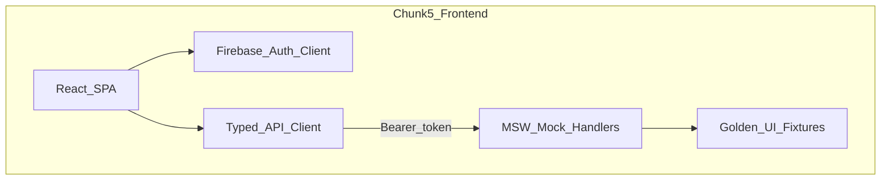
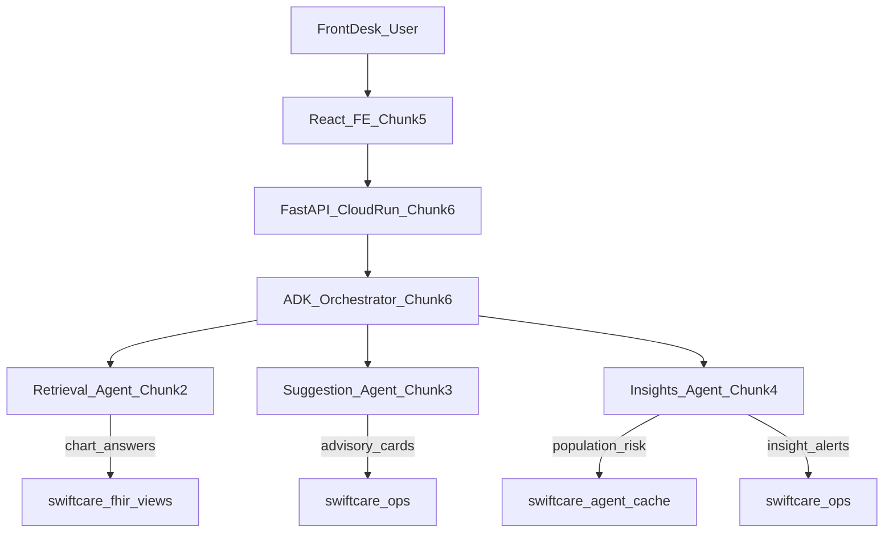
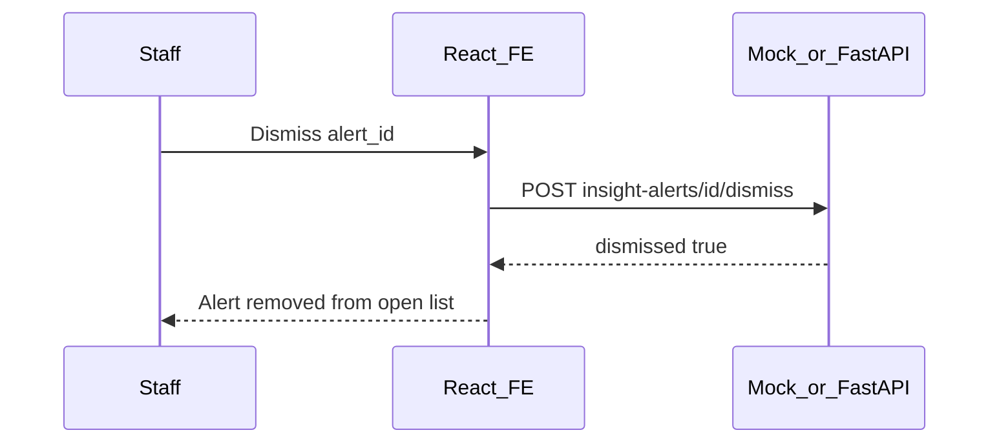
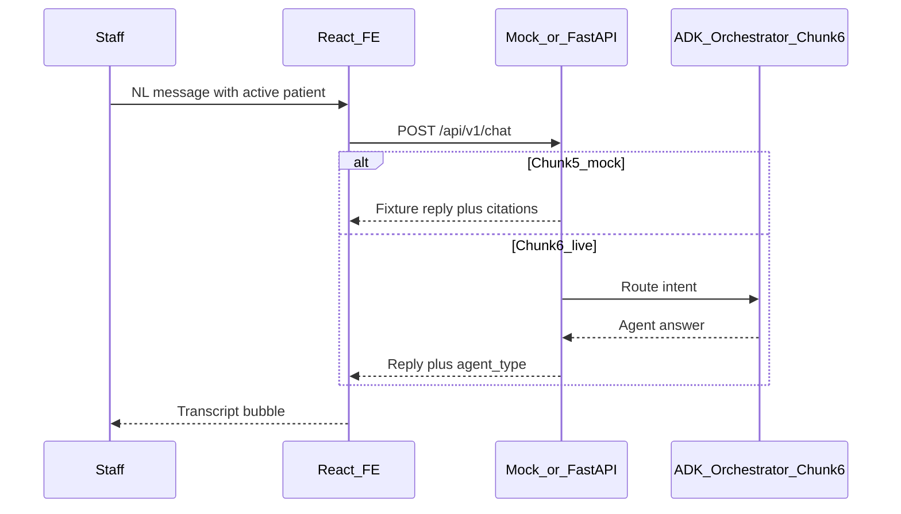

# Chunk 5: Frontend for SwiftCare AI

**Scope:** Build the React front-desk workspace — patient search, chart panels, dismissible advisory cards, population risk / insight alerts, **downloadable patient details / AI patient lists**, Firebase Auth (client), and an NL chat panel against a typed API contract. Depends on Chunks 1–4 ([final_chunk_1.md](final_chunk_1.md), [final_chunk_2.md](final_chunk_2.md), [final_chunk_3.md](final_chunk_3.md), [final_chunk_4.md](final_chunk_4.md)). FastAPI, ADK orchestration, Pub/Sub, and Cloud Run remain **Chunk 6**.

---

# PART A — Human Review

> Review this section before implementation. Sign off on decisions in Section A.10.

## A.1 Executive Summary

Chunk 5 delivers the **React frontend** for **SwiftCare AI** — the staff-facing shell that sits above the three agents already built in Chunks 2–4.

Where Retrieval **answers chart questions**, Suggestion **proposes dismissible advisory cards**, and Insights **mines population risk**, the Frontend **renders those grounded payloads** in a single front-desk workspace that stays **simple and warm** — minimal on-screen data, soft colors, no dashboard overwhelm. Staff authenticate, find a patient, review a light chart context including **documented diagnostic outcomes**, **recommended next steps**, and a **symptoms list** (patient-reported + staff-added), download details when needed, and ask natural-language questions through a chat panel that targets the future Chunk 6 orchestrator API.

Example staff flows:

- Sign in → search *"Kuhn"* → pick a row → open patient workspace
- Scan **symptoms**, **documented diagnostic outcomes**, meds, allergies, visits, vitals
- Review **Recommended next steps** (guardrailed advisories) and dismiss or keep them
- Add a symptom noted at the front desk; see patient-reported symptoms on file
- **Download patient details** (JSON/CSV) for the open chart
- Dismiss an allergy advisory card after acknowledging it
- Open **Insights** → filter care gaps → dismiss or keep an insight alert
- Ask in chat: *"Which patients have care gaps?"* → **Download all patients shown in that AI response**
- Ask in chat: *"What was their last visit?"* (mock reply in Chunk 5; live agents in Chunk 6)

Chunk 5 delivers:

1. A **Vite + React + TypeScript** app under `frontend/`
2. **Firebase Authentication (client SDK only)** — email/password; ID token on requests (Chunk 3 D11)
3. **Typed API client + MSW mocks** shaped to agent tool contracts so the UI is demoable before FastAPI exists
4. **Screens:** Login, Home/Search, Patient workspace (Symptoms / Outcomes / Next steps), Insights/risk, Chat panel, App shell
5. **Exports:** single-patient details download + bulk download of patients listed in an AI/chat response
6. A **validation runbook (F1–F5)** and golden UI fixtures
7. Local development via **`npm run dev` / `scripts/run_frontend.sh`** — no Cloud Run

All clinical and ops **data** still lives in BigQuery (Chunk 1). The browser never queries BigQuery directly. Until Chunk 6 ships FastAPI, the FE talks to **mock handlers** that return fixture JSON matching real tool shapes.

---

## A.2 UI Capabilities

Front-desk workflows mapped to screens, future API routes, and Chunk 1 / agent contracts:


| User Story | Example Action | Primary UI | Future API (A.11) | Source Contract |
| ---------- | -------------- | ---------- | ----------------- | --------------- |
| Staff login | Email/password sign-in | `/login` | Auth is client-side; API receives Bearer token | Chunk 3 D11 |
| Patient lookup | Search *"Kuhn"* | Home search | `GET /api/v1/patients/search` | `search_patients` ([agents/patient_lookup.py](../agents/patient_lookup.py)) |
| Disambiguate | Pick row #2 | Search results table | Same + session set | `results_table` / `display_*` names |
| Chart overview | Open patient | `/patient/:id` | `GET /api/v1/patients/{id}/summary` | Retrieval `get_patient_summary` |
| Symptoms | View / add symptoms | Patient → Symptoms | `GET/POST .../symptoms`, PATCH resolve | Ops `patient_symptoms` (staff + reported) |
| Diagnostic outcomes | View conditions on file | Patient → Outcomes | `GET .../conditions` | FHIR `fact_conditions` / Condition |
| Recommended next steps | Review / dismiss advisories | Patient → Next steps | advisory-cards routes | Suggestion `advisory_cards` |
| Meds / allergies | Scan lists | Patient panels | `.../medications`, `.../allergies` | Retrieval tools |
| Visits / timeline / vitals | Review history | Patient panels | `.../visits`, `.../timeline`, `.../vitals` | Retrieval tools |
| Advisory cards | List / dismiss (same as next steps layer) | Next-steps strip | `GET/POST .../advisory-cards`, dismiss | Suggestion `advisory_cards` |
| Risk huddle | Morning briefing | `/insights` | `GET /api/v1/insights/distribution` | Insights `get_risk_distribution` |
| Care-gap list | Filter at-risk | Insights table | `GET /api/v1/insights/at-risk` | `list_at_risk_patients` |
| Insight alerts | List / dismiss | Alert strip | `GET/POST .../insight-alerts`, dismiss | Insights `insight_alerts` |
| Dual ops layers | Same patient | Cards **and** alerts, separate UI | Both list endpoints | Chunk 4 A.11 rule 3 |
| Download patient details | Click **Download details** on open chart | Patient workspace | Client export of loaded panels; optional `GET .../export` | Retrieval chart aggregates |
| Download AI patient list | Click **Download patients** on a chat bubble | Chat panel | Structured `patients[]` on `POST /api/v1/chat` | Search / at-risk / any agent list |
| Download Insights cohort | Click **Download patients** on at-risk table | `/insights` | Client export of displayed rows | `list_at_risk_patients` |
| NL ask | Chat prompt | Chat panel | `POST /api/v1/chat` | Orchestrator (Chunk 6); mocked in Chunk 5 |
| Looker (optional) | Open dashboard | Nav external link | N/A | Chunk 1 optional Looker |

**Out of scope for Chunk 5:**

- FastAPI routes, ADK orchestrator, Pub/Sub, Cloud Run deploy (Chunk 6)
- Mutating FHIR Condition / Medication resources from the browser (diagnoses stay chart-sourced reads)
- Firestore / Firebase Realtime Database / Firebase Hosting as a data store
- Embedded Looker Studio BI product (optional external URL only)
- **AI-invented diagnoses or prescriptions** — SwiftCare must not present model output as a clinician diagnosis
- Framing next steps as signed clinical orders

**In scope (clarified):**

- Showing **documented diagnostic outcomes** from the patient chart (FHIR conditions)
- Showing **recommended next steps** as the Suggestion advisory layer (ops, dismissible, disclaimed)
- **Symptoms list** per patient: reported + added by healthcare workers (ops table; FE can create/resolve via API/mocks)

---

## A.2b Staff UX Patterns

Front-desk staff will not think in tool names. The UI must feel **simple, warm, and easy to scan** — never a dense clinical dashboard.

### Design principles (charts, cards, insights)

1. **Minimal data on screen** — show only the few fields staff need to act; hide IDs, codes, and long lists behind “Show more” / download.
2. **One glance per block** — each chart panel, advisory card, and insight row should be readable in ~2 seconds.
3. **Warm, soft color** — easy on the eyes for long front-desk shifts; no neon, no purple glow, no harsh red “alarm” chrome.
4. **Breathing room** — generous spacing, short lists (default caps), no stacked metric walls or multi-chart grids.
5. **Friendly labels** — plain language over FHIR codes; severity as soft chips, not screaming banners.

### Visual hierarchy (one workspace composition)

1. **App shell:** brand **SwiftCare AI**, nav (Home / Insights / optional Looker), signed-in staff email, sign-out — quiet header, not a toolbar farm.
2. **Primary work area:** either Search, Patient workspace, or Insights — **not** a dense multi-widget dashboard on first paint.
3. **Secondary layer:** Chat drawer/panel for NL questions; collapsed or slim by default so it does not compete with patient context.
4. **Ops overlays:** Advisory cards and insight alerts are **short, dismissible strips** (title + one line + dismiss) — never prescription pads or critical-order banners.
5. **Patient charts:** compact **summary strip** + tabs. Primary tabs: **Overview** | **Symptoms** | **Outcomes** | **Next steps** | More (meds / visits / vitals). Do not open every FHIR facet at full height simultaneously.

### Display rules (user-facing)

1. **Lead with the answer** — 3–5 primary fields first; `patient_id` as secondary copyable text.
2. **Lean tables** — Search default columns: Name, Last visit, Age. At-risk default: Name, What to review, Level.
3. **Default list caps (UI):** symptoms **8**, diagnostic outcomes **5**, next steps **3**, medications **5**, allergies **5**, visits **5**, timeline **8**, at-risk **10** (expand / download for more).
4. **Symptoms (every patient):** simple list with text, who reported (`patient` | `staff`), who recorded (staff name/email), when. Staff can **Add symptom** (short free text + source). Resolve/hide without deleting audit history. Calm empty state: *"No symptoms recorded yet."*
5. **Diagnostic outcomes (on file):** show chart-documented conditions as **“Diagnostic outcomes”** with subtitle **“From the patient chart — not generated by SwiftCare AI.”** Default fields: plain condition name + status (active/resolved). No ICD code wall unless “Show more.”
6. **Recommended next steps:** primary label for the Suggestion advisory layer. Each row: title + one-line body + soft chip + Dismiss. Footer disclaimer always visible. Never label these as “orders,” “Rx,” or “AI diagnosis.”
7. **Plain-language risk labels** (Insights):

   | Code | Label |
   | ---- | ----- |
   | `gap_in_care` | care gap (visit overdue) |
   | `polypharmacy` | many active meds |
   | `high_utilizer` | high visit volume (90d) |
   | `chronic_burden` | multiple active conditions |
   | `scheduling_inefficiency` | scheduling inefficiency (ops) |

8. **Name display:** use `display_*` names; never re-add Synthea suffixes.
9. **Insight alerts:** plain risk label + soft severity + one-line message + dismiss (separate from Next steps).
10. **Insights page:** lean snapshot + short at-risk list — not a BI dashboard.
11. **Separate layers:** **Next steps** (Suggestion) vs **Insights** (population alerts) — never merge.
12. **Tone:** calm, warm, brief. No scare language; no “Prescribe” chrome.
13. **Downloads** and AI list download rules unchanged (full detail off-screen).

### Prefer vs avoid (UI chrome)


| Prefer | Avoid |
| ------ | ----- |
| Soft warm surfaces, muted accents | Cold blue-gray walls; purple gradients; neon |
| Few columns, “Show more” | Every FHIR field on first paint |
| “Diagnostic outcomes (on file)” | “AI diagnosis” / “SwiftCare diagnosed…” |
| “Recommended next steps” + ops disclaimer | “Clinical order” / “Rx” / unsigned treatment plan |
| Staff-added / patient-reported symptoms | Inventing symptoms from the LLM |
| Short advisory / insight rows | Dense card grids with badges, stats, chips everywhere |
| "Dismiss" | "Complete order" / "Sign off treatment" |
| "Care gap (visit overdue)" | "Noncompliant patient" |
| Quiet source hint | Fake confidence meters / KPI strips |
| "Download patient details" / "Download patients (N)" | "Export chart for treatment" / silent auto-download |

---

## A.3 Key Decisions


| # | Decision | Choice | Rationale |
| - | -------- | ------ | --------- |
| D1 | App location | **`frontend/`** at repo root | Clear separation from Python `agents/` |
| D2 | Framework | **Vite + React 18+ + TypeScript** | Spec says React; Vite is fast local DX; TS matches API contracts |
| D3 | Routing | **React Router** — `/login`, `/`, `/patient/:patientId`, `/insights` | Simple SPA; Cloud Run can serve static + API later |
| D4 | Backend in Chunk 5 | **MSW mock API** + typed client | Prior chunks defer FastAPI to Chunk 6; mocks unblock FE |
| D5 | API base URL | **`VITE_API_BASE_URL`** (mock default `/api`) | Chunk 6 swaps to Cloud Run URL without rewriting screens |
| D6 | Staff auth | **Firebase Auth client SDK** (email/password) | Chunk 3 D11; identity only; no Firestore data |
| D7 | Token transport | `Authorization: Bearer <Firebase ID token>` | Chunk 6 verifies with Admin SDK |
| D8 | Dev bypass | **`VITE_AUTH_BYPASS=true`** → synthetic `dev-user` | Offline / CI demos without Firebase project |
| D9 | BigQuery from browser | **Never** | Chunk 1 D1; all data via API (mock → FastAPI) |
| D10 | State | React state + URL (`patientId`); optional session sync via API | `swiftcare_ops.sessions` owned by backend |
| D11 | Visual design | **Warm, soft, low-density UI** — simple panels; minimal on-screen fields; progressive disclosure | Front-desk friendly; reduces overwhelm; easy on the eyes |
| D12 | Looker | Optional **external** `VITE_LOOKER_STUDIO_URL` link | Chunk 4 deferred polish; not embedded BI |
| D13 | Chat in Chunk 5 | Mock transcript + canned grounded replies | Real ADK routing is Chunk 6 |
| D14 | Cards / alerts create | Prefer list + dismiss in UI; create via chat/API when available | Create tools already exist on agents; FE must not invent card bodies |
| D15 | Testing | Vitest + React Testing Library + MSW contract tests | Parallel to agent golden suites |
| D16 | Single-patient download | **Client-side export** of already-loaded chart panels (JSON + CSV); optional Chunk 6 `GET .../export` for server-built file | Full detail off-screen so the page stays light |
| D17 | AI-response patient download | Chat (and list UIs fed by agents) expose **Download patients (N)** when response includes structured `patients[]` | Staff can save care-gap / search cohorts without re-querying; only rows the AI returned |
| D18 | Export formats | **JSON** (full nested) and **CSV** (flat tabular) via browser download | Front-desk paste into spreadsheets; JSON for handoff/debug |
| D19 | Export audit | Chunk 5: no BQ audit write; Chunk 6 **should** log `patient_access_audit` action `export_patient` / `export_patient_list` | PHI access trail when live API exists |
| D20 | Information density | Default UI caps; tabs for chart facets; no KPI strips | Prevents overwhelm; download/API still carry full payloads |
| D21 | Diagnostic outcomes UI | Show **chart-documented conditions** as “Diagnostic outcomes (on file)” | Staff need outcome context; AI must not invent diagnoses (Chunks 2–4) |
| D22 | Recommended next steps UI | Map Suggestion **advisory cards** to a “Recommended next steps” panel | Same guardrailed dismissible layer; friendlier front-desk label |
| D23 | Symptoms per patient | Ops table `swiftcare_ops.patient_symptoms` + FE list/add/resolve | Reported + staff-added; not FHIR Condition writes |

### D6 detail — Firebase Auth (client only)

Reaffirms [final_chunk_3.md](final_chunk_3.md) §A.3 D11:

1. React obtains a Firebase ID token after email/password sign-in.
2. Every API request (mock or real) attaches `Authorization: Bearer <token>`.
3. Chunk 6 FastAPI calls `verify_id_token` and passes `uid`/email as `user_id` into ops logging — replacing `"dev-user"`.
4. **Not in scope:** Firestore, Realtime Database, Firebase Hosting as app data store, or caching PHI in Firebase.

### D21–D23 detail — Outcomes, next steps, symptoms

| UI label | Data source | Who authors it | Must not mean |
| -------- | ----------- | -------------- | ------------- |
| Diagnostic outcomes | FHIR Condition / `fact_conditions` (read) | Chart / prior clinical documentation | SwiftCare AI made a diagnosis |
| Recommended next steps | `advisory_cards` via Suggestion tools | Suggestion agent (ops) + staff dismiss | Signed order / prescription |
| Symptoms | `patient_symptoms` ops rows | Patient-reported (staff records) or staff-added | Auto-generated LLM symptom list |

Chunk 5 ships UI + MSW fixtures. Chunk 6 implements reads/writes and should add SQL for `patient_symptoms` if not already present (forward schema below in A.11 / B.4).

## A.4 Features Delivered


| Feature | Location | Description |
| ------- | -------- | ----------- |
| Vite React app | `frontend/` | TypeScript SPA |
| App shell | `frontend/src/components/AppShell.tsx` | Brand, nav, auth menu |
| Login | `frontend/src/pages/LoginPage.tsx` | Firebase or bypass |
| Search home | `frontend/src/pages/HomePage.tsx` | Patient name search + results table |
| Patient workspace | `frontend/src/pages/PatientPage.tsx` | Summary + Symptoms + Outcomes + Next steps + other panels |
| Chart panels | `frontend/src/components/chart/*` | Simple capped lists; includes conditions |
| Symptoms panel | `frontend/src/components/chart/SymptomsPanel.tsx` | List / add / resolve symptoms |
| Outcomes panel | `frontend/src/components/chart/DiagnosticOutcomesPanel.tsx` | Chart-documented conditions |
| Next steps UI | `frontend/src/components/NextStepsPanel.tsx` | Advisory cards as recommended next steps |
| Advisory card UI | `frontend/src/components/AdvisoryCard.tsx` | Short title + one line + soft chip + dismiss |
| Insight alert UI | `frontend/src/components/InsightAlert.tsx` | Plain label + one-line message + soft severity |
| Insights page | `frontend/src/pages/InsightsPage.tsx` | Lean summary + short at-risk list (not a BI dashboard) |
| Chat panel | `frontend/src/components/ChatPanel.tsx` | NL → `POST /api/v1/chat` (mocked); **Download patients (N)** when `patients[]` present |
| Download helpers | `frontend/src/utils/download.ts` | Trigger browser file download (JSON/CSV blob) |
| Patient export UI | `frontend/src/components/DownloadPatientDetails.tsx` | Format picker + download on patient workspace |
| Chat list export UI | `frontend/src/components/DownloadPatientsFromReply.tsx` | Per-assistant-message download control |
| API client | `frontend/src/api/client.ts` | Typed fetch wrapper + auth header |
| Domain types | `frontend/src/api/types.ts` | Mirror agent tool JSON |
| MSW mocks | `frontend/src/mocks/` | Handlers + fixtures |
| Auth module | `frontend/src/auth/` | Firebase init, AuthProvider, bypass |
| Styles | `frontend/src/styles/tokens.css` | Warm soft palette; easy on the eyes |
| Tests | `frontend/src/**/*.test.tsx`, contract tests | F1–F5 |
| Run script | `scripts/run_frontend.sh` | `npm install` + `npm run dev` |
| Env example | `frontend/.env.example` | Vite + Firebase keys |

---

## A.5 Architecture

### Chunk 5 runtime (local dev)



### Position in full SwiftCare pipeline



**Chunk 5 implements only the React FE box** (plus mocks). The FastAPI / ADK boxes stay dashed until Chunk 6.

### What is NOT happening

- No FastAPI, ADK HTTP gateway, Pub/Sub, or Cloud Run in this chunk
- No BigQuery credentials or SQL in the browser
- No Firestore / Realtime DB for sessions, cards, or patient data
- No inventing medications, allergies, vitals, symptoms, or diagnostic outcomes in UI code
- No presenting SwiftCare output as a clinician diagnosis or signed order
- No merging next steps and insight alerts into one list
- No dense multi-panel “command center” layout — charts, cards, and insights stay simple and warm (A.2b / B.6)

### Example click flows

**Flow 1 — Find patient and open chart**

1. Staff signs in (Firebase or bypass).
2. Home: type `Kuhn` → `GET /api/v1/patients/search?q=Kuhn`.
3. Results table shows display names (fixture mirrors `search_patients`).
4. Click row → navigate `/patient/{patient_id}`; set active patient via `PUT /api/v1/session`.
5. Page loads summary, **symptoms**, **diagnostic outcomes**, **next steps**, meds, allergies, visits, vitals, open insight alerts (parallel).
6. Staff reviews Outcomes (on file) and Next steps; may **Add symptom** from the desk.
7. Staff clicks **Download patient details** → chooses JSON or CSV → browser saves file built from loaded panels only.

**Flow 2 — Dismiss advisory card**

1. On patient page, Advisory strip shows open cards.
2. Staff clicks **Dismiss** → `POST /api/v1/patients/{id}/advisory-cards/{card_id}/dismiss`.
3. Card removed from open list; disclaimer was visible before dismiss.

**Flow 3 — Insights huddle**

1. Nav → `/insights`.
2. Load distribution + at-risk (`risk_flag=gap_in_care`) + open insight alerts.
3. Click patient name → `/patient/:id` with that `patient_id`.

**Flow 4 — Chat (Chunk 5 mock)**

1. Open chat: *"Latest BP for this patient?"*
2. `POST /api/v1/chat` with `{ message, patient_id, session_id }`.
3. Mock returns a grounded-looking reply citing `mv_patient_latest_vitals` from fixtures.
4. Chunk 6 replaces mock with orchestrator → Retrieval.

**Flow 5 — Download patients from AI response**

1. Staff asks in chat: *"Which patients have care gaps? Keep it to 5."*
2. `POST /api/v1/chat` returns `reply` plus structured `patients: [{ patient_id, display_*, risk_flag, ... }]`.
3. Assistant bubble shows **Download patients (5)**.
4. Staff picks CSV → browser saves `swiftcare-ai-patients-{timestamp}.csv` with exactly those rows (no extras).
5. If `patients` is empty/missing, the download control is hidden.

---

## A.6 Dependencies

### Chunk 1 (data — via API, not direct)

| Object | Used By FE Surface | Notes |
| ------ | ------------------ | ----- |
| `v_patient_360` | Summary / search fields | Via API aggregate |
| `fact_conditions` / Condition | Diagnostic outcomes panel | Chart-documented only |
| `patient_symptoms` | Symptoms panel | New ops table (Chunk 6 SQL; mocked in Chunk 5) |
| `v_active_medications` | Meds panel | |
| `v_active_allergies` | Allergies panel | |
| `v_visit_summary` / visits | Visits panel | |
| `v_patient_timeline` | Timeline panel | |
| `mv_patient_latest_vitals` | Vitals panel | |
| `mv_at_risk_patients` / `v_risk_flags` | Insights page | |
| `advisory_cards` | Recommended next steps | Schema: [sql/04_ops_tables.sql](../sql/04_ops_tables.sql) |
| `insight_alerts` | Alert strip | Same |
| `sessions` | Active patient | Backend-owned |

### Chunks 2–4 (contracts)

| Agent | FE consumes |
| ----- | ----------- |
| Retrieval | Search + chart panel field shapes |
| Suggestion | `content` JSON, `source_refs`, dismiss |
| Insights | At-risk rows, distribution, alerts, `PLAIN_RISK_LABELS` |

### Explicit non-dependencies (Chunk 5)

| Item | Owner |
| ---- | ----- |
| FastAPI / Cloud Run | Chunk 6 |
| ADK orchestrator / Pub/Sub | Chunk 6 |
| Firebase Admin `verify_id_token` | Chunk 6 |
| Gemini / Vertex calls from browser | Never |

**Prerequisite:** Chunks 1–4 implemented (agents runnable via `adk web`). FE can proceed on mocks without live BQ if fixtures are loaded.

---

## A.7 Cost Estimate


| Resource | Estimate (Chunk 5 dev) | Cost |
| -------- | ---------------------- | ---- |
| Firebase Auth | Email/password free tier | $0 |
| Vite local dev | Laptop only | $0 |
| MSW / fixtures | No cloud | $0 |
| Gemini / BigQuery | Not called by FE | $0 in Chunk 5 |
| Cloud Run / CDN hosting | Deferred to Chunk 6 | $0 now |

**Guardrails:** Do not enable paid Firebase products for data; do not embed paid Looker features; keep PHI out of `localStorage` beyond ephemeral UI state.

---

## A.8 Trade-offs, Risks & Mitigations


| Trade-off / Risk | Mitigation |
| ---------------- | ---------- |
| Mock/API drift vs real agents | Shared TypeScript types + F2 contract tests; A.11 is Chunk 6 source of truth |
| Staff confuse next steps with orders | “Recommended next steps” + mandatory ops disclaimer; F5 |
| AI mistaken for diagnosing | Outcomes subtitle: chart-sourced only; F5-008 |
| Symptom spam / clutter | Cap visible rows; resolve soft-hide; short free-text only |
| Auth without backend verify (until Chunk 6) | Document gap; bypass only for local; never ship bypass to prod |
| PHI in browser storage | Prefer in-memory/React state; no patient chart dumps in `localStorage` |
| Downloaded files contain PHI | Explicit staff-initiated download only; filename includes date; UI note: *"Contains patient data — handle per clinic policy"*; Chunk 6 audit `export_*` actions |
| AI list download invents patients | Export only structured `patients[]` from the response payload; never parse free-text names into export rows |
| Chat promises live agents too early | Chat empty-state: *"Demo replies until API is connected (Chunk 6)"* |
| Overbuilt / overwhelming UI | Enforce A.2b density caps, warm soft palette (B.6), tabs/accordion; F4-005 |
| Dual-layer confusion | Separate short headings + soft chips (`info/attention` vs `HIGH/MEDIUM/LOW`) |
| Synthea ugly names | Always prefer `display_*` fields in tables **and** export columns |

---

## A.9 Request Flow

### Login → search → patient chart

```mermaid
sequenceDiagram
  participant Staff
  participant FE as React_FE
  participant Auth as Firebase_Auth
  participant API as Mock_or_FastAPI
  participant BQ as BigQuery_Chunk6_only

  Staff->>FE: Open /login
  Staff->>Auth: Email password
  Auth-->>FE: ID token
  Staff->>FE: Search Kuhn
  FE->>API: GET /patients/search Authorization Bearer
  API-->>FE: matches display names
  Staff->>FE: Select patient
  FE->>API: PUT /session active_patient_id
  FE->>API: GET summary meds allergies visits vitals cards alerts
  Note over API,BQ: Chunk 5 MSW returns fixtures; Chunk 6 queries BQ via agents
  API-->>FE: Grounded JSON
  FE-->>Staff: Patient workspace
```

### Dismiss insight alert



### Chat (mock vs future)



---

## A.10 Exit Criteria — Human Sign-off

- [ ] Decisions in A.3 reviewed and accepted
- [ ] `frontend/` Vite React TS app runs locally via `scripts/run_frontend.sh`
- [ ] Login works with Firebase **or** documented auth bypass for local demo
- [ ] Patient search + disambiguation table uses display names
- [ ] Patient workspace shows summary, **symptoms**, **diagnostic outcomes**, **recommended next steps**, meds, allergies, visits, timeline, vitals from API/mocks
- [ ] Chart/cards/insights follow **simple low-density** rules (caps, tabs/accordion, soft warm palette per A.2b / B.6)
- [ ] Diagnostic outcomes labeled as **on file / chart-sourced** (not AI diagnosis)
- [ ] Recommended next steps = advisory cards with disclaimer + dismiss; soft chips
- [ ] Symptoms list supports view + staff add + resolve; shows reported_by / recorded_by
- [ ] Insight alerts render plain labels + dismiss; severity as soft chips (not alarm banners)
- [ ] Cards and alerts shown as **separate** layers for one patient
- [ ] Insights page: distribution + at-risk table + open alerts
- [ ] **Download patient details** works (JSON and CSV) from patient workspace using loaded data only
- [ ] Chat responses with `patients[]` show **Download patients (N)**; export matches response rows exactly
- [ ] Download control hidden when chat reply has no structured patient list
- [ ] Chat panel calls `POST /api/v1/chat` (mocked) without inventing clinical facts outside fixtures
- [ ] No BigQuery access from browser; Bearer token attached when auth enabled
- [ ] F1–F5 validation runbook passes
- [ ] A.11 API contract reviewed as input to Chunk 6
- [ ] Ready for Chunk 6 (FastAPI + ADK orchestrator + Cloud Run)

---

## A.11 API Contract for Chunk 6

Chunk 5 ships the FE against this contract (MSW). Chunk 6 implements the same paths on FastAPI and wires ADK agents. Paths are versioned under `/api/v1`.

### Conventions

- **Auth:** `Authorization: Bearer <Firebase ID token>` required when `VITE_AUTH_BYPASS` is false.
- **Errors:** `{ "error": "<code>", "message": "<human>" }` with appropriate HTTP status.
- **IDs:** `patient_id`, `card_id`, `alert_id`, `session_id` are strings (UUIDs).
- **Grounding:** responses must mirror agent tool fields; do not invent clinical rows.
- **Authorization boundary:** the token establishes identity only. Chunk 6 must
  authorize every patient-scoped request and bind sessions to the verified uid;
  client-supplied `user_id` values and a guessed `session_id` must never grant
  access. Until then, this contract is synthetic-demo only.

### Endpoints


| Method | Path | Purpose | Agent / source |
| ------ | ---- | ------- | -------------- |
| `GET` | `/api/v1/health` | Liveness | FastAPI |
| `PUT` | `/api/v1/session` | Upsert session; set `active_patient_id` | `swiftcare_ops.sessions` |
| `GET` | `/api/v1/session` | Current session | sessions |
| `GET` | `/api/v1/patients/search?q=` | Name search | Retrieval / shared `search_patients` |
| `GET` | `/api/v1/patients/{patient_id}/summary` | Patient 360 summary | `get_patient_summary` |
| `GET` | `/api/v1/patients/{patient_id}/conditions` | Documented diagnostic outcomes | Condition / `fact_conditions` |
| `GET` | `/api/v1/patients/{patient_id}/symptoms` | List symptoms (active default) | `patient_symptoms` |
| `POST` | `/api/v1/patients/{patient_id}/symptoms` | Add symptom (staff) | `patient_symptoms` INSERT |
| `POST` | `/api/v1/patients/{patient_id}/symptoms/{symptom_id}/resolve` | Soft-resolve symptom | UPDATE status |
| `GET` | `/api/v1/patients/{patient_id}/medications` | Active meds | `get_active_medications` |
| `GET` | `/api/v1/patients/{patient_id}/allergies` | Active allergies | `get_active_allergies` |
| `GET` | `/api/v1/patients/{patient_id}/visits` | Visit history | `get_visit_history` |
| `GET` | `/api/v1/patients/{patient_id}/timeline` | Timeline events | `get_patient_timeline` |
| `GET` | `/api/v1/patients/{patient_id}/vitals` | Latest vitals | `get_latest_vitals` |
| `GET` | `/api/v1/patients/{patient_id}/advisory-cards?open=true` | Recommended next steps (list) | `list_advisory_cards` |
| `POST` | `/api/v1/patients/{patient_id}/advisory-cards/{card_id}/dismiss` | Dismiss next step | `dismiss_advisory_card` |
| `GET` | `/api/v1/insights/distribution` | Risk buckets | `get_risk_distribution` |
| `GET` | `/api/v1/insights/at-risk` | Query: `risk_flag`, `risk_level`, `limit` | `list_at_risk_patients` |
| `GET` | `/api/v1/insights/alerts?open=true` | List alerts (optional `patient_id`) | `list_insight_alerts` |
| `POST` | `/api/v1/insights/alerts/{alert_id}/dismiss` | Dismiss alert | `dismiss_insight_alert` |
| `POST` | `/api/v1/chat` | NL message → orchestrated reply (include `patients[]` when listing people) | Chunk 6 ADK |
| `GET` | `/api/v1/patients/{patient_id}/export?format=json\|csv` | Optional server-built patient details file (Chunk 6) | Retrieval aggregates + audit |

Chunk 5 implements patient-details download **client-side** from already-fetched panel data; the export GET is optional for Chunk 6 parity and audit logging.

### Example payloads

**`GET /api/v1/patients/search?q=Kuhn`**

```json
{
  "match_count": 2,
  "matches": [
    {
      "patient_id": "uuid",
      "first_name": "...",
      "last_name": "...",
      "display_first_name": "Fannie",
      "display_last_name": "Kuhn",
      "city": "...",
      "state": "...",
      "last_visit_date": "2019-01-01",
      "age_years": 72,
      "gender": "female",
      "match_score": 1.0
    }
  ],
  "results_table": "| # | Name | ...",
  "display_hint": "Reply with a row # or Patient ID to continue."
}
```

**Advisory card row** (UI label: **Recommended next steps**)

```json
{
  "card_id": "uuid",
  "session_id": "uuid-or-null",
  "patient_id": "uuid",
  "agent_type": "suggestion",
  "content": {
    "title": "Allergy awareness",
    "body": "Documented allergen on file — staff should be aware before scheduling.",
    "severity": "attention",
    "card_type": "allergy_awareness",
    "disclaimer": "Not a clinical order. Staff review required. Not a diagnosis or prescription."
  },
  "source_refs": [{ "view": "v_active_allergies", "patient_id": "uuid", "fields": ["allergen"] }],
  "dismissed": false,
  "created_at": "2026-01-01T00:00:00Z"
}
```

**Diagnostic outcome row** (`GET .../conditions`)

```json
{
  "condition_id": "uuid",
  "patient_id": "uuid",
  "display_name": "Essential hypertension",
  "status": "active",
  "onset_date": "2018-03-01",
  "source": "chart",
  "attribution": "Documented on patient chart — not generated by SwiftCare AI"
}
```

**Symptom row** (`GET/POST .../symptoms`)

```json
{
  "symptom_id": "uuid",
  "patient_id": "uuid",
  "description": "Shortness of breath on exertion",
  "reported_by": "patient",
  "recorded_by_user_id": "firebase-uid-or-dev-user",
  "recorded_by_display": "dev-user@local",
  "status": "active",
  "recorded_at": "2026-09-04T16:00:00Z",
  "resolved_at": null
}
```

`reported_by`: `patient` | `staff`  
`status`: `active` | `resolved`

**Forward schema (Chunk 6 SQL — mock in Chunk 5):**

```sql
CREATE TABLE IF NOT EXISTS `{{GCP_PROJECT_ID}}.swiftcare_ops.patient_symptoms` (
  symptom_id           STRING NOT NULL,
  patient_id           STRING NOT NULL,
  description          STRING NOT NULL,
  reported_by          STRING NOT NULL,  -- patient | staff
  recorded_by_user_id  STRING,
  status               STRING NOT NULL,  -- active | resolved
  recorded_at          TIMESTAMP DEFAULT CURRENT_TIMESTAMP(),
  resolved_at          TIMESTAMP
);
```

**Insight alert row**

```json
{
  "alert_id": "uuid",
  "patient_id": "uuid",
  "alert_type": "gap_in_care",
  "severity": "MEDIUM",
  "message": "Operational insight: ... Not a diagnosis or clinical order. Staff review required. Operational insight only.",
  "dismissed": false,
  "created_at": "2026-01-01T00:00:00Z"
}
```

**`POST /api/v1/chat`**

Request:

```json
{
  "message": "What medications are they on?",
  "patient_id": "uuid-or-null",
  "session_id": "uuid-or-null"
}
```

Response (Chunk 6):

```json
{
  "reply": "Active medications (source: v_active_medications): ...",
  "agent_type": "retrieval",
  "patient_id": "uuid",
  "citations": [{ "view": "v_active_medications" }],
  "cards": [],
  "alerts": [],
  "patients": []
}
```

When the agent returns a **list of people** (search matches, care-gap cohort, at-risk rows, etc.), populate `patients` with structured rows so the FE can offer **Download patients (N)**:

```json
{
  "reply": "Top care-gap patients (source: mv_at_risk_patients): ...",
  "agent_type": "insights",
  "patient_id": null,
  "citations": [{ "view": "mv_at_risk_patients" }],
  "cards": [],
  "alerts": [],
  "patients": [
    {
      "patient_id": "uuid",
      "display_first_name": "Fannie",
      "display_last_name": "Kuhn",
      "risk_flag": "gap_in_care",
      "risk_level": "MEDIUM",
      "days_since_last_visit": 842,
      "age_years": 72,
      "city": "...",
      "state": "..."
    }
  ]
}
```

Rules for `patients[]`:

1. Include **only** patients the agent actually returned in that turn (same set as the scannable table in `reply`).
2. Prefer `display_*` name fields; always include `patient_id`.
3. Omit or send `[]` for prose-only answers (single-chart Q&A with no list) — FE hides download.
4. Chunk 5 mocks must return `patients` for at least one care-gap / search fixture (`FX-CHAT-LIST`).

Chunk 5 mock may return a static `reply` + `agent_type` (+ optional `patients`) from fixtures without calling Gemini.

### Patient details export shape (client or `GET .../export`)

JSON envelope written to disk:

```json
{
  "exported_at": "2026-09-04T16:00:00Z",
  "patient_id": "uuid",
  "disclaimer": "Operational export for staff use. Not a clinical order or legal medical record substitute.",
  "summary": { },
  "symptoms": [],
  "diagnostic_outcomes": [],
  "recommended_next_steps": [],
  "medications": [],
  "allergies": [],
  "visits": [],
  "timeline": [],
  "vitals": { },
  "insight_alerts_open": []
}
```

CSV for single-patient details: one sectioned flat file **or** a zip of CSVs is acceptable; MVP = single CSV with a `section` column (`summary` | `symptom` | `outcome` | `next_step` | `medication` | …).

CSV for AI patient list: one row per `patients[]` entry; columns = keys present in the payload (at minimum `patient_id`, display names).

### Session body

```json
{
  "session_id": "uuid",
  "active_patient_id": "uuid-or-null"
}
```

`user_id` is response-only and is derived by the backend from the verified
token. The client must not send it. A supplied `session_id` must be accepted
only when it belongs to that same verified user; otherwise return 403.

### Create endpoints (optional create for cards/alerts; required for symptoms)

- **Symptoms:** Chunk 5 UI **must** support Add + Resolve against mocks; Chunk 6 persists to `patient_symptoms`.
- Chunk 6 should also expose create routes for parity with agent tools (`create_advisory_card`, `create_insight_alert`). Next-steps create may remain chat-driven; FE must not free-type clinical diagnoses into outcomes (outcomes are read-only from chart).

---

# PART B — Agentic Implementation

> Execute sections in order. Use `<!-- AGENT:... -->` markers to locate contracts. Replace placeholders with project-specific values. Do **not** implement FastAPI here.

<!-- AGENT:CHUNK5_START -->

## B.1 Environment Variables

<!-- AGENT:ENV -->

Add `frontend/.env.example` (and local `frontend/.env` — never commit secrets):

```bash
# API — leave as /api for MSW; Chunk 6 sets Cloud Run origin
VITE_API_BASE_URL=/api

# Auth
VITE_AUTH_BYPASS=true
VITE_FIREBASE_API_KEY=
VITE_FIREBASE_AUTH_DOMAIN=
VITE_FIREBASE_PROJECT_ID=
VITE_FIREBASE_APP_ID=

# Optional Looker link (Chunk 1 dashboard)
VITE_LOOKER_STUDIO_URL=

# Feature flags
VITE_ENABLE_CHAT=true
VITE_DEMO_BANNER=true
```

Root `.env` remains Python/agent-focused ([.env.example](../.env.example)); do not put Firebase web keys in the Python env file.

When `VITE_AUTH_BYPASS=true`, AuthProvider sets `user_id=dev-user` and skips Firebase. **Production builds must set bypass false.**

---

## B.2 Project Layout

<!-- AGENT:LAYOUT -->

```text
frontend/
├── package.json
├── tsconfig.json
├── vite.config.ts
├── index.html
├── .env.example
├── public/
│   └── favicon.svg
└── src/
    ├── main.tsx
    ├── App.tsx
    ├── styles/
    │   ├── tokens.css
    │   └── global.css
    ├── auth/
    │   ├── firebase.ts
    │   ├── AuthProvider.tsx
    │   └── useAuth.ts
    ├── api/
    │   ├── client.ts
    │   ├── types.ts
    │   ├── patients.ts
    │   ├── insights.ts
    │   ├── session.ts
    │   ├── chat.ts
    │   ├── symptoms.ts
    │   └── export.ts
    ├── mocks/
    │   ├── browser.ts
    │   ├── handlers.ts
    │   └── fixtures/
    │       ├── patients.json
    │       ├── chart.json
    │       ├── conditions.json
    │       ├── symptoms.json
    │       ├── cards.json
    │       ├── alerts.json
    │       └── chat.json
    ├── components/
    │   ├── AppShell.tsx
    │   ├── SearchResultsTable.tsx
    │   ├── AdvisoryCard.tsx
    │   ├── NextStepsPanel.tsx
    │   ├── InsightAlert.tsx
    │   ├── InsightAlertStrip.tsx
    │   ├── RiskDistribution.tsx
    │   ├── AtRiskTable.tsx
    │   ├── ChatPanel.tsx
    │   ├── DownloadPatientDetails.tsx
    │   ├── DownloadPatientsFromReply.tsx
    │   ├── DemoBanner.tsx
    │   └── chart/
    │       ├── SummaryPanel.tsx
    │       ├── SymptomsPanel.tsx
    │       ├── DiagnosticOutcomesPanel.tsx
    │       ├── MedicationsPanel.tsx
    │       ├── AllergiesPanel.tsx
    │       ├── VisitsPanel.tsx
    │       ├── TimelinePanel.tsx
    │       └── VitalsPanel.tsx
    ├── utils/
    │   ├── download.ts
    │   ├── toCsv.ts
    │   └── buildPatientExport.ts
    ├── pages/
    │   ├── LoginPage.tsx
    │   ├── HomePage.tsx
    │   ├── PatientPage.tsx
    │   └── InsightsPage.tsx
    └── test/
        ├── setup.ts
        └── contract.test.ts

scripts/
└── run_frontend.sh
```

Also update README Chunk 5 status to Done when implementation exits (checklist B.10) — not part of this plan-doc-only step if only writing the plan; **do update README when code ships**.

---

## B.3 Screen & Component Specs

<!-- AGENT:SCREENS -->

### B.3.1 `AppShell`

- Props: `children`
- Shows brand **SwiftCare AI** (hero-level in shell header — product name must remain the primary identity signal)
- Nav links: Home (`/`), Insights (`/insights`), optional Looker (`target=_blank` if URL set)
- Auth menu: email + Sign out
- Renders `DemoBanner` when `VITE_DEMO_BANNER=true` (*"Using mock API until Chunk 6"*)

### B.3.2 `LoginPage`

- Email + password fields; Sign in button
- If bypass: single **Continue as dev-user** button
- On success → navigate `/`

### B.3.3 `HomePage` + `SearchResultsTable`

- Search input + submit
- Calls `searchPatients(q)`
- **Default columns:** Name (`display_*`), Last visit, Age — Patient ID via copy control / expand (not a primary wall of columns)
- Empty / zero-match states with calm warm copy
- Row click → `setSession({ active_patient_id })` then `/patient/:id`

### B.3.4 `PatientPage`

- Route param `patientId`
- Parallel fetch: summary, **symptoms**, **conditions (outcomes)**, **advisory cards (next steps)**, medications, allergies, visits, timeline, vitals, open insight alerts
- Layout (keep it light):
  1. **Summary strip** — name, age, last visit; actions: Download + Copy ID
  2. **Primary tabs:** Overview | **Symptoms** | **Outcomes** | **Next steps** | More…
  3. Overview: vitals snapshot + open next-steps count + active symptom count (no dense grid)
  4. **Symptoms** tab: `SymptomsPanel`
  5. **Outcomes** tab: `DiagnosticOutcomesPanel`
  6. **Next steps** tab: `NextStepsPanel` (advisory cards)
  7. More…: meds, allergies, visits, timeline, insight alerts for this patient
- Chat panel slim/collapsed by default
- `DownloadPatientDetails` includes symptoms, outcomes, next steps in export envelope

### B.3.5 Chart panels — primary fields only

Default view shows **minimal columns**; remaining fields via “Show more” or download.


| Component | Show by default | Hide until expand / download |
| --------- | --------------- | ---------------------------- |
| `SummaryPanel` | display name, age, last visit date | gender, city/state, counts, deceased, raw ids |
| `SymptomsPanel` | description, reported_by chip, recorded_at (top **8** active) | recorder id; resolved history behind toggle |
| `DiagnosticOutcomesPanel` | display_name, status (top **5** active) | codes, onset_date, raw ids |
| `MedicationsPanel` | medication_name (top **5**) | prescribed_date, status, codes |
| `AllergiesPanel` | allergen (top **5**) | criticality unless high → chip |
| `VisitsPanel` | visit_date + short visit_type (top **5**) | class, complaint, status, ids |
| `TimelinePanel` | event_date + event_label (top **8**) | codes, source ids |
| `VitalsPanel` | BP + heart rate + observation date | height/weight/bmi/RR unless toggled |

Empty panels: calm one-liner — never fabricate.

### B.3.5a `SymptomsPanel`

- List active symptoms; chip **Patient reported** vs **Staff added**
- **Add symptom** form: description (required, ≤200 chars), `reported_by` select (`patient` | `staff`), submit → `POST .../symptoms`
- **Resolve** control per row → resolve endpoint; row leaves default list
- Attribution line: recorded by display name + time
- Never auto-fill from chat/LLM without staff confirm

### B.3.5b `DiagnosticOutcomesPanel`

- Heading: **Diagnostic outcomes**
- Subtitle (always): **From the patient chart — not generated by SwiftCare AI**
- Read-only list from `GET .../conditions`
- No edit/create of diagnoses in FE

### B.3.6 `NextStepsPanel` / `AdvisoryCard`

- Section title: **Recommended next steps**
- Default row: **title** + truncated **one-line body** + soft severity chip + **Dismiss**
- Expand: full body + muted disclaimer (ops, not an order)
- Do **not** show raw `card_type` / `source_refs` by default
- Max **3** visible + “Show more”
- Soft warm styling per B.6

### B.3.7 `InsightAlert` / strip + Insights page

- Default row: plain risk label + soft severity chip + **one-line** message + Dismiss
- `RiskDistribution`: friendly snapshot — top buckets only
- `AtRiskTable`: Name | What to review | Level; default `limit=10`; **Download patients (N)**
- Open alerts strip: max **3** visible — **separate** from Next steps
- Soft severity colors (B.6)

### B.3.8 `ChatPanel`

- Message list + input; keep bubbles short
- Sends `{ message, patient_id, session_id }`
- Quiet `agent_type` text when present
- If cards/alerts non-empty, offer gentle refresh of Next steps / Insights strips
- If `patients?.length > 0`, **Download patients (N)**
- Footer note when mocked

### B.3.9 Download utilities

- `download.ts`: `downloadBlob(filename, blob)` via temporary `<a download>`
- `toCsv.ts`: escape fields; header row from union of keys
- `buildPatientExport.ts`: assemble A.11 envelope including `symptoms`, `diagnostic_outcomes`, `recommended_next_steps`
- Filenames: `swiftcare-patient-{patientIdShort}-{yyyyMMdd-HHmm}.json|csv` and `swiftcare-ai-patients-{yyyyMMdd-HHmm}.json|csv`

---

## B.4 API Client + Mock Handlers

<!-- AGENT:API_CLIENT -->

### B.4.1 `client.ts`

```typescript
// Pseudocode contract — implement equivalently
async function apiFetch<T>(path: string, init?: RequestInit): Promise<T> {
  const token = await getIdTokenOrBypass();
  const headers = new Headers(init?.headers);
  headers.set("Accept", "application/json");
  if (token) headers.set("Authorization", `Bearer ${token}`);
  const res = await fetch(`${import.meta.env.VITE_API_BASE_URL}${path}`, {
    ...init,
    headers,
  });
  if (!res.ok) {
    const body = await res.json().catch(() => ({}));
    throw new ApiError(res.status, body.error ?? "unknown", body.message);
  }
  return res.json() as Promise<T>;
}
```

### B.4.2 `types.ts` (mirror agents)

Must include TypeScript interfaces for:

- `PatientSearchResponse` / `PatientMatch` (incl. `display_first_name`, `display_last_name`)
- `PatientSummary`, `Medication`, `Allergy`, `Visit`, `TimelineEvent`, `Vitals`
- `DiagnosticOutcome` / `ConditionRow` (`display_name`, `status`, `attribution`)
- `Symptom`, `SymptomCreateRequest` (`description`, `reported_by`)
- `AdvisoryCard`, `AdvisoryContent`, `SourceRef` (UI: recommended next steps)
- `InsightAlert`, `AtRiskPatient`, `RiskDistributionRow`
- `Session`, `ChatRequest`, `ChatResponse` (must include optional `patients?: ChatPatientRow[]`)
- `ChatPatientRow` — at least `patient_id`, `display_first_name?`, `display_last_name?`, plus optional risk/visit fields
- `PatientDetailsExport` — envelope in A.11 (includes symptoms, diagnostic_outcomes, recommended_next_steps)
- Unions: `CardType`, `CardSeverity`, `AlertType`, `AlertSeverity`, `ExportFormat`, `SymptomReportedBy` (`patient` | `staff`), `SymptomStatus`

### B.4.3 MSW `handlers.ts`

Implement one handler per A.11 endpoint. Serve from `fixtures/*.json`. Behavior:

- Search filters fixture patients by case-insensitive name substring
- Patient-scoped GETs 404 with `{ error: "not_found" }` if unknown id
- Conditions handler returns chart outcomes with `attribution` string set
- Symptoms: in-memory list per patient; POST appends; resolve flips `status`
- Dismiss endpoints flip `dismissed` in memory for the MSW worker lifetime
- Chat returns fixture reply keyed by simple intent keywords (`med`, `vital`, `allerg`, `risk`, `gap`, `care gap`, `symptom`) else generic ops help text
- Care-gap / list intents must include non-empty `patients[]` for download demos
- Optional MSW handler for `GET .../export` that returns JSON envelope (Chunk 6 preview); Chunk 5 UI may ignore it and use client build

Enable MSW in `main.tsx` when `import.meta.env.DEV` **or** when `VITE_API_BASE_URL` is relative `/api`.

---

## B.5 Auth Wiring

<!-- AGENT:AUTH -->

1. `firebase.ts` — `initializeApp` with Vite env config; export `getAuth`.
2. `AuthProvider` — `onAuthStateChanged`; exposes `{ user, idToken, signIn, signOut, bypass }`.
3. Protected routes: if no user and not bypass → redirect `/login`.
4. Attach token in `apiFetch` as in B.4.1.
5. Bypass mode: `user = { uid: "dev-user", email: "dev-user@local" }`, token string `"bypass-dev-user"`.
6. Document in UI when bypass is active (DemoBanner).

Chunk 6 will reject bypass tokens; production must use real Firebase.

---

## B.6 Visual / Copy Rules

<!-- AGENT:VISUALS -->

### Warm, easy-on-the-eyes palette (`tokens.css`)

Direction: **soft warmth + low contrast fatigue** for long shifts. Avoid purple gradients, neon, and the common AI “cream + terracotta + loud serif” cliché — keep brand wordmark calm and readable.

```css
:root {
  /* Soft warm stone — not stark white / cold blue-gray */
  --sc-bg: #f3efe8;
  --sc-surface: #fffcf8;
  --sc-surface-muted: #ebe4da;
  --sc-ink: #2f2a26;
  --sc-muted: #7a7168;
  --sc-accent: #7d8f6e;       /* soft sage — calm, warm-adjacent */
  --sc-accent-soft: #dfe6d8;
  --sc-border: #e0d7cc;
  --sc-info: #8a7a68;         /* soft taupe chip (advisory info) */
  --sc-warn: #c4a574;         /* soft sand-amber (attention) */
  --sc-high: #b08989;         /* muted rose — serious but not alarm red */
  --sc-medium: #c4a574;
  --sc-low: #8a9a7e;
  --sc-font-sans: "Nunito Sans", "Segoe UI", sans-serif;
  --sc-font-display: "Nunito", "Segoe UI", sans-serif; /* friendly, not loud display serif */
  --sc-radius: 10px;
  --sc-space: 1.25rem;        /* generous default gap */
  --sc-shadow: 0 1px 2px rgba(47, 42, 38, 0.06); /* whisper only */
}
```

### Density rules (must follow)

| Surface | Rule |
| ------- | ---- |
| Patient charts | Tabs; Overview / Symptoms / Outcomes / Next steps; list caps per A.2b |
| Next steps / insight strips | Max 3 rows; one-line body; soft chips |
| Insights page | Snapshot + lean table; no KPI tile rows |
| Search / at-risk | ≤3 primary columns by default |
| Color | Soft chips only; never full-bleed red banners |
| Motion | Subtle fade/expand only (≤2 intentional motions); no confetti or pulsing alerts |

### Copy constants

```ts
export const NEXT_STEPS_TITLE = "Recommended next steps";
export const OUTCOMES_TITLE = "Diagnostic outcomes";
export const OUTCOMES_SUBTITLE =
  "From the patient chart — not generated by SwiftCare AI";
export const SYMPTOMS_TITLE = "Symptoms";
export const INSIGHT_LAYER_TITLE = "Insights";
export const DEFAULT_CARD_DISCLAIMER =
  "Not a clinical order. Staff review required. Not a diagnosis or prescription.";
export const DEFAULT_ALERT_DISCLAIMER =
  "Not a diagnosis or clinical order. Staff review required. Operational insight only.";
```

Forbidden chrome strings (F5): `Prescribe`, `Order set`, `AI diagnosis`, `SwiftCare diagnosed`, `Rx`, `Sign treatment`.

Typography: friendly sans for UI and brand; keep hierarchy with size/weight, not heavy ornament. Prefer **short lists** over dense tables; prefer **one primary action** per strip (Dismiss, Add symptom, or Download), not action clusters.

---

## B.7 Validation Runbook (F1–F5)

<!-- AGENT:VALIDATION -->

### F1 — Component / unit tests (blockers)

| CHECK_ID | Check | Pass |
| -------- | ----- | ---- |
| F1-001 | `SearchResultsTable` renders display names, not raw Synthea suffix names when `display_*` present | Pass |
| F1-002 | `AdvisoryCard` / Next steps always shows disclaimer (content or fallback) | Pass |
| F1-003 | `InsightAlert` maps `gap_in_care` → plain label | Pass |
| F1-004 | Dismiss callbacks fire with `card_id` / `alert_id` | Pass |
| F1-005 | Protected route redirects unauthenticated users when bypass false (mocked auth) | Pass |
| F1-006 | `DownloadPatientDetails` JSON includes symptoms, diagnostic_outcomes, recommended_next_steps | Pass |
| F1-007 | `DownloadPatientsFromReply` exports exactly `patients.length` rows; control hidden when `patients` empty | Pass |
| F1-008 | `DiagnosticOutcomesPanel` shows chart attribution subtitle; no edit controls | Pass |
| F1-009 | `SymptomsPanel` can add symptom and shows reported_by chip; resolve removes from active list | Pass |

### F2 — API contract / MSW (blockers)

| CHECK_ID | Check | Pass |
| -------- | ----- | ---- |
| F2-001 | Search handler returns `match_count` + `matches[]` shape | Pass |
| F2-002 | Summary / conditions / symptoms / meds / allergies / visits / vitals match `types.ts` | Pass |
| F2-003 | Dismiss card/alert returns `{ dismissed: true }` and hides from open list | Pass |
| F2-004 | At-risk honors `limit` ≤ 50 | Pass |
| F2-005 | Chat returns `reply` + `agent_type` | Pass |
| F2-006 | 401/403 path documented when token missing (non-bypass) | Pass |
| F2-007 | List-style chat fixture includes `patients[]` with `patient_id` on each row | Pass |
| F2-008 | POST symptom returns created row; resolve sets `status=resolved` | Pass |

### F3 — Golden UI fixtures (blockers)

| CHECK_ID | Check | Pass |
| -------- | ----- | ---- |
| F3-001 | Fixture patient set includes at least one multi-match surname (e.g. Kuhn-class) | Pass |
| F3-002 | Fixture includes ≥1 open next-step card, ≥1 outcome, ≥1 patient-reported + ≥1 staff symptom, ≥1 `gap_in_care` alert | Pass |
| F3-003 | Patient page tabs: Symptoms / Outcomes / Next steps visible in smoke | Pass |
| F3-004 | `FX-CHAT-LIST` returns ≥3 patients; download smoke saves file | Pass |

### F4 — Accessibility / UX smoke (warnings → fix before sign-off)

| CHECK_ID | Check | Pass |
| -------- | ----- | ---- |
| F4-001 | Inputs have labels; dismiss **and download** buttons named | Pass |
| F4-002 | Tables use `<th>` headers | Pass |
| F4-003 | Color is not sole severity signal (text chip + color) | Pass |
| F4-004 | Mobile: shell usable at 375px width (stack panels); download controls reachable | Pass |
| F4-005 | Patient page does not show all chart facets expanded at once; list caps respected | Pass |
| F4-006 | Advisory/insight default rows are single-line; Insights page has no KPI tile strip | Pass |

### F5 — Guardrail UI (blockers)

| CHECK_ID | Check | Pass |
| -------- | ----- | ---- |
| F5-001 | No forbidden chrome strings in AppShell / card / alert components | Pass |
| F5-002 | Next steps labeled as recommended ops steps; Insights separate | Pass |
| F5-003 | Demo banner when mocks active | Pass |
| F5-004 | UI never writes fabricated med/allergy/vital/outcome rows client-side | Pass |
| F5-005 | Patient-list download never invents rows beyond `patients[]` | Pass |
| F5-006 | Export UI shows patient-data handling note | Pass |
| F5-007 | No harsh full-bleed red alert banners; severity uses soft chips from B.6 tokens | Pass |
| F5-008 | Outcomes panel never claims AI diagnosis; forbidden chrome strings absent | Pass |

Log results informally in PR description; optional: add rows to `data_validation_runs` later in Chunk 7.

---

## B.8 Screen ↔ Agent Matrix

<!-- AGENT:MATRIX -->


| UI surface | HTTP (A.11) | Owning agent (Chunk 6) | Chunk 1 / ops object |
| ---------- | ----------- | ---------------------- | -------------------- |
| Search | `GET .../patients/search` | Retrieval (shared lookup) | `v_patient_360` |
| Summary | `GET .../summary` | Retrieval | `v_patient_360` |
| Symptoms | `GET/POST .../symptoms` | FastAPI + ops | `patient_symptoms` |
| Diagnostic outcomes | `GET .../conditions` | Retrieval / BQ | `fact_conditions` |
| Recommended next steps | advisory-cards routes | Suggestion | `advisory_cards` |
| Meds | `GET .../medications` | Retrieval | `v_active_medications` |
| Allergies | `GET .../allergies` | Retrieval | `v_active_allergies` |
| Visits | `GET .../visits` | Retrieval | visit tools / views |
| Timeline | `GET .../timeline` | Retrieval | `v_patient_timeline` |
| Vitals | `GET .../vitals` | Retrieval | `mv_patient_latest_vitals` |
| Advisory list/dismiss | advisory-cards routes | Suggestion (Next steps UI) | `advisory_cards` |
| Distribution / at-risk | insights routes | Insights | `v_risk_flags`, `mv_at_risk_patients` |
| Alert list/dismiss | insight-alerts routes | Insights | `insight_alerts` |
| Chat | `POST .../chat` | Orchestrator → any | per intent; may include `patients[]` |
| Download patient details | Client build (Chunk 5) / optional `GET .../export` | Retrieval aggregates | panels + ops strips |
| Download AI patients | Client CSV/JSON from chat `patients[]` | Same agent that listed them | no extra query |
| Session | `PUT/GET .../session` | FastAPI | `sessions` |

---

## B.9 Golden UI Fixtures

<!-- AGENT:FIXTURES -->

Align fixture themes with agent golden suites (`tests/retrieval/golden_queries.yaml`, suggestion, insights):

| Fixture ID | Intent | Contents |
| ---------- | ------ | -------- |
| `FX-SEARCH-MULTI` | Ambiguous surname | ≥2 matches, `results_table`, display names |
| `FX-CHART-FULL` | Happy-path chart | Summary + symptoms + outcomes + next steps + meds + allergies + visits + vitals |
| `FX-OUTCOMES` | Diagnostic outcomes | ≥2 active conditions with chart attribution |
| `FX-SYMPTOMS` | Symptoms | ≥1 `reported_by=patient`, ≥1 `reported_by=staff` |
| `FX-CARD-ALLERGY` | Next steps | Open `allergy_awareness` / `attention` + disclaimer |
| `FX-CARD-FOLLOWUP` | Next steps | Open `follow_up_scheduling` / `info` |
| `FX-ALERT-GAP` | Insight layer | Open `gap_in_care` / `MEDIUM` |
| `FX-ALERT-UTIL` | Insight layer | Open `high_utilizer` / `HIGH` |
| `FX-DIST` | Huddle | Distribution rows across flags/levels |
| `FX-CHAT-MEDS` | Chat mock | Reply citing `v_active_medications`, `agent_type=retrieval`, `patients: []` |
| `FX-CHAT-LIST` | Chat list + download | Care-gap style reply + `patients` length ≥3 with display names + `patient_id` |
| `FX-CHAT-REFUSE` | Guardrail tone | Reply refusing diagnosis; offer ops next step; `patients: []` |

Use stable fake UUIDs in fixtures so deep links in demos are reproducible.

---

## B.10 Execution Checklist

<!-- AGENT:CHECKLIST -->

- [ ] Scaffold Vite React TS app in `frontend/`
- [ ] Add `tokens.css`, AppShell, routing
- [ ] Implement `api/types.ts` + `client.ts`
- [ ] Implement MSW handlers + golden fixtures (B.9)
- [ ] Build Login + auth bypass + Firebase wiring
- [ ] Build Home search + Patient workspace (**Symptoms / Outcomes / Next steps** tabs, density caps)
- [ ] Build SymptomsPanel (list / add / resolve)
- [ ] Build DiagnosticOutcomesPanel (read-only, chart attribution)
- [ ] Build NextStepsPanel + dismiss (**short rows**, soft chips, ops disclaimer)
- [ ] Build Insights page + InsightAlert strip (**lean summary**, not BI dashboard)
- [ ] Apply warm soft `tokens.css` (B.6) and verify F4-005/006, F5-007/008
- [ ] Build ChatPanel (mocked) with **Download patients (N)** when `patients[]` present
- [ ] Build **Download patient details** (JSON/CSV) including symptoms, outcomes, next steps
- [ ] Add download utils + F1-008/009 / F2-008 coverage
- [ ] Add `scripts/run_frontend.sh` and `frontend/.env.example`
- [ ] Run F1–F5; fix blockers
- [ ] Manual walkthrough of A.5 example flows
- [ ] Update README Chunk 5 status when code is done
- [ ] Hand A.11 contract to Chunk 6 implementer
- [ ] Proceed to Chunk 6 — Integrate agents and deploy to Cloud Run

---

## B.11 Troubleshooting

<!-- AGENT:TROUBLESHOOT -->


| Symptom | Likely cause | Fix |
| ------- | ------------ | --- |
| Blank API data | MSW not started | Ensure `worker.start()` in `main.tsx` before render |
| CORS errors when pointing at real API | Chunk 6 missing CORS | Configure FastAPI `CORSMiddleware` for FE origin |
| 401 on all calls | Bypass false, no token | Sign in or set `VITE_AUTH_BYPASS=true` locally |
| Ugly Synthea names | Using `first_name` only | Prefer `display_first_name` / `display_last_name` |
| Cards look like orders | Missing disclaimer / wrong styles | Enforce B.6; F5-001/008 |
| Outcomes look AI-generated | Missing subtitle | Always show `OUTCOMES_SUBTITLE` |
| Cannot add symptoms | Mock/handler missing | Implement symptoms fixtures + POST/resolve (F2-008) |
| Dismissed item returns | Fixture reset on reload | Expected for MSW memory; Chunk 6 persists in BQ |
| Chat invents meds | Bad mock | Fixture-only replies; never LLM in browser |
| Firebase init error | Missing env keys | Fill `VITE_FIREBASE_*` or use bypass |
| Dual lists confusing | Combined component | Keep separate strips/titles per A.2b |
| Download button missing on chat | Response lacks `patients[]` | Ensure list intents populate structured array (F2-007 / FX-CHAT-LIST) |
| CSV opens wrong in Excel | Encoding | Prefixed UTF-8 BOM optional; document for implementers |
| Page feels crowded | Too many panels open | Use tabs/accordion; enforce A.2b caps; move detail to Download |
| Harsh red alerts | Wrong severity styling | Use B.6 soft rose/sand chips only |

---

## B.12 Invoke / Run Snippet

<!-- AGENT:RUN -->

```bash
# From repo root
cd frontend
cp .env.example .env   # edit as needed; bypass=true for offline
npm install
npm run dev            # http://localhost:5173

# Or:
./scripts/run_frontend.sh
```

Suggested `scripts/run_frontend.sh`:

```bash
#!/usr/bin/env bash
set -euo pipefail
ROOT="$(cd "$(dirname "$0")/.." && pwd)"
cd "$ROOT/frontend"
if [[ ! -d node_modules ]]; then
  npm install
fi
npm run dev -- --host 127.0.0.1 --port 5173
```

Vitest:

```bash
cd frontend && npm test
```

Until Chunk 6 exists, keep agents available in separate terminals for contract comparison:

```bash
./scripts/run_retrieval_agent.sh   # :8000
./scripts/run_suggestion_agent.sh  # :8001
./scripts/run_insights_agent.sh    # :8002
```

<!-- AGENT:CHUNK5_END -->

---

> **Next:** Chunk 6 — Integrate agents and deploy to Cloud Run (implement A.11 FastAPI, Firebase Admin verify, ADK orchestrator, Pub/Sub as needed, replace MSW with live API).
