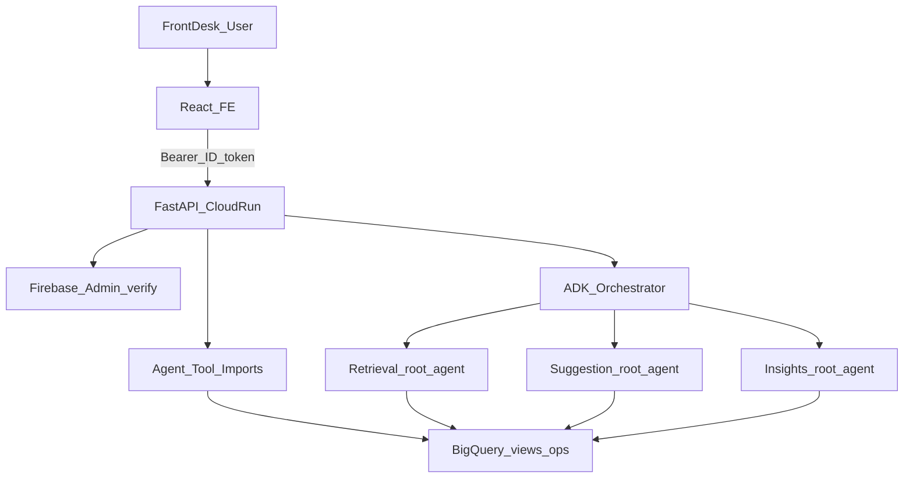
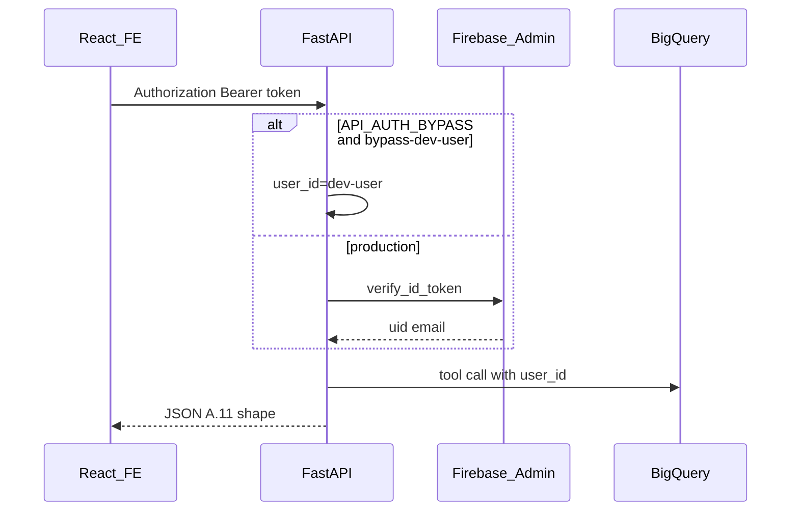

# Chunk 6: Integrate Agents + Deploy to Cloud Run

**Scope:** Implement the Chunk 5 **A.11** FastAPI contract, wire the three ADK agents (Retrieval / Suggestion / Insights) behind an orchestrator for `POST /api/v1/chat`, add `patient_symptoms` persistence, verify Firebase ID tokens, and deploy a single Cloud Run service that can serve the API (and optionally the built React FE). Depends on Chunks 1–5 ([final_chunk_1.md](final_chunk_1.md)–[final_chunk_5.md](final_chunk_5.md)). Full demo polish remains **Chunk 7**.

---

# PART A — Human Review

> Review this section before implementation. Sign off on decisions in Section A.10.

## A.1 Executive Summary

Chunk 6 closes the gap between the **React front-desk workspace** (Chunk 5, MSW-mocked) and the **three standalone ADK agents** (Chunks 2–4). Staff keep the same UI; the browser stops talking to fixtures and starts talking to a live **FastAPI** service on **Cloud Run** that:

1. Serves every A.11 route under `/api/v1`
2. Calls **existing agent tool functions** for chart panels, cards, alerts, and search (no free-form SQL)
3. Routes natural-language chat through an **ADK orchestrator** using the Chunk 4 intent → agent map
4. Verifies **Firebase Auth** ID tokens and writes real `user_id` into ops tables
5. Persists symptoms in **`swiftcare_ops.patient_symptoms`**
6. Ships as **one Docker image → one Cloud Run service** (API + optional static FE)

Example staff flows after cutover:

- Sign in (real Firebase or local API bypass) → search *"Kuhn"* → BigQuery-backed matches
- Open chart panels → Retrieval tool payloads
- Dismiss a next-step card / insight alert → rows persist in BQ
- Add / resolve a symptom → `patient_symptoms`
- Chat *"What meds are they on?"* → orchestrator → Retrieval → grounded reply
- Chat *"Which patients have care gaps?"* → Insights → `patients[]` for download
- Hit the public Cloud Run URL for a Patchamomma demo

Chunk 6 delivers:

1. **`api/`** FastAPI application implementing A.11
2. **`api/orchestrator.py`** intent router + ADK `Runner` (pattern from [`scripts/invoke_insights_agent.py`](../scripts/invoke_insights_agent.py))
3. **Firebase Admin** verification (+ local `API_AUTH_BYPASS`)
4. **SQL** for `patient_symptoms` ([sql/09_patient_symptoms.sql](../sql/09_patient_symptoms.sql))
5. **Dockerfile** + `scripts/run_api.sh` + `scripts/deploy_cloud_run.sh`
6. **FE cutover** notes (`VITE_API_BASE_URL`, MSW off, demo banner off)
7. **Validation runbook G1–G\*** and API contract tests

**Pub/Sub is not required for Chunk 6 MVP.** Agents run in-process. Pub/Sub (IDs-only coordination) stays planned for Chunk 7 if needed.

---

## A.2 Capabilities

| User Story | Example | API | Owner |
| ---------- | ------- | --- | ----- |
| Health | Probe liveness | `GET /api/v1/health` | FastAPI |
| Session | Set active patient | `PUT/GET /api/v1/session` | `swiftcare_ops.sessions` |
| Patient lookup | Search Kuhn | `GET /api/v1/patients/search` | `search_patients` |
| Chart panels | Summary, meds, … | `GET /api/v1/patients/{id}/…` | Retrieval tools |
| Conditions | Diagnostic outcomes | `GET .../conditions` | BQ `fact_conditions` helper |
| Symptoms | List / add / resolve | symptoms routes | `patient_symptoms` |
| Next steps | List / dismiss / create | advisory-cards routes | Suggestion tools |
| Insights | Distribution / at-risk | insights routes | Insights tools |
| Alerts | List / dismiss / create | alerts routes | Insights tools |
| Chat | NL question | `POST /api/v1/chat` | Orchestrator → agent |
| Export | Server file + audit | `GET .../export` | Aggregates + audit |
| Deploy | Public demo URL | Cloud Run | Docker |

**Out of scope for Chunk 6:**

- Chunk 7 demo video, pitch deck, full polish
- Mandatory Pub/Sub topology
- Rewriting agent prompts or FE screens (env / banner cutover only)
- Firestore / Firebase Hosting as clinical datastore
- Free-form text-to-SQL
- Diagnosing or prescribing via API

---

## A.3 Key Decisions


| # | Decision | Choice | Rationale |
| - | -------- | ------ | --------- |
| D1 | HTTP contract | Chunk 5 **A.11** unchanged | FE already typed + MSW’d against it |
| D2 | Tool access | **Import agent tool functions** in-process | Avoids `adk web` HTTP; same guarded SQL |
| D3 | Chat | Intent → agent map (Chunk 4 A.11) + ADK `Runner` | Reuses `root_agent`s; no monolith prompt rewrite |
| D4 | Hosting | **One Cloud Run service** | Single public URL; FastAPI may mount `frontend/dist` |
| D5 | Pub/Sub | **Deferred** (Chunk 7 optional) | Not needed for vertical slice |
| D6 | Auth | Firebase Admin `verify_id_token`; `API_AUTH_BYPASS` local only | Matches Chunk 3/5 plan; never bypass in prod |
| D7 | Symptoms SQL | New file `sql/09_patient_symptoms.sql` | `sql/05_views.sql` already taken |
| D8 | Conditions | Small BQ helper in `api/` reading `fact_conditions` | No dedicated agent tool today |
| D9 | Export | Implement `GET .../export` + audit `export_*` | Completes Chunk 5 optional parity |
| D10 | CORS | `CORS_ORIGINS` env (localhost + Cloud Run FE origin) | FE may be same-origin if static-mounted |
| D11 | Secrets | Cloud Run env + Secret Manager for Firebase SA JSON if needed | ADC for BQ/Vertex on Cloud Run SA |
| D12 | Service account | Roles: BQ JobUser/DataEditor on project datasets, Vertex AI User, Cloud Run invoker as needed | Least privilege for demo |

---

## A.4 Architecture

### Target runtime



### Auth sequence



### Chat routing (Chunk 4 map)

| Intent signals | Route | Notes |
| -------------- | ----- | ----- |
| care gaps, at risk, high utilizer, risk distribution, insight alert | **insights** | Population tools |
| meds, vitals, timeline, last visit, chart summary | **retrieval** | Requires `patient_id` after resolve |
| advisory card, allergy awareness, next step card | **suggestion** | Requires `patient_id` |
| Name only ("Kuhn") | search via any, prefer retrieval lookup | Set `sessions.active_patient_id` on pick |
| Mixed care-gap then meds | insights → session patient → retrieval | Orchestrator may two-hop |
| Mixed alert + card | insights + suggestion separately | Never merge alert/card tables |

### What is NOT happening

- FE does not query BigQuery
- Orchestrator does not invent clinical rows
- Bypass tokens are rejected when `K_SERVICE` (Cloud Run) is set / `API_AUTH_BYPASS=false`
- Pub/Sub messages are not part of the MVP path

---

## A.5 Features Delivered (when implemented)


| Feature | Location | Description |
| ------- | -------- | ----------- |
| FastAPI app | `api/main.py` | CORS, routers, optional static FE |
| Auth dependency | `api/auth.py` | Firebase Admin + bypass |
| Session routes | `api/routers/session.py` | Upsert/get `sessions` |
| Patient routes | `api/routers/patients.py` | Search + chart + symptoms + cards + export |
| Insights routes | `api/routers/insights.py` | Distribution, at-risk, alerts |
| Chat route | `api/routers/chat.py` | Orchestrator entry |
| Conditions helper | `api/bq_conditions.py` | `fact_conditions` → outcomes shape |
| Symptoms helpers | `api/symptoms.py` | CRUD on `patient_symptoms` |
| Orchestrator | `api/orchestrator.py` | Intent + Runner |
| SQL migration | `sql/09_patient_symptoms.sql` | Ops table |
| Local run | `scripts/run_api.sh` | uvicorn |
| Deploy | `scripts/deploy_cloud_run.sh` | build/push/deploy |
| Container | `Dockerfile`, `.dockerignore` | Multi-stage FE + API |
| Tests | `tests/api/` | Contract + intent unit tests |

---

## A.6 Dependencies

### Prior chunks

| Chunk | Provides |
| ----- | -------- |
| 1 | FHIR views, cache, ops tables, `fact_conditions` |
| 2 | Retrieval `root_agent` + chart tools |
| 3 | Suggestion `root_agent` + advisory card tools |
| 4 | Insights `root_agent` + risk/alert tools + route map |
| 5 | FE + A.11 MSW contract + Firebase client |

### Python packages (add to `pyproject.toml`)

```text
fastapi
uvicorn[standard]
firebase-admin
httpx          # tests
# existing: google-adk, google-cloud-bigquery, python-dotenv, pyyaml
```

### GCP services

| Service | Use |
| ------- | --- |
| Cloud Run | Host API (+ optional static FE) |
| BigQuery | All clinical + ops reads/writes |
| Vertex AI / Gemini | ADK agent chat turns |
| Firebase Auth | ID tokens |
| Artifact Registry | Container images |
| Secret Manager | Optional Firebase credentials JSON |
| Pub/Sub | **Not** in Chunk 6 MVP |

### IAM (Cloud Run runtime SA)

- `roles/bigquery.jobUser`
- `roles/bigquery.dataEditor` (or dataset-scoped equivalents on `swiftcare_*`)
- `roles/aiplatform.user` (Vertex)
- Firebase Admin via SA key or Application Default + Firebase project binding

---

## A.7 Risks & Mitigations


| Risk | Mitigation |
| ---- | ---------- |
| MSW / live API drift | Contract tests mirror FE types + Chunk 5 A.11 |
| Gemini cost / latency on every chat | Intent router; keep panel GETs as direct tool calls (no LLM) |
| Cold start on Cloud Run | Min instances 0 OK for demo; document warm-up `GET /health` |
| PHI in application logs | Log IDs + action names; avoid dumping full chart bodies at INFO |
| Bypass token in prod | Force `API_AUTH_BYPASS=false` when `K_SERVICE` set |
| Conditions endpoint missing tool | Dedicated parameterized helper; allowlist table |
| `sql/05_*` name collision | Use `sql/09_patient_symptoms.sql` |
| Orchestrator mis-routes | Unit tests on intent classifier; golden chat cases |

---

## A.8 Success Criteria

- [ ] `GET /api/v1/health` returns 200 on Cloud Run
- [ ] Search `q=Kuhn` returns BQ-backed matches with `display_*` names
- [ ] Patient panels load without MSW
- [ ] Symptom add/resolve persists across reload
- [ ] Advisory dismiss / alert dismiss persist in BQ
- [ ] Chat meds question → `agent_type=retrieval` + grounded reply
- [ ] Chat care-gaps → `agent_type=insights` + `patients[]` when listing
- [ ] FE build with `VITE_API_BASE_URL=<service>` and `VITE_DEMO_BANNER=false` works
- [ ] README Public URL placeholder filled after first successful deploy
- [ ] `pytest tests/api/ tests/retrieval/ tests/suggestion/ tests/insights/` green

---

## A.9 Cost Notes (demo scale)

| Item | Expectation |
| ---- | ----------- |
| Cloud Run | Low — scale to zero between demos |
| BigQuery | Same as agent local use; panel GETs are small allowlisted scans |
| Gemini | Chat turns only; panel routes avoid LLM |
| Artifact Registry | One image |

---

## A.10 Sign-off

| Role | Name | Date | OK |
| ---- | ---- | ---- | -- |
| Builder | | | [ ] |
| Reviewer | | | [ ] |

**Decisions locked:** D1–D12 in A.3. Proceed to PART B.

---

# PART B — Agentic Implementation

> Execute sections in order. Use `<!-- AGENT:... -->` markers. Do **not** change Chunk 5 A.11 response shapes unless FE and this doc are updated together.

<!-- AGENT:CHUNK6_START -->

## B.1 Environment Variables

<!-- AGENT:ENV -->

### Root `.env.example` additions

```bash
# --- Chunk 6: FastAPI ---
API_HOST=0.0.0.0
API_PORT=8080
API_AUTH_BYPASS=true
# Comma-separated; include Vite origin for local split deploy
CORS_ORIGINS=http://127.0.0.1:5173,http://localhost:5173
# Firebase Admin (production). Prefer ADC + FIREBASE_PROJECT_ID, or:
# GOOGLE_APPLICATION_CREDENTIALS=/path/to/sa.json
FIREBASE_PROJECT_ID=
# Set automatically on Cloud Run; used to refuse bypass
# K_SERVICE=

# Optional: directory of built FE for StaticFiles mount
STATIC_FE_DIR=frontend/dist
```

### Frontend `.env.example` cutover notes

```bash
# Local MSW (Chunk 5 default)
VITE_API_BASE_URL=/api
VITE_AUTH_BYPASS=true
VITE_DEMO_BANNER=true

# Live API (Chunk 6)
# VITE_API_BASE_URL=https://YOUR-SERVICE-XXXX.run.app/api
# VITE_AUTH_BYPASS=false
# VITE_DEMO_BANNER=false
```

MSW starts when `DEV` **or** `VITE_API_BASE_URL === '/api'` ([frontend/src/main.tsx](../frontend/src/main.tsx)). Pointing at Cloud Run disables mocks automatically if the base URL is absolute.

Update root [`.env.example`](../.env.example) and [frontend/.env.example](../frontend/.env.example) when implementing.

---

## B.2 SQL — `patient_symptoms`

<!-- AGENT:SQL_SYMPTOMS -->

**File:** [`sql/09_patient_symptoms.sql`](../sql/09_patient_symptoms.sql)  
(Do **not** reuse `sql/05_*` — that slot is `05_views.sql`.)

```sql
-- Chunk 6: patient-reported + staff-added symptoms (ops; not FHIR Condition)
CREATE TABLE IF NOT EXISTS `{{GCP_PROJECT_ID}}.swiftcare_ops.patient_symptoms` (
  symptom_id           STRING NOT NULL,
  patient_id           STRING NOT NULL,
  description          STRING NOT NULL,
  reported_by          STRING NOT NULL,  -- patient | staff
  recorded_by_user_id  STRING,
  status               STRING NOT NULL,  -- active | resolved
  recorded_at          TIMESTAMP DEFAULT CURRENT_TIMESTAMP(),
  resolved_at          TIMESTAMP
);
```

**Deploy:**

```bash
# substitute project id from .env
bq query --use_legacy_sql=false < sql/09_patient_symptoms.sql
```

**Smoke:**

1. Insert one `reported_by=staff` row for a known Kuhn `patient_id`
2. `GET .../symptoms` returns it
3. Resolve → `status=resolved`, `resolved_at` set
4. Default list returns active only; the implemented API exposes all statuses
   with `?active=false` (not `?status=all`).

Wire list/add/resolve in `api/symptoms.py` with parameterized BigQuery (copy allowlist pattern from agent `bq_client`s). Audit optional `patient_access_audit` action `symptom_write`.

---

## B.3 Package Layout — FastAPI

<!-- AGENT:API_LAYOUT -->

```text
api/
├── __init__.py
├── main.py              # FastAPI app, CORS, mount routers, optional StaticFiles
├── auth.py              # verify_id_token / bypass → CurrentUser
├── deps.py              # get_bq, get_current_user
├── orchestrator.py      # intent classify + ADK Runner
├── bq_conditions.py     # conditions / diagnostic outcomes
├── symptoms.py          # patient_symptoms helpers
├── session_store.py     # sessions upsert/get
├── export_builder.py    # GET export aggregate + audit
└── routers/
    ├── __init__.py
    ├── health.py
    ├── session.py
    ├── patients.py      # search, chart, symptoms, cards, export
    ├── insights.py
    └── chat.py
```

### `main.py` sketch

```python
from fastapi import FastAPI
from fastapi.middleware.cors import CORSMiddleware
from fastapi.staticfiles import StaticFiles
import os

app = FastAPI(title="SwiftCare AI API", version="0.6.0")
origins = [o.strip() for o in os.getenv("CORS_ORIGINS", "").split(",") if o.strip()]
app.add_middleware(
    CORSMiddleware,
    allow_origins=origins or ["http://127.0.0.1:5173"],
    allow_credentials=True,
    allow_methods=["*"],
    allow_headers=["*"],
)
# include_router(..., prefix="/api/v1")
static_dir = os.getenv("STATIC_FE_DIR")
if static_dir and os.path.isdir(static_dir):
    app.mount("/", StaticFiles(directory=static_dir, html=True), name="fe")
```

### Auth (`api/auth.py`)

```python
# Pseudocode contract
# - If API_AUTH_BYPASS=true AND not on Cloud Run (K_SERVICE unset)
#     AND Bearer == "bypass-dev-user" → user_id="dev-user", email="dev-user@local"
# - Else firebase_admin.auth.verify_id_token(token) → uid, email
# - Missing/invalid → 401 {"error":"unauthorized","message":"..."}
```

Initialize Firebase Admin once from `FIREBASE_PROJECT_ID` + ADC / credentials.

### Authorization and session ownership (required before real PHI)

Firebase token verification establishes **who** called the API; it does not grant
that user permission to enumerate or read every patient. This demo uses only
synthetic Synthea data, so broad authenticated access is acceptable solely for
the demo. A production deployment is blocked until every patient-scoped route
(including search, export, card/alert mutation, symptoms, and chat's active
patient) calls a server-side `require_patient_access(current_user, patient_id)`.

- Derive `user_id` exclusively from the verified token. Never accept it from a
  request body, query parameter, chat message, or an agent tool argument.
- Load a requested `session_id` with both `session_id` **and** `user_id`; reject
  a mismatch with 403. Session IDs are opaque correlators, not bearer grants.
- Back `require_patient_access` with a clinic-approved assignment/role source
  (and enforce staff roles for write actions). The Cloud Run service account's
  BigQuery access is not a substitute for per-user authorization.
- Write an immutable access-audit event after each successful protected read or
  mutation. Do not log raw ID tokens, free-text symptom content, or full chat
  prompts unless the retention policy explicitly permits it.

Until that control exists, label the deployment **synthetic-demo only**; do not
describe Firebase identity, CORS, or BigQuery dataset permissions as PHI access
control.

### Tool reuse map (panel routes — **no LLM**)


| Route | Call |
| ----- | ---- |
| `GET .../search` | `agents.patient_lookup.search_patients` or retrieval wrapper |
| `GET .../summary` | `agents.retrieval.tools.patient_360.get_patient_summary` |
| `GET .../medications` | `agents.retrieval.tools.medications.get_active_medications` |
| `GET .../allergies` | `agents.retrieval.tools.allergies.get_active_allergies` |
| `GET .../visits` | `agents.retrieval.tools.visits.get_visit_history` |
| `GET .../timeline` | `agents.retrieval.tools.timeline.get_patient_timeline` |
| `GET .../vitals` | `agents.retrieval.tools.vitals.get_latest_vitals` |
| `GET .../advisory-cards` | `agents.suggestion.tools.advisory_cards.list_advisory_cards` |
| `POST .../advisory-cards/{id}/dismiss` | `dismiss_advisory_card` |
| `POST .../advisory-cards` (create) | `create_advisory_card` |
| `GET .../insights/distribution` | `get_risk_distribution` |
| `GET .../insights/at-risk` | `list_at_risk_patients` |
| `GET .../insights/alerts` | `list_insight_alerts` |
| `POST .../alerts/{id}/dismiss` | `dismiss_insight_alert` |
| `POST .../alerts` (create) | `create_insight_alert` |

Pass `user_id` from auth into logging helpers where tools accept / ops layers expect it. Prefer setting env/`AGENT_TYPE` appropriately when invoking package loggers, or call shared logging with explicit `agent_type`.

### Error shape

Always:

```json
{ "error": "<code>", "message": "<human>" }
```

Map tool `None` / empty to empty lists, not 500. Unknown `patient_id` → 404 where appropriate.

---

## B.4 Conditions Endpoint

<!-- AGENT:CONDITIONS -->

FE expects diagnostic outcomes ([final_chunk_5.md](final_chunk_5.md) A.11). Implement `api/bq_conditions.py`:

```sql
SELECT
  condition_id,  -- or generate stable id from row keys if needed
  patient_id,
  display_name,  -- map from condition display / code text in fact_conditions
  status,        -- active | inactive from is_active
  onset_date,
  'chart' AS source,
  'Documented on patient chart — not generated by SwiftCare AI' AS attribution
FROM `{{project}}.swiftcare_fhir_analytics.fact_conditions`
WHERE patient_id = @patient_id
  AND is_active  -- current route returns active conditions only
```

If an all-status view is later added, make it an explicit, validated
`active_only`/`status` parameter and update the FastAPI route, frontend type,
and contract tests together; a SQL-only query flag is not an API feature.

Align column names with the deployed `fact_conditions` schema in [sql/03_analytics_etl.sql](../sql/03_analytics_etl.sql) / [sql/05_views.sql](../sql/05_views.sql). Parameterize via BigQuery client; add table to an allowlist.

---

## B.5 Orchestrator (`POST /api/v1/chat`)

<!-- AGENT:ORCHESTRATOR -->

### Request / response

Request:

```json
{
  "message": "What medications are they on?",
  "patient_id": "uuid-or-null",
  "session_id": "uuid-or-null"
}
```

Response (Chunk 5 A.11):

```json
{
  "reply": "...",
  "agent_type": "retrieval|suggestion|insights",
  "patient_id": "uuid-or-null",
  "citations": [{ "view": "..." }],
  "cards": [],
  "alerts": [],
  "patients": []
}
```

### Algorithm

1. Resolve `user_id` only from auth. Load/create only a session owned by that
   user; if body `patient_id` is set, authorize it first, then upsert
   `sessions.active_patient_id`.
2. **Classify intent** with deterministic keyword / regex rules (Chunk 4 table). Default: `retrieval` if `active_patient_id` else `insights` for population-ish unknowns; never invent diagnosis.
3. Select `root_agent` from `agents.retrieval.agent` / `suggestion` / `insights`.
4. Run ADK:

```python
Runner(agent=root_agent, app_name="swiftcare", session_service=InMemorySessionService())
# user_id = firebase uid (not always "dev-user")
# Prefixed message may include: "active_patient_id=<uuid>\n\n{message}"
```

`InMemorySessionService()` is per-process and must not be presented as durable
chat history: with the current MVP it is created for each request, so
`session_id` preserves active-patient/audit correlation only. Use a durable ADK
session implementation (or explicitly persist an approved, minimized turn
history) before advertising cross-request conversational memory. Do not put
patient data in browser storage to work around this limitation.

5. Parse final text into `reply`. Optionally scrape tool events for citations / structured lists.
6. If insights/search returned a people list, populate `patients[]` with `patient_id` + `display_*` (+ risk fields when present). Omit for prose-only chart Q&A.
7. If suggestion created cards this turn, optionally include in `cards` (else FE refreshes list endpoints).
8. Write `agent_query_log` with correct `agent_type`.

### Intent classifier (minimal)

```text
insights_keywords = care gap, at risk, high utilizer, risk distribution, insight alert, cohort, huddle
suggestion_keywords = advisory card, allergy awareness, next step card, recommend card
retrieval_keywords = meds, medication, vitals, timeline, last visit, chart, summar, allerg
```

Mixed intents: run primary agent; if reply contains `HANDOFF →`, optionally second hop once (MVP: return handoff text and let staff continue — document as G-chat acceptance).

### Guardrails

- Refuse diagnosis/prescribe language in orchestrator system prefix if classifier detects it → short refusal + offer ops alternative (or let agent prompt handle it).
- Cap Runner timeout; return 504-style JSON on hang.

---

## B.6 Dockerfile

<!-- AGENT:DOCKER -->

Multi-stage:

```dockerfile
# --- FE build ---
FROM node:22-alpine AS fe
WORKDIR /fe
COPY frontend/package*.json ./
RUN npm ci
COPY frontend/ ./
ARG VITE_API_BASE_URL=/api
ARG VITE_AUTH_BYPASS=false
ARG VITE_DEMO_BANNER=false
ENV VITE_API_BASE_URL=$VITE_API_BASE_URL \
    VITE_AUTH_BYPASS=$VITE_AUTH_BYPASS \
    VITE_DEMO_BANNER=$VITE_DEMO_BANNER
RUN npm run build

# --- API ---
FROM python:3.11-slim
WORKDIR /app
COPY pyproject.toml README.md ./
COPY agents ./agents
COPY api ./api
COPY sql ./sql
RUN pip install --no-cache-dir -e ".[dev]" \
 && pip install --no-cache-dir fastapi "uvicorn[standard]" firebase-admin
COPY --from=fe /fe/dist ./frontend/dist
ENV STATIC_FE_DIR=/app/frontend/dist
ENV PORT=8080
ENV API_AUTH_BYPASS=false
CMD exec uvicorn api.main:app --host 0.0.0.0 --port ${PORT}
```

Add `.dockerignore`: `.venv`, `frontend/node_modules`, `**/__pycache__`, `.env`, `private_docs`, `.git`.

Same-origin note: if FE is served from Cloud Run and API is under `/api`, set `VITE_API_BASE_URL=/api` in the image build **and** ensure MSW is **not** started in production builds (`import.meta.env.DEV` is false; absolute same-origin `/api` would still enable MSW per current `main.tsx`). **Implementation must tighten the MSW gate:**

```ts
// Prefer: enable MSW only when explicitly requested
if (import.meta.env.DEV && import.meta.env.VITE_USE_MSW === 'true') { ... }
// Or: enable when VITE_API_BASE_URL === '/api' AND DEV
if (import.meta.env.DEV && import.meta.env.VITE_API_BASE_URL === '/api') { ... }
```

**Locked choice for Chunk 6:** change `main.tsx` so MSW runs only when `import.meta.env.DEV && VITE_API_BASE_URL === '/api'`. Production builds never start MSW even if base is `/api`.

---

## B.7 Deploy — Cloud Run

<!-- AGENT:DEPLOY -->

### Scripts

**`scripts/run_api.sh`**

```bash
#!/usr/bin/env bash
set -euo pipefail
ROOT="$(cd "$(dirname "$0")/.." && pwd)"
# shellcheck disable=SC1091
source "$ROOT/.env"
export PYTHONPATH="$ROOT${PYTHONPATH:+:$PYTHONPATH}"
cd "$ROOT"
exec uvicorn api.main:app --host "${API_HOST:-127.0.0.1}" --port "${API_PORT:-8080}" --reload
```

**`scripts/deploy_cloud_run.sh`** (outline)

```bash
#!/usr/bin/env bash
set -euo pipefail
PROJECT="${GCP_PROJECT_ID:?}"
REGION="${GOOGLE_CLOUD_LOCATION:-us-central1}"
SERVICE="${CLOUD_RUN_SERVICE:-swiftcare-api}"
IMAGE="${REGION}-docker.pkg.dev/${PROJECT}/swiftcare/${SERVICE}:$(git rev-parse --short HEAD)"

gcloud builds submit --tag "$IMAGE" .
gcloud run deploy "$SERVICE" \
  --image "$IMAGE" \
  --region "$REGION" \
  --platform managed \
  --allow-unauthenticated \
  --set-env-vars "GCP_PROJECT_ID=${PROJECT},GOOGLE_CLOUD_PROJECT=${PROJECT},GOOGLE_GENAI_USE_VERTEXAI=TRUE,GOOGLE_CLOUD_LOCATION=${REGION},API_AUTH_BYPASS=false,FIREBASE_PROJECT_ID=${FIREBASE_PROJECT_ID},CORS_ORIGINS=${CORS_ORIGINS},BQ_DATASET_OPS=swiftcare_ops,..." \
  --service-account "${CLOUD_RUN_SA}"

gcloud run services describe "$SERVICE" --region "$REGION" --format='value(status.url)'
```

Document filling README Public URL with the printed service URL.

### Pre-deploy checklist

- [ ] `sql/09_patient_symptoms.sql` applied
- [ ] Chunk 1 datasets present
- [ ] Runtime SA can query BQ + call Vertex
- [ ] Firebase project matches FE `VITE_FIREBASE_*`
- [ ] `API_AUTH_BYPASS=false` on Cloud Run
- [ ] Deployment is explicitly synthetic-demo only, or production patient
      authorization, session ownership checks, and role-based writes have been
      independently tested

---

## B.8 FE Cutover

<!-- AGENT:FE_CUTOVER -->

1. Fix MSW gate (B.6 locked choice).
2. Local live mode: run API on `:8080`, set `VITE_API_BASE_URL=http://127.0.0.1:8080/api`, `VITE_DEMO_BANNER=false`, keep bypass only if `API_AUTH_BYPASS=true`.
3. Production image: bake FE with matching API base (`/api` if same origin).
4. Update DemoBanner copy path: with `VITE_DEMO_BANNER=false`, banner hidden.
5. Chat empty-state can stay generic; remove “until Chunk 6” wording in a small copy tweak if still present.

---

## B.9 Tests

<!-- AGENT:TESTS -->

```text
tests/api/
├── test_health.py
├── test_auth_bypass.py
├── test_patients_contract.py   # shapes vs FE types / A.11
├── test_symptoms.py
├── test_intent_router.py       # pure unit, no BQ
└── conftest.py                 # TestClient, env bypass
```

- Prefer mocking tool functions for contract tests; one optional integration mark for BQ smoke.
- Keep existing `tests/retrieval|suggestion|insights` green.
- Add `httpx` + `fastapi` to dev/install deps.

---

## B.10 Validation Runbook (G1–G12)

<!-- AGENT:VALIDATION -->

| ID | Check | Pass |
| -- | ----- | ---- |
| G1 | `./scripts/run_api.sh` → `GET /api/v1/health` 200 | |
| G2 | Bypass auth: search Kuhn returns ≥1 match with display names | |
| G3 | Open summary / meds / allergies / visits / vitals / timeline | |
| G4 | Conditions return chart attribution string | |
| G5 | Add symptom → list → resolve → gone from active | |
| G6 | List advisory cards; dismiss; remains dismissed after refresh | |
| G7 | Insights distribution + at-risk filter | |
| G8 | Dismiss insight alert persists | |
| G9 | Chat meds with active patient → `agent_type=retrieval` | |
| G10 | Chat care gaps → `agent_type=insights` + `patients` when list | |
| G11 | `GET .../export?format=json` + audit row | |
| G12 | Cloud Run URL health + FE walkthrough without MSW | |

---

## B.11 Execution Checklist

<!-- AGENT:CHECKLIST -->

- [ ] Author/review this doc (PART A signed)
- [ ] Add pyproject deps: fastapi, uvicorn, firebase-admin, httpx
- [ ] Apply `sql/09_patient_symptoms.sql`
- [ ] Scaffold `api/` package + routers for all A.11 paths
- [ ] Implement auth + session + symptoms + conditions
- [ ] Wire tool imports for panels / cards / alerts
- [ ] Implement orchestrator + chat route
- [ ] Implement export + audit
- [ ] Tighten FE MSW gate; document env cutover
- [ ] Add `scripts/run_api.sh`, Dockerfile, `.dockerignore`, `deploy_cloud_run.sh`
- [ ] Add `tests/api/`; run full pytest
- [ ] Deploy Cloud Run; fill README Public URL
- [ ] Run G1–G12
- [ ] Mark README Chunk 6 Done; hand off to Chunk 7

---

## B.12 Troubleshooting

<!-- AGENT:TROUBLESHOOT -->

| Symptom | Likely cause | Fix |
| ------- | ------------ | --- |
| 401 on all routes | Bypass off / bad token | Local: `API_AUTH_BYPASS=true` + FE bypass; prod: real Firebase |
| CORS errors | Origin missing | Add Vite origin to `CORS_ORIGINS` |
| Empty search | BQ perms / wrong project | Check ADC / Cloud Run SA; `GCP_PROJECT_ID` |
| Chat 500 | Vertex not enabled / model | `GOOGLE_GENAI_USE_VERTEXAI`, location, IAM |
| MSW still mocking prod | Gate too loose | DEV-only MSW (B.6) |
| Symptoms 500 | Table missing | Run `sql/09_patient_symptoms.sql` |
| Conditions empty | Column mismatch | Align helper with `fact_conditions` DDL |
| Cold start timeout | First Vertex+BQ | Retry; optional min-instances=1 for demo day |

---

## B.13 A.11 Endpoint Checklist (implementation parity)

<!-- AGENT:A11_PARITY -->

| Method | Path | Status when done |
| ------ | ---- | ---------------- |
| GET | `/api/v1/health` | [ ] |
| PUT | `/api/v1/session` | [ ] |
| GET | `/api/v1/session` | [ ] |
| GET | `/api/v1/patients/search` | [ ] |
| GET | `/api/v1/patients/{id}/summary` | [ ] |
| GET | `/api/v1/patients/{id}/conditions` | [ ] |
| GET/POST | `/api/v1/patients/{id}/symptoms` | [ ] |
| POST | `/api/v1/patients/{id}/symptoms/{sid}/resolve` | [ ] |
| GET | `/api/v1/patients/{id}/medications` | [ ] |
| GET | `/api/v1/patients/{id}/allergies` | [ ] |
| GET | `/api/v1/patients/{id}/visits` | [ ] |
| GET | `/api/v1/patients/{id}/timeline` | [ ] |
| GET | `/api/v1/patients/{id}/vitals` | [ ] |
| GET | `/api/v1/patients/{id}/advisory-cards` | [ ] |
| POST | `/api/v1/patients/{id}/advisory-cards` (create) | [ ] |
| POST | `/api/v1/patients/{id}/advisory-cards/{cid}/dismiss` | [ ] |
| GET | `/api/v1/insights/distribution` | [ ] |
| GET | `/api/v1/insights/at-risk` | [ ] |
| GET | `/api/v1/insights/alerts` | [ ] |
| POST | `/api/v1/insights/alerts` (create) | [ ] |
| POST | `/api/v1/insights/alerts/{aid}/dismiss` | [ ] |
| POST | `/api/v1/chat` | [ ] |
| GET | `/api/v1/patients/{id}/export` | [ ] |

---

<!-- AGENT:CHUNK6_END -->

# Appendix — Spec alignment

| Spec ([spec.md](spec.md)) | Chunk 6 coverage |
| ------------------------- | ---------------- |
| Integrate agents | Orchestrator + in-process tools |
| Deploy to Cloud Run | Dockerfile + deploy script |
| FastAPI | `api/` |
| Firebase | Admin verify |
| BigQuery | Existing + `patient_symptoms` |
| Pub/Sub | Deferred (documented) |
| Gemini / ADK | Chat Runner only for NL; panels = tools |

**Next:** Chunk 7 — Full test run, final polish, documentation demos (video, pitch, public URLs).
