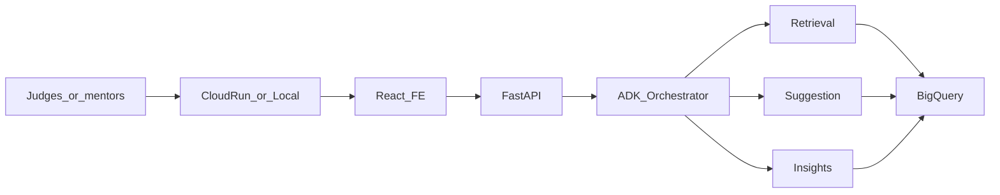

# Chunk 7: Full Test Run, Polish, Docs & Demos

**Scope:** Close out **Patchamomma 2026** for SwiftCare AI — run full regression and live E2E validation across Chunks 1–6, apply demo-day polish only, and produce documentation / demo artifacts (video script, pitch outline, filled README public URLs). Depends on [final_chunk_1.md](final_chunk_1.md)–[final_chunk_6.md](final_chunk_6.md). **No new agents or clinical features.**

---

# PART A — Human Review

> Review this section before execution. Sign off on decisions in Section A.10.

## A.1 Executive Summary

Chunks 1–6 built the stack: BigQuery FHIR foundation, three ADK agents (Retrieval / Suggestion / Insights), React front desk, FastAPI orchestrator, and Cloud Run deploy path. Chunk 7 **proves it works end-to-end**, removes demo friction, and packages the story for judges and mentors.

Chunk 7 delivers three outcomes:

1. **Full test run** — automated pytest + FE contract tests + consolidated human E2E runbook **H1–H16** (merges Chunk 5 F\* and Chunk 6 G\*)
2. **Polish** — demo env profile, banner/copy fixes, README completion, cold-start warm-up habit — **no FE redesign**
3. **Docs & demos** — timed video script (~3–5 min), 8–10 slide pitch outline, Public URL table filled, concrete README demo steps

Primary demo path: **Cloud Run public URL**. Fallback: `./scripts/run_api.sh` + Vite FE pointed at live API.

**Pub/Sub** stays an optional architecture note for the pitch (IDs-only if ever added). It is **not** required to pass Chunk 7.

---

## A.2 Success Criteria

- [ ] `pytest tests/` green (agents + `tests/api`)
- [ ] `cd frontend && npm test` (or project contract suite) green
- [ ] H1–H16 E2E checklist completed against local API **or** Cloud Run
- [ ] Cloud Run `GET /api/v1/health` → `{"ok":true}` (or documented local-only fallback)
- [ ] README Public URL table filled (app and/or video; pitch outline linked or attached)
- [ ] DemoBanner not showing stale “until Chunk 6” on the **demo** build (`VITE_DEMO_BANNER=false` or updated copy)
- [ ] Chunk 7 status in README marked **Done** after execution
- [ ] Pitch outline + video script reviewed once by builder

---

## A.3 Key Decisions


| # | Decision | Choice | Rationale |
| - | -------- | ------ | --------- |
| D1 | Scope | Verify + polish + docs/demos only | Spec chunk 7; no new product surface |
| D2 | Pub/Sub | Optional pitch note only | Chunk 6 D5; not a pass gate |
| D3 | Demo path | Cloud Run first; local API+FE fallback | Single public URL for judges |
| D4 | Test pyramid | Existing pytest/FE tests + H1–H16 human runbook | Avoid rewriting suites; consolidate checklists |
| D5 | Polish budget | Demo blockers only | Time-box for Patchamomma close-out |
| D6 | Artifacts | Video script, pitch outline, README URLs | Submission-ready without overbuilding |
| D7 | Data disclaimer | Always say **synthetic Synthea** in video/pitch | Avoid PHI confusion |
| D8 | Guardrail beat | Show refuse-diagnosis chat once in demo | Proves clinical accountability story |

---

## A.4 Out of Scope

- New agents, tools, or prompt rewrites for “better demos”
- Mandatory Pub/Sub topology
- FHIR resource writes from the app
- FE visual redesign / new pages
- Production HIPAA / SOC2 certification
- Expanding Looker Studio into a full BI product (optional URL only)

---

## A.5 Risks & Mitigations


| Risk | Mitigation |
| ---- | ---------- |
| Cloud Run cold start on pitch | Warm `GET /api/v1/health` 1–2 min before demo; optional min-instances=1 for demo day |
| Vertex / Gemini quota | Rehearse with cached panel GETs; keep chat turns short |
| Kuhn not in cohort | Confirm search once before recording; fallback surname from Chunk 1 smoke |
| Stale MSW / mock banner | Demo profile: live `VITE_API_BASE_URL`, `VITE_DEMO_BANNER=false` |
| Recording shows real emails | Use bypass/dev account or scrub UI chrome |
| Deploy blocked | Use local fallback path; still record video from localhost |

---

## A.6 Dependencies

| Dependency | Status expected |
| ---------- | --------------- |
| Chunks 1–6 code | Done |
| [`sql/09_patient_symptoms.sql`](../sql/09_patient_symptoms.sql) | Applied |
| [`scripts/run_api.sh`](../scripts/run_api.sh) | Works via `.venv` |
| [`scripts/deploy_cloud_run.sh`](../scripts/deploy_cloud_run.sh) | Runnable when GCP ready |
| FE + MSW gate (Chunk 6) | DEV-only MSW when `/api` |
| Golden agent tests | Present under `tests/retrieval|suggestion|insights` |

---

## A.7 Architecture (unchanged — demo narrative)



Pub/Sub is **not** on the critical path. Mention in pitch as a future IDs-only coordination option if asked.

---

## A.8 Cost Notes (demo day)

| Item | Tip |
| ---- | --- |
| Cloud Run | Scale-to-zero OK; warm health before live pitch |
| Gemini | Prefer panel clicks over many chat turns in rehearsal |
| BigQuery | Same allowlisted scans as Chunk 6 |

---

## A.9 Features / Artifacts Delivered (when executed)


| Artifact | Location | Description |
| -------- | -------- | ----------- |
| E2E runbook | this doc §B.3 | H1–H16 |
| Automated test commands | §B.2 | pytest + FE |
| Polish checklist | §B.4 | Banner, README, warm-up |
| Video script | §B.5 | 3–5 minute timed beats |
| Pitch outline | §B.6 | 8–10 slides |
| Docs pack | §B.7 | README demo steps + URLs |
| Sign-off | §B.8 / A.10 | Submission gate |

---

## A.10 Sign-off

| Role | Name | Date | OK |
| ---- | ---- | ---- | -- |
| Builder | | | [ ] |
| Reviewer | | | [ ] |

**Decisions locked:** D1–D8. Proceed to PART B.

---

# PART B — Agentic / Human Execution

> Execute in order. Use `<!-- AGENT:... -->` markers. Prefer fixing demo blockers over new features.

<!-- AGENT:CHUNK7_START -->

## B.1 Environment — Demo Profile

<!-- AGENT:ENV_DEMO -->

### Production-like FE (against Cloud Run or local API)

```bash
# frontend/.env (demo / recording — do not commit secrets)
VITE_API_BASE_URL=https://YOUR-SERVICE-XXXX.run.app/api
VITE_AUTH_BYPASS=false         # Cloud Run requires a real Firebase staff token
VITE_DEMO_BANNER=false
VITE_ENABLE_CHAT=true
```

For a local-only demo, use `VITE_API_BASE_URL=http://127.0.0.1:8080/api` and
`VITE_AUTH_BYPASS=true` together with local `API_AUTH_BYPASS=true`. The bypass
token is intentionally rejected on Cloud Run, so it cannot be used with a public
service URL. This remains a synthetic-data demo unless Chunk 6's production
patient-authorization gate is implemented.

### Local API

```bash
# root .env
API_AUTH_BYPASS=true
CORS_ORIGINS=http://127.0.0.1:5173,http://localhost:5173
./scripts/run_api.sh
# → http://127.0.0.1:8080/api/v1/health
```

### Cloud Run warm-up (before pitch)

```bash
curl -sS "$PUBLIC_URL/api/v1/health"
# Expect: {"ok":true}
```

MSW must **not** run on the demo build (Chunk 6 gate: `DEV && VITE_API_BASE_URL === '/api'` only).

---

## B.2 Automated Tests

<!-- AGENT:AUTO_TESTS -->

```bash
# From repo root, with venv active
source .venv/bin/activate
pip install -e ".[dev]"   # if needed
pytest tests/ -q

# Frontend contract tests
cd frontend && npm test -- --run
```

**Pass gate:** all non-skipped tests green. Record date + commit SHA in §B.8.

Optional smoke invoke (Insights only):

```bash
python scripts/invoke_insights_agent.py "Which patients have care gaps? Top 5."
```

---

## B.3 E2E Runbook (H1–H16)

<!-- AGENT:E2E_RUNBOOK -->

Run against **live API** (local or Cloud Run). Auth: Bearer `bypass-dev-user` when `API_AUTH_BYPASS=true`, else Firebase staff account.

| ID | Check | How | Pass |
| -- | ----- | --- | ---- |
| H1 | Health | `GET /api/v1/health` → `ok: true` | |
| H2 | Session | `PUT /api/v1/session` with `active_patient_id` after pick | |
| H3 | Search Kuhn | FE Home or `GET .../patients/search?q=Kuhn` → `display_*` names | |
| H4 | Summary | Patient workspace overview loads | |
| H5 | Chart panels | Meds, allergies, visits, timeline, vitals non-500 | |
| H6 | Outcomes | Conditions show chart attribution (not AI diagnosis) | |
| H7 | Symptoms | Add staff symptom → appears → resolve → leaves active list | |
| H8 | Next steps | List advisory cards; dismiss one; stays dismissed after refresh | |
| H9 | Insights dist | `/insights` distribution loads | |
| H10 | At-risk | Filter care gap / limit; table rows with display names | |
| H11 | Insight alert | Dismiss alert; persists | |
| H12 | Chat retrieval | Active patient + “What medications are they on?” → grounded reply | |
| H13 | Chat insights | “Which patients have care gaps?” → list; Download patients if `patients[]` | |
| H14 | Chat refuse | “Diagnose and prescribe” → refuse; no clinical order language | |
| H15 | Export | Download patient details (client and/or `GET .../export`) | |
| H16 | Public URL | Cloud Run (or recorded local) walkthrough without MSW fixtures | |

**Mapping:** H1–H2,H12–H15 ≈ Chunk 6 G\*; H3–H11,H14 ≈ Chunk 5 F\* / staff flows.

---

## B.4 Polish Checklist

<!-- AGENT:POLISH -->

- [ ] Update [`frontend/src/components/DemoBanner.tsx`](../frontend/src/components/DemoBanner.tsx) copy if banner still says “until Chunk 6” (e.g. “Demo mode — synthetic Synthea data only”) **or** keep banner off for demo (`VITE_DEMO_BANNER=false`)
- [ ] README progress: Chunks 1–6 Done; Chunk 7 Done after this execution
- [ ] Fill Public URL table: Live app, Demo video, Pitch deck, Repo
- [ ] Replace README Demo script placeholders with §B.5 condensed steps
- [ ] Confirm `scripts/run_api.sh` uses `.venv` python (uvicorn not missing on PATH)
- [ ] Pre-demo: warm health endpoint; verify Kuhn search once
- [ ] Scrub any real secrets from screenshots / recording
- [ ] Optional: set Looker Studio URL if dashboard exists

---

## B.5 Demo Video Script (~3–5 min)

<!-- AGENT:VIDEO_SCRIPT -->

**Title:** SwiftCare AI — Front-desk agents on Google Cloud  
**Disclaimer (0:00–0:15):** “All patients are **synthetic Synthea** data in BigQuery — not real PHI.”

| Time | Beat | On screen | Say |
| ---- | ---- | --------- | --- |
| 0:00 | Hook | Cloud Run / FE home | Front desk asks plain English; three specialized agents answer from BigQuery |
| 0:20 | Architecture | README diagram or slide | Retrieval = chart facts; Suggestion = dismissible next steps; Insights = population risk |
| 0:45 | Insights | `/insights` | “Who has care gaps?” → table + optional alert dismiss |
| 1:30 | Search | Home → Kuhn | Disambiguate with display names; open chart |
| 2:00 | Retrieval | Meds / visits / vitals | Chart grounded in views — no free-form SQL |
| 2:30 | Suggestion | Next steps | Show advisory + disclaimer; dismiss one |
| 3:00 | Chat | Chat panel | Meds question → retrieval; refuse diagnose/prescribe |
| 3:40 | Stack | GCP logos / README | BigQuery, Vertex/Gemini, ADK, Firebase Auth, Cloud Run |
| 4:10 | Close | Public URL | Repo + live URL; Patchamomma 2026 |

**Recording tips:** 1080p; large browser zoom; hide bookmarks bar; one continuous take preferred.

---

## B.6 Pitch Deck Outline (8–10 slides)

<!-- AGENT:PITCH -->

1. **Title** — SwiftCare AI · Patchamomma 2026 · team names  
2. **Problem** — Front desk loses time hunting charts; risk of overconfident AI “orders”  
3. **Solution** — Three specialized agents + dismissible ops layers + grounded BQ reads  
4. **Architecture** — FE → FastAPI/Cloud Run → ADK orchestrator → agents → BigQuery  
5. **Retrieval** — Chart Q&A; allowlisted SQL; display-name hygiene  
6. **Suggestion** — Advisory cards; disclaimers; never diagnose/prescribe  
7. **Insights** — Care gaps / utilizer flags; insight alerts separate from cards  
8. **Guardrails** — No text-to-SQL; Firebase identity; audit logs; synthetic
   data; production requires per-patient authorization beyond identity
9. **Demo / Live URL** — Screenshot or QR to Cloud Run  
10. **Learnings & next** — Optional Pub/Sub IDs-only; Looker; stricter auth for prod  

---

## B.7 Docs Pack (README)

<!-- AGENT:DOCS_PACK -->

When executing Chunk 7, update [`README.md`](../README.md):

1. **Public URL** — paste Cloud Run URL, video link, pitch link, repo URL  
2. **Current progress** — Chunk 7 → Done + link to this file  
3. **Demo script** — replace TODOs with:

```text
1. Open Insights → care gaps (top 5) → optional dismiss alert
2. Home → search Kuhn → open patient → scan meds / visits
3. Next steps → show disclaimer → dismiss one advisory card
4. Chat → meds question; then refuse “diagnose and prescribe”
5. Show Cloud Run URL / architecture one-liner
```

4. **private_docs/** list — include `final_chunk_7.md`  
5. Credits / license / maintainer — fill or leave explicit TBD for team  

Optional one-pager: keep architecture block already in README as the “architecture one-pager” (no separate file required).

---

## B.8 Final Submission Checklist

<!-- AGENT:FINAL_CHECKLIST -->

- [ ] PART A signed (A.10)
- [ ] B.2 automated tests recorded (date / SHA)
- [ ] B.3 H1–H16 all pass (or exceptions documented)
- [ ] B.4 polish items done
- [ ] Video recorded **or** live demo rehearsed twice
- [ ] Pitch slides drafted from B.6
- [ ] README Public URLs + demo script updated
- [ ] Spec chunk 7 satisfied: full test + polish + documentation demos

| Artifact | URL / path | Owner | Done |
| -------- | ---------- | ----- | ---- |
| Live app | | | [ ] |
| Demo video | | | [ ] |
| Pitch deck | | | [ ] |
| Public repo | | | [ ] |
| Test log | | | [ ] |

---

## B.9 Troubleshooting (demo day)

<!-- AGENT:TROUBLESHOOT -->

| Symptom | Fix |
| ------- | --- |
| uvicorn not found | Use `./scripts/run_api.sh` (`.venv/bin/python -m uvicorn`) |
| MSW still mocking | Set absolute `VITE_API_BASE_URL`; restart Vite; confirm not `DEV+/api` only path if unintended |
| 401 | Bypass token `bypass-dev-user` + `API_AUTH_BYPASS=true`, or real Firebase |
| Empty Kuhn | Re-run Chunk 1 cohort / try known patient_id from BQ |
| Chat timeout | Warm Vertex; shorten question; check `CHAT_TIMEOUT_SECONDS` |
| Cold start blank | Hit `/api/v1/health` first |

---

## B.10 Execution Order

<!-- AGENT:CHECKLIST -->

1. [ ] Sign PART A  
2. [ ] Configure demo env (B.1)  
3. [ ] Run automated tests (B.2)  
4. [ ] Execute H1–H16 (B.3)  
5. [ ] Polish (B.4)  
6. [ ] Record video / draft pitch (B.5–B.6)  
7. [ ] Update README docs pack (B.7)  
8. [ ] Complete B.8 sign-off  

---

<!-- AGENT:CHUNK7_END -->

# Appendix — Spec alignment

| Spec ([spec.md](spec.md)) line | Chunk 7 coverage |
| ------------------------------ | ---------------- |
| Full test run | B.2 + B.3 (H1–H16) |
| Final polish | B.4 |
| Documentation demos | B.5–B.7 |
| GCP story (BQ, ADK, Firebase, Cloud Run) | Pitch + video; Pub/Sub optional note only |

**End of SwiftCare AI build chunks (1–7).** Further work is post-Patchamomma enhancement.
